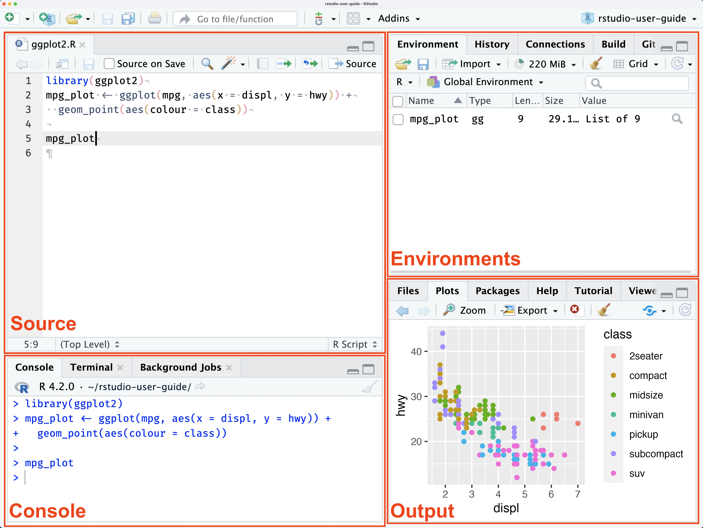
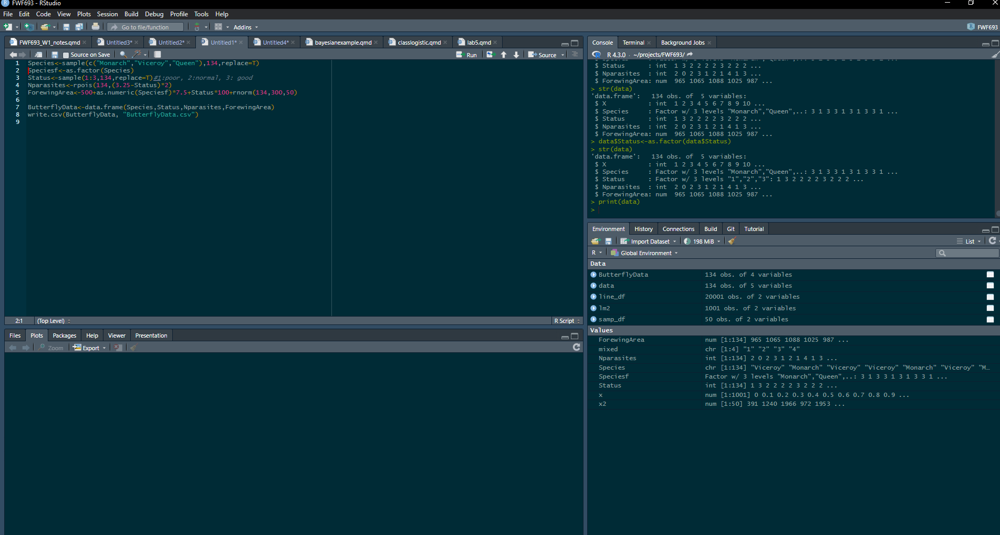
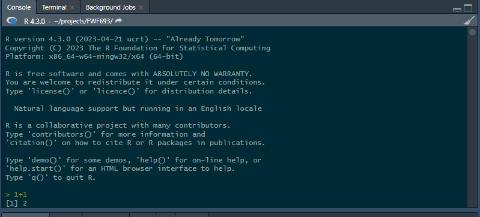
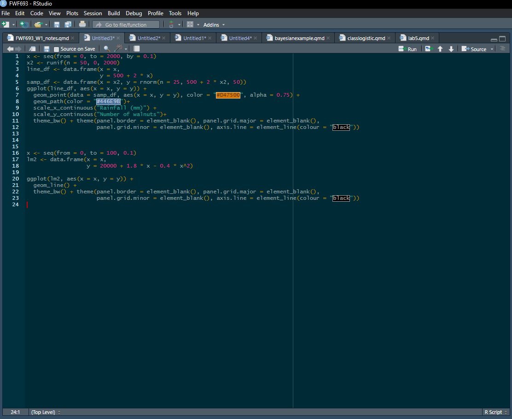

# This week's assignment

Introduction to R, Projects, and Quarto.

Next week topic will be:

1.  Statistical inference and linear models in R

::: callout-important
## About assignments

While assignments are usually due on Fridays before class (check CANVAS), please read the following:

1.  On Fridays, I will stay past the end of the class in the classroom, in case you have any questions.
2.  My office is in room 474 of the ANR building. I am available MWF after class until \~4 pm and I am happy to help you with any assignment questions. Please don't hesitate to ask! I have also availability on Tuesdays and Thursdays
3.  I am ALWAYS available via email, and I will do my best effort to reply to any R questions about the assignments as soon as possible. Please don't hesitate to reach me.
4.  Most of the assignments will have the following structure: half-tutorial, and then half questions and assignment. You only need to turn things in that actually say "assignment question". As we move on, there will be less and less tips and less "tutorials" and more questions.
:::

## Introduction to R

`R` is probably the most used language for statistical analysis in natural resources and agriculture. Other people use SAS (still very popular, but it is slowly becoming more unpopular) and python. R is designed for statistical analysis and data visualization, and in my opinion it is more intuitive, cleaner and faster than python for a majority of general uses in data analysis. It is **not** the only option, but it is an incredible resource for data analysis.

`R` is also free and open source, and there are incredibly smart people constantly working on developing packages that help you with your specific needs.

More importantly, whether you are going to continue your academic career, go into the professional world, or analyze your data the use of `R` is now a huge advantage in the job market!

The objectives for this course (R-wise) are the following:

1.  Learn the logic and syntax of coding! This is the most important aspect. If you understand the logic, then you can run whatever you want. It might take some research, looking for some functions, asking online, but you can get there
2.  Interpret results. Particularly for linear models and generalized linear models. Are the results significant? What is the effect size? What is the effect of the independent variable on the dependent variable? What do I report on my paper? All of these questions and more
3.  Understand error messages. Why is there an error message, what does it mean, and how to fix it. Errors in your code are unavoidable, and while often times it's easy to find solutions online, sometimes it isn't, and it is always better when you can understand them yourself.
4.  Get better and more efficient at it. Don't spend hours wrangling or moving data around before you can even attempt to analyze it.
5.  Use the great visualization tools available to make great publication-quality plots

##### Let's get started!

Please contact me (or raise your hand if in the classroom) to get help.

Open R-Studio and go to file \> new script.

This is usually how we start a new script where we will be writing code

At this point, you should see four panes:

{width="665"}

Mine looks a bit different, but it is the same logic:

{width="580"}

The different panes do different things. Let's go one by one on what they do:

##### Console

This is what the console looks like:

{width="547"}

You can type code here, and this is where the outputs are "printed". Notice in the figure how I wrote 1+1 and it gave me a result? Try it yourself. Try to use this "calculator" and multiply and divide.

::: callout-tip
## Work at your own pace!

I want you to worry less about grades, and more about learning and acquiring skills.

If you have used R before, some of the steps in this assignment mat be too "basic". If that's the case feel free to skip them. Also, feel free to help other people that may be having issues or struggling. Collaborative learning can be super useful. And teaching/helping allows you to acquire even deeper knowledge.

At the same time, if you are brand new and are struggling, and this is taking a while to complete. Feel free to not do the last parts of the assignment (just let me know what you had issues with). Hopefully later in the course you won't feel the need to do this.

**Graduate student life** can be very busy. I want you to spend as much time as you can learning R and stats, because I believe it can be extremely beneficial for your career, but DO NOT sacrifice your learning in other areas (particularly research). Talk to me if you need more time, or have any issues
:::

Try to run the following lines of code (if you are experienced with all of these commands, you can skip this step). You can copy and paste the code. Run them one by one, and try to understand what is happening:

```{r eval=FALSE}
5+5
```

```{r eval=FALSE}
8^5
```

```{r eval=FALSE}
sqrt(9)
```

```{r eval=F}
c(5,7,9,15,50)
```

```{r eval=F}
mean(c(5,7,9,15,50))
```

```{r eval=F}
sd(c(5,7,9,15,50))
```

```{r eval=FALSE}
1:10

-5:10

c(1:10,-5:10,25)
```

These are all basic commands!

##### Source

Now that you got familiar with what the console can do, it's time to remember the following: **DO NO WRITE YOUR CODE DIRECTLY INTO THE CONSOLE!** Using it as a quick calculator may be OK (as we just did), but for the majority of your work and analyses, you want to write scripts, and write your code there.

These scripts are written on the source window, which looks like this:

{width="436"}

Here is where you can write all of your code and script. This is a code editor, so, we can re-run lines of code and modify/edit them for future use.

Try writing all of the code chunks you just ran, but instead of doing it in the console, write them in source window. To run each line of code you can use `ctrl` + `Enter` (at least on Windows, I am sure there must be a shortcut for macOS). You can also click run on top right corner of the window.

##### Creating and naming objects. Also; the environment and history pane

So far, you have been running r just as a calculator, but the strength of `R` is in running full scripts, models, and analyses. To do so, we need to use `R` less as a calculator and more as a programming software.

To create objects in R we use the `<-` operator. This is probably the most important operator in `R`. While you can create objects with `=` I would avoid this, as it can create some issues later on. This is how you create and name objects:

$$
\underbrace{x}_{name} \underbrace{<-}_{symbol} \underbrace{17}_{value}
$$

Here, we created an object called `x`, with a value of 17.

Try writing `x <- 17` in your script/code editor (not in the console!) and run it.

Now, let's create a new object called y

```{r eval=F}
y<- x*2
```

Again run that.

As you can see, R is running these lines, but it is not printing the values.

If you look at the environment/history pane, you can see all of the objects that are loaded in R. This should include `x` and `y` and their values. You can also see their values by running the following code:

```{r eval=F}
print(x)

print(y)
```

As you probably also noticed, y equals 34. This is because $y = 2x$ and $x = 17$. This is super useful! You don't need to use numbers every time, you can also use objects.

You can also print objects by simply running `y` or `x`:

```{r eval=FALSE}
y
```

#### Vectors

You can create vectors in different ways.

Way 1:

```{r eval =F}
vector1<-c(4,6,1,11,50)
```

Run that and check the values of the vector. Does it make sense?

Vectors can be numeric, or other types:

```{r eval=F}
Breed<-c("Holstein","Hereford","Longhorn","Longhorn","Longhorn","Hereford")
```

We can ask R about the class of an object.

```{r eval=F}
class(vector1)

class(Breed)
```

We can also change classes:

```{r eval=F}
Breed<-(as.factor(Breed))
Breed
class(Breed)

```

Here we changed from character to factor. See how it created a "level"? Essentially, R is making 3 groups and assigning each entry in the vector to one of the groups (that's a good way to think about it). It makes a lot of computational sense, and it is needed for modeling.

Now, let's try something fun. Let's go back to numeric vectors.

If you remember, x = 17 and y = 34. Run the following:

```{r eval =F}
y-vector1
```

What happened when you did that? You are doing vector math! This can be incredibly useful!

Another way of creating a vector:

```{r eval=F}
vector2<-1:100
vector3<-1001:1100
print(vector2)
print(vector3)
```

Run those lines, does it make sense?

If we want to extract a specific value, we can use `[]` as an index.

For example:

```{r eval=FALSE}
vector2[5]
```

Gives us the 5th value on vector2, which turns out is 5

Also, try the following:

```{r eval=FALSE}
vector3[5]
```

Which should give us the 5th value of vector3: 1005.

Now, try the following:

```{r eval=F}
vector2+vector3
```

What happened? This is called vectorized math. Essentially, the first number in vector 2 was added to the fist number in vector 3, and then the second number on vector 2 was added to the second number on vector 3 and so on. This will be super useful for you!

There is another way of creating a vector:

```{r eval=F}
vector4<-seq(1,100,4)
```

That can also be pretty useful! Do you understand what happened? You are creating a sequence of numbers! From 1

Actually, there are many, many, many ways of creating vectors. Which are simply a one dimensional matrix. Here are some examples that I use:

```{r eval=F}
rnorm(50,0,5) #We sample 50 random values from a normal distribution with mean 0 and sd 5
rpois(100,10) #We sample 100 random values from a poisson distribution with lamba 10
runif(100,-10,10) #We sample 100 random individuals from a uniform distribution from -10 to 10
dpois(1:20,5) # The probability of obtaining a value of 1, 2, 3, ... ,20 if we were sampling randomly from a Poisson distribution.

```

We won't have much time to go over probability distributions. If you are unfamiliar with them, as part of the class, the first reading will be 🔗 [chapter 4](https://collinn.github.io/sbi/ch4.html)🔗 and 🔗[chapter 5](https://collinn.github.io/sbi/ch6.html)🔗 of 🔗[An Intuitive, Interactive, Introduction to Biostatistics by Caitlin Ward and Collin Nolte](https://collinn.github.io/sbi/index.html)*🔗* . I would recommend you read those chapters before continuing.

::: callout-note
If you can't figure out what a "function" does. Using the help function might help. Use `?` to ask R about a function. Try running `?rnorm` and see if you can figure out what this function does.\
Again, no problem if you can't figure it out. By the end of the semester, you will! Also, what even is a function anyway?
:::

### Functions

`R` comes with tons of pre-built functions. You can also build your own, which can be a great way to do an analysis that you have to repeat multiple times. There are also `packages` that you can download to analyze your data. Essentially, a function is a code chunk that performs a task. However, it does require you to give it some information. That information is called `input`. Let's go back to the `runif` function. This function generates random deviates following a uniform distribution. However, to do that, it needs some information. The information that it needs is: `runif(n, min, max)` n is the number of deviates you want to generate. Min is the minimum potential value, and max is the maximum potential value (the limits of the uniform distribution. Try it:

```{r eval=FALSE}
runif(n=50, min=-20,max=20)
```

Let's try using `rnorm(n,mean,sd)` which generates n random variates using a normal distribution with mean "mean", and standard deviation "sd". Try it:

```{r eval=FALSE}
rnorm(20,0,1) 

```

If you notice, we did not have to specify that 20 was n, 0 was the mean and 1 was the sd. `R` knew it already. `inputs` in `functions` have a pre-determined order.

We will explore a lot more functions in the next section.

### Matrices and Data Frames

Our data usually have a different structure than just a single vector. We usually have excel files, databases, and dataframes with multiple columns and multiple rows. We will mostly work with dataframes during the course. Later on we will incorporate lists, and matrices with more than 2 dimensions though.

Matrices and dataframes in r have different characteristics. An important one is that **Matrices in R CANNOT contain different types of data. They all have to be either numerical, character, or logical or other.** While matrices are super useful, we will focus on using dataframes first. Dataframes can contain multiple types of data.

Now, let's work on some real data.

## Reading data into R

You can import data of various formats into R; they include data tables in the form of `.dbf`, `.csv`, and `.xlsx` files or even spatial data such as vectors `.shp` or rasters `.nc`.

But the most common type of data files imported into R are probably`.csv` files.

You can import the dataset using the function `read.csv()`

Type this into R:

```{r eval=FALSE}
read.csv('C:/Users/amolina6/Documents/projects/FWF690/ButterflyData.csv')
```

The text within the brackets, and contained in quotation marks, is the file path (directory and file name) of the file you want to import. This is my directory. Yours would most likely be different. Perhaps something like…

IF MAC:

```{r eval=FALSE}
read.csv('~/FWF690/ButterflyData.csv')
```

IF WINDOWS:

```{r eval=FALSE}
read.csv('C:/Users/YourUserID/FWF690/ButterflyData.csv')
```

How do you find the file path?

For mac, open Finder, click to the folder where you saved your data, find your file, right-click (or ctrl-click) it, and then click on GetInfo.

For Windows, you can search documents, or you can look at the latest downloads on your browser.

When we read a datafile, we need to create an "R object". We can do it this way:

$$ \underbrace{data}_{Object\; name} \; \; \; \underbrace{<-}_{arrow} \; \; \underbrace{read.csv('~C:/.../eel.csv')}_{Data} $$

You can also do the following to import data into r:

1.  You can change your working directory, to the folder where your data is located, and then you don't have to write the flepath. Check this website: <https://dzchilds.github.io/eda-for-bio/working-directories-and-data-files.html>

2.  Create a project. If you create a project, the location of said project (folder) will be the working directory. If you download files directly into the folder, you can read them without specifying a working directory.

I highly recommend you create a project. This will make your life easier and that's what I do. Make sure to go to file \> new project \> new directory, and **select a location in your computer that will be easy for you to access.** At this point I would recommend you download **ALL** files directly into the project folder. Again, this is what I do, so I read files like this:

```{r}
data<-read.csv("ButterflyData.csv", stringsAsFactors = T)
# raise your hand if you are  struggling to read this.
```

This file will only open if it's saved in the same working directory where you are currently working or in the same project.

::: callout-tip
Did you realize the `#` symbol in that last code chunk? This is a very useful symbol. It is used to comment the code, and everything after the symbol won't run. It's a good idea to comment all of your scripts.
:::

Going back to our dataset, `head` shows us the top rows:

```{r}
head(data)
```

We can use `summary` to obtain a summary of the dataset:

```{r}
summary(data)
```

We can also ask it how many columns and how many rows it has. This is a great way to "count" observations. We use `ncol()` and `nrow()` to do this:

```{r}
nrow(data)
```

#### Indices in dataframes

We can index dataframes using `[,]`, and you should think of it as `[rows,columns]` or, in the case of most dataframes: `[observation,variable]`. So, `[5,]` is the fifth observation:

```{r}
data[5,]
```

While `[,5]` is the fifth variable, in this case "Forewing Area":

```{r}
data[,5]
```

Finally, you can get the fifth observation from the fifth variable:

```{r}
data[5,5]
```

Pretty useful, right? Variables usually also have names, and we can use the `$` operator to obtain specific variables (or columns) by name rather than by number. For example:

```{r}
data$ForewingArea
```

And if you want the fifth observation for this variable:

```{r}
data$ForewingArea[5]
```

Note than in this case `[]` is one dimensional. That is because `data$ForewingArea` returns a one dimensional (AKA vector) matrix with the values for this variable.

And if you want to obtain the first four columns of the dataframe you can do the following:

```{r}
data[1:5,]
```

Look at that last result. The X column doesn't make sense. However, it is super easy to remove it. we can use `[,-1]` to remove the first column:

```{r}
data<-data[,-1]
data
```

And now it's gone! Be very careful! Just run that line once. If you were to run it again you would remove the new "first" column (Species).

::: callout-note
While this worked great, the tidyverse (<https://www.tidyverse.org/>) is better for data transformation and cleaning than baseR (in my opinion). We will work on that later, but the R for Data Science book is available online for free: <https://r4ds.hadley.nz/data-visualize> I do recommend trying to master base R before moving into tidy or data.tables.
:::

Finally, we can also use indices to obtain certain data that we are interested in. We can use `logical` operators for this. For example:

```{r}
dataMonarch<-data[data$Species=="Monarch",]
head(dataMonarch)
```

This gives us a new dataframe that only contains monarchs.

These are called "logical operators". Here are the ones I use the most often:

| Operator  | Description           |
|-----------|-----------------------|
| \<        | less than             |
| \<=       | less than or equal to |
| \>        | more than             |
| \>=       | more than or equal to |
| ==        | equal to              |
| !=        | different than        |
| !x        | not x                 |
| x & y     | x AND y               |
| isTRUE(x) | test if X is true     |
| X%in%Y    | is X in Y?            |

Another cool thing about indices, is that we can use functions on specific columns (or variables) of a dataframe. For example:

```{r}
mean(dataMonarch$ForewingArea)
```

Gives us the mean of the Forewing Area for Monarchs.

Finally, we can also add columns using the `$` operator. The forewing area is in squared millimeters, if we wanted to calculate it in squared centimeters we could do the following:

```{r}
dataMonarch$FAcm<-dataMonarch$ForewingArea*0.01
head(dataMonarch)
```

## Projects

I really recommend you create a project for each specific research project you have. Common workflows have tons of problems, the main one is that R uses a global workspace. Without projects you are running and working on different analyses in the same global environment. As your code gets more complex, this will get more and more dangerous.

## Quarto

You may or may not have heard of RMarkdown or Markdown. For your assignments, you will be using a similar program called Quarto.

Quarto is a multi-language, [next-generation](https://quarto.org/docs/faq/rmarkdown.html) version of R Markdown from Posit. Just like Markdown and RMarkdown, Quarto is a plain text file editor. It has tons of advantages:

1.  It allows to annotate your code
2.  You can embed, run code and show plots.
3.  This whole document was written using Quarto, by the end of the semester, I hope you are able to write full reports on Quarto
4.  You can mix it with Github and have version control
5.  Create a yearly report. You can write the report, and have sections that are data-dependent. As new data comes in, the report auto-updates.

If you want to learn about how to format in Quarto, you can use the following cheat sheet for RMarkdown (it uses the same syntax): <https://posit.co/blog/the-r-markdown-cheat-sheet/>

For me, the most important aspect of Quarto is embedding code (I call these "call chunks"). To do this you use the following symbol: three times. This way:

```` ```{r} ````

The `` ` `` symbol is on the top left section of your keyboard. Next to the 1, and under the \~.

You can also go to insert \> executable cell \> R.

While I recommend you use scripts in your own research, I will have you use Quarto for your assignments in this class. This will print a "report" with all your answers, code and results, which will be easier for me to grade.

To create a new quarto file, go to File \> New File \> Quarto Document \> Write a title and your name \> Create.

Make sure the header has the following information, with the following header (this will make it pretty, and upload all the information):

```         
title: "Title of document"
author: "Your name"
format: 
  html:
    self-contained: true
editor: visual
```

Or if you prefer to upload a word document do the following:

```         
title: "Title of document"
author: "Your name"
format: docx
```

You can copy and paste it.

::: callout-warning
## ✏️ Question 1 ✏️ 5pts

1.  Create a new Quarto file (html, PDF or Word). This is the file that you will upload to Canvas.
2.  Write an answer of why experimental design is important
3.  Inside the Quarto file, using a code chunk, load the dataset, and then remove the first column `X` as we did earlier.
4.  Look at the whole dataset
5.  If you did your plot in R, try to embed it using code. If you used a different software option (or drew it), upload it to canvas as an independent file.
:::

::: callout-warning
## ✏️ Question 2 ✏️ 5pts

1.  In the same file, create an object with only monarchs, one object with only viceroy, and one with only queen.
2.  Estimate the mean forewing area for each group. Do you think this differences are significant? Can we tell if the differences are because they are different species or because of some other variable (e.g., parasites)
3.  Estimate the standard deviation of the forewing area for each group
4.  Create a new object in which you only have observations that have a forewing area lower than 1000, AND 2 or more parasites.
:::

::: callout-warning
## ✏️ Question 3 ✏️5pts

You came up with a new population butterfly condition index (BCI). The equation is fairly simple:

$$ BCI_i = \frac{x_i}{\overline{x}} $$

where $BCI_i$ is the index for individual i, $x_i$ is the forewing area for individual i, and $\overline{x}$ is the sample mean. You need to estimate this for each individual, and you have to use a different $\overline{x}$ for each species (each species has its own mean forewing area).

Write the code needed to estimate this BCI for each individual.

tip: In the three objects you created (one for each species) add a column that estimates this BCI. Report he maximum and the minimum BCI (functions `max` and `min`) for each species.
:::

Click Render, and upload the resulting html file to CANVAS. If you can't get it to work contact me or talk to me after class.
