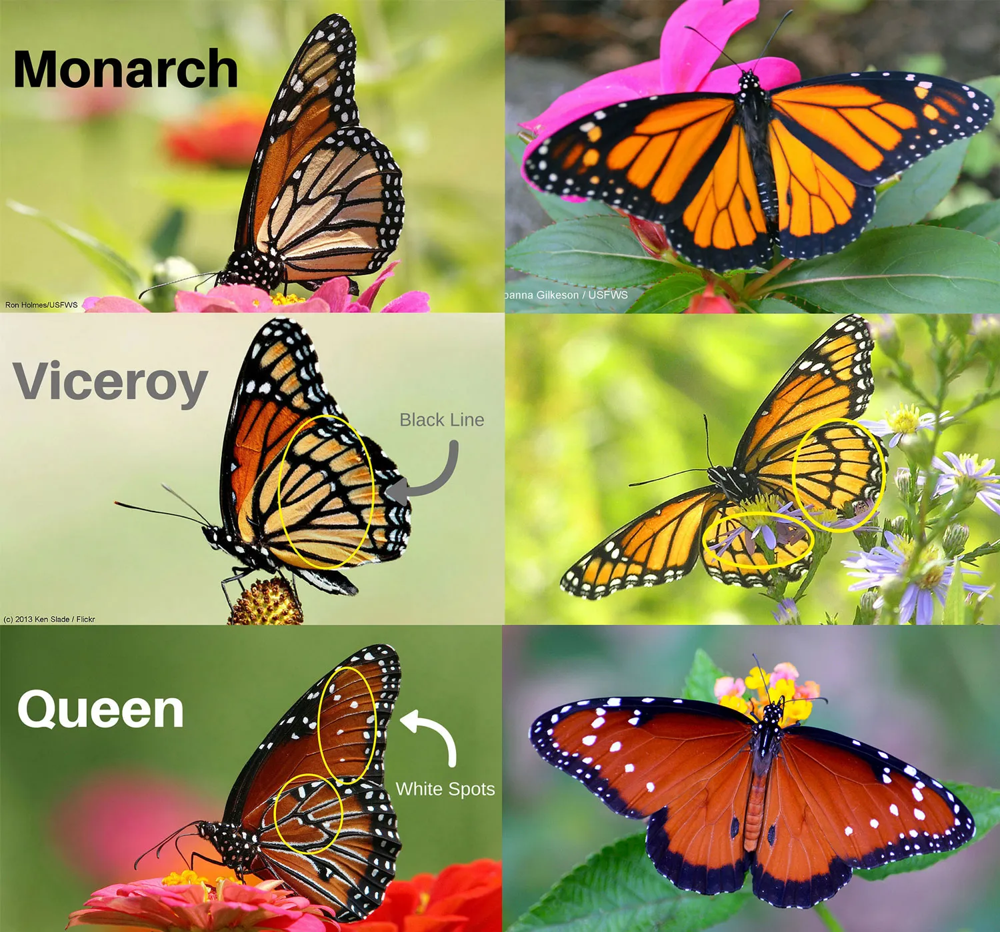

## Butterfly data

We will continue to use the butterfly dataset. This dataset has information on three species. This is how they look:

{width="567"}

And we want to obtain the *statistics* or *estimates* using our sampled data.

::: callout-warning
## ✏️ Question 1 ✏️ 5pts

1.  Estimate the mean for each species (you can recycle your code from last week!)
2.  Estimate the median for each species (function: `median`)
3.  Estimate the variance and standard deviation. `sd` function estimates the standard deviation
4.  Estimate the standard error of the mean for each species
5.  Obtain a CI for the mean estimate for each species
:::

After obtaining all your estimates, we will do a pretty simple plot. For this plot we will use a `package`. In R, we can download `packages` that help us do specific analyses or functions. They can be extremely useful. The package we will download is `ggplot2`.

To download and install it run:

(Run this in a separate script, not inside a quarto file)

```{r eval=FALSE}
install.packages("ggplot2")
```

**YOU ONLY HAVE TO INSTALL IT ONCE PER COMPUTER. Once it is installed, you don't have to run the `install.packages`** **line again!**

If we want to use a package, we need to load it:

```{r}
library(ggplot2)
```

You need to do this each session. In Quarto, you need to load it inside a datachunk BEFORE you use it.

We will do a super simple plot. We will plot the point estimate and confidence interval. Before we do this, we will create a new dataframe. In R, create a new dataframe (i.e., new object) that looks like the following table:

| Species | Estimate | lower_ci | upper_ci |
|---------|----------|----------|----------|
| Queen   | x        | x        | x        |
| Viceroy | x        | x        | x        |
| Monarch | x        | x        | x        |

Of course, the "x" should be replace by the actual values.

::: callout-tip
## I need help!

I am more than happy to help you if you are struggling with this. However, I do want you to try to solve it before asking me. You can use a lot of resources, particularly online, that help you figure things out.

There are also many ways to do something. I don't really care about code efficiency, as long as it is doing what it is supposed to be doing!
:::

After you have created the new dataframe, we can plot the results with something similar to:

```{r eval=FALSE}
ggplot(newdataframe, aes(x = Species, y = Estimate)) +
     geom_point(size = 3) + 
     geom_errorbar(aes(ymin = lower_ci, ymax = upper_ci), width = 0.1) +
     labs(title = "Point Estimates with Confidence Intervals") 
```

It is perfectly OK if you don't understand that code. I will go more into detail regarding plotting data in R later in the semester. It is also OK to notice that the plot is a bit ugly. We will learn how to make plots look nicer!

::: callout-warning
## ✏️ Question 2 ✏️2 points

Based on the last plot, and your estimated means and CI's, would you say that the mean forewing area is different among species? Explain
:::

We can also plot in R using `baseR` (this means, we don't need the ggplot package). An example of this is the following code that will plot boxplots for the three populations:

```{r echo=FALSE}
data<-read.csv("ButterflyData.csv", stringsAsFactors = T)
```

```{r}
boxplot(ForewingArea~Species,data=data)
```

::: callout-warning
## ✏️ Question 3 ✏️2 points

Answer:

1.  What is a boxplot?
2.  What are the differences between this boxplot, and the plot we ran using ggplot?
:::

::: callout-warning
## ✏️ Question 4 ✏️ 1 point

Estimate the Coefficient of Variation for forewing area for each species, and mention which species has the highest variation.
:::
