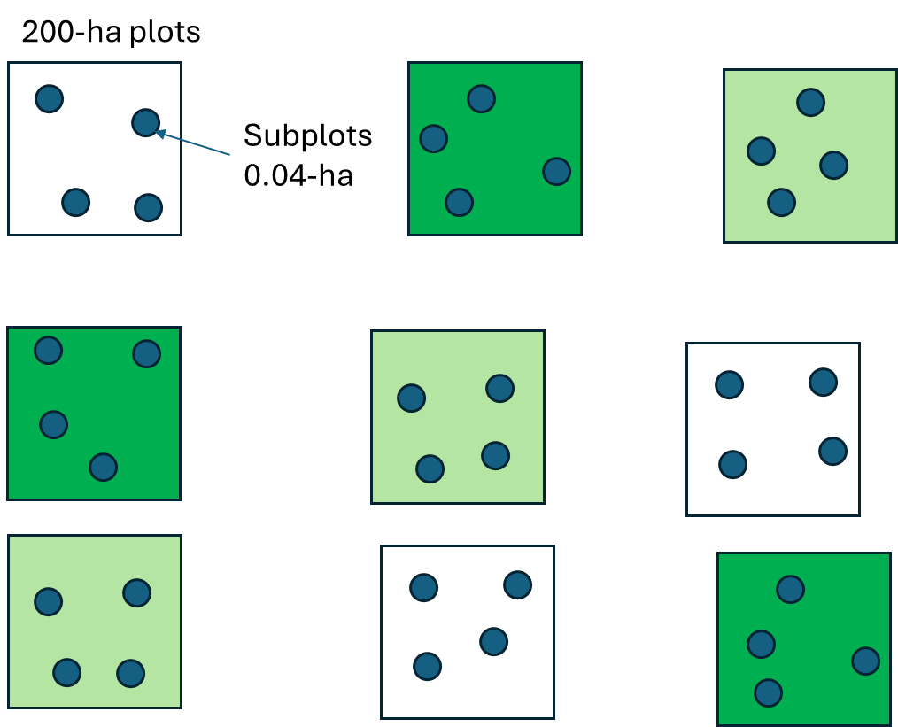

# Instructions

In this assignment, you will run analyses for different factorial and nested designs. For each of the following scenarios, you will need to:

1.  Identify the type of design (factorial, nested, etc.).

2.  Write the null hypotheses

3.  Explain how many factors there are and if they are fixed or random.

4.  Run an anova using the `aov()` function in R.

5.  Write the ANOVA equation for the model you are testing. For example, if you are testing a two-way factorial design with factors A and B, your ANOVA equation might look like this:

$$ Y_{ijk} = \mu + \alpha_i + \beta_j + (\alpha \beta)_{i,j} + \epsilon_{ijk} $$

Where:

-   $Y_{ijk}$ is the response variable for the k-th observation in the i-th level of factor

-   $\alpha$ and the j-th level of factor $beta$.

-   $\mu$ is the overall mean.

-   $\alpha_i$ is the effect of the i-th level of factor $\alpha$.

-   $\beta_j$ is the effect of the j-th level of factor $\beta$.

-   $(\alpha \beta)_{i,j}$ is the interaction effect between factors $\alpha$ and $\beta$.

-   $\epsilon_{ijk}$ is the random error term.

To write an equation in Quarto, you can use LaTeX syntax within double dollar signs `$$`. You can check this website: [Math in R (R Markdown/Quarto)](https://rpruim.github.io/s341/S19/from-class/MathinRmd.html) for more information on how to write mathematical equations in R Markdown and Quarto.

You can also right click on any equation in any of my assignments, and select `show math as`, followed by `Tex commands` and that will show you how to write that equation in LaTeX syntax.

6.  Interpret the results of your ANOVA, including the main effects and interaction effects if applicable. Discuss what the results mean in the context of the experiment you are analyzing.

7.  If you find significant effects, consider conducting post-hoc tests to further explore the differences between groups. You can use functions like `TukeyHSD()` or use the `emmeans` package in R for this purpose.

8.  For the models with an interaction, run them again with the interaction term removed to see how the main effects change without the interaction. Write the ANOVA equation for this new model as well.

9.  Interpret the differences between the interaction model and the non-interaction model

```{r echo=FALSE, message=FALSE}

library(ggplot2)
library(dplyr)

```

## Experiments

::: {.panel-tabset style="background-color: #dcf0f2; border: 1px solid white; .tabs{         border-right: 2px solid #636363;       border-top: 2px solid #636363;       border-bottom: 2px solid #636363; }"}
## Cows and Farms 🐄

You are testing 3 types of diet in cows: diet A, diet B, and diet C. Because of space limitations, you run your experiments in 5 different farms. Each farm allows you to use 9 animals, so you randomly select 3 individual to each treatment at each farm.

All the data is in the `cowfarms.csv` file on Canvas.

This is the data:

```{r echo=F, warning=F}
dataanova<-read.csv("cowfarms.csv")
dataanova$x <- c(seq(from=0.6,to=1.4,length=15),seq(from=1.6,to=2.4,length=15),seq(from=2.6,to=3.4,length=15))
ybari <- dataanova %>%
  group_by(treatment) %>%
  summarise(y = mean(values)) %>%
  mutate(x = 1:3,
         label = c("bar(y)[A]", "bar(y)[B]", "bar(y)[C]"))

ybari2 <- dataanova %>%
  group_by(treatment, farm) %>%
  summarise(y = mean(values)) %>%
  mutate(x = 1:5)


dataanova$ybar <- rep(ybari$y, each = 15)

ggplot(dataanova, aes(x = x, y = values)) +
  geom_point(aes(color = as.factor(farm)), size = 3) +
  scale_x_continuous("Diet treatment", labels = c("High-E", "Forage", "Mixed"), breaks = 1:3,guide = "none") +
  scale_y_continuous("Weight gain")+
  geom_hline(yintercept = mean(dataanova$values)) +
  annotate("text", label = "bar(y)[.]", x = 3.5, y = mean(dataanova$values) + 1.2,
           parse = TRUE, size = 5)+
  theme_classic()+
  geom_segment(data = ybari, aes(x = x - 0.45, xend = x + 0.45, y = y, yend = y, color = treatment)) +
  #geom_segment(data = ybari2, aes(x = x - 0.45, xend = x + 0.45, y = y, yend = y, color = farm)) +

  geom_segment(data = ybari, aes(x = x, xend = x, y = mean(dataanova$values), yend = y), color = "#D47500") +
  geom_segment(data = dataanova, aes(x = x, xend = x, y = ybar, yend = values), color = "#3CB521")


```

## Insecticide and abundance of moths 🦋

You are a graduate student looking at data on abundance of moth larvae in fields following one of three treatments: Control, Bt, and Dimilin. Unfortunately, the previous graduate student and professor both left the institution), so, you do not have much of an idea of the experimental design. Luckily, you have the data and the following image from a presentation they gave! Use the `mdat2.csv` file!\


## Cows and Breeds 🐮

You are interested in the effects of three different diets in three different breeds. You also wonder whether different breeds respond differently. This is in the `cowbreeds.csv` file

## Fertilizer Irrigation and Light

A greenhouse experiment tests the effect of fertilizer, irrigation, and light in the growth of tomato plants. This is in the `growthdata.csv` file
:::

How to run the models?

This is how you rune the anovas:

```{r eval=F}
# Two fixed effects
model <- aov(Y ~ A + B, data = df)           # additive
model <- aov(Y ~ A * B, data = df)           # with interaction

# One fixed (A), one random (B)
model <- aov(Y ~ A + B + Error(B), data = df)     # additive
model <- aov(Y ~ A * B + Error(B), data = df)     # with interaction

# Nested (B nested within A)
model <- aov(Y ~ A + Error(A/B), data = df)  # additive only — interaction impossible
                                             # B levels are unique to each A level, they never cross
```