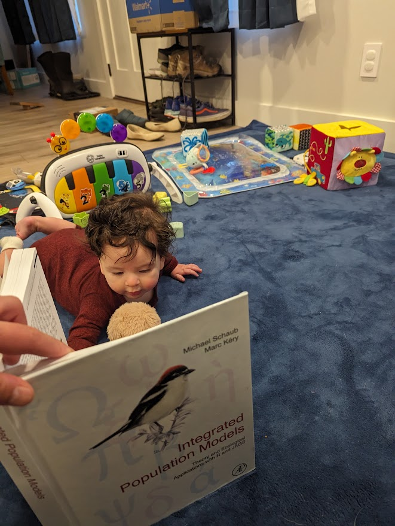
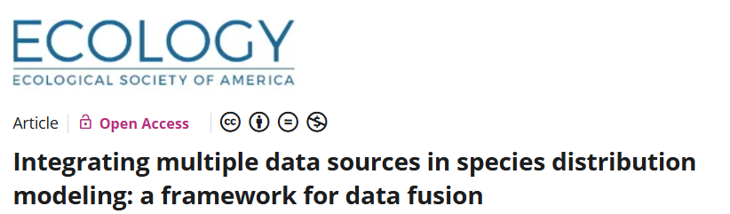
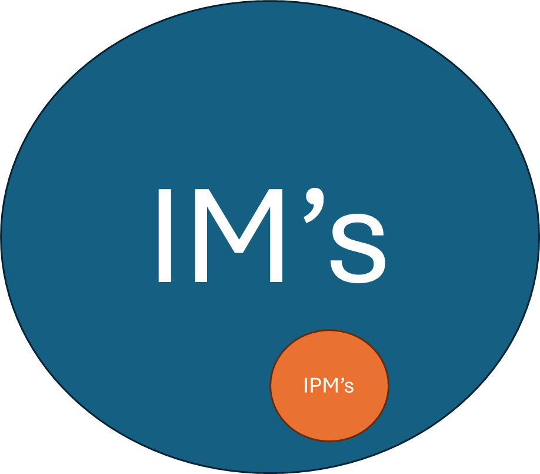
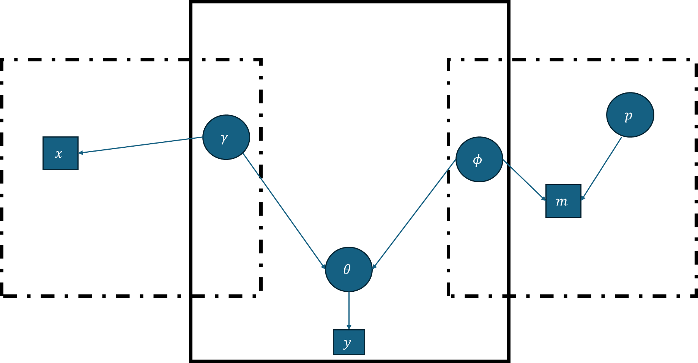
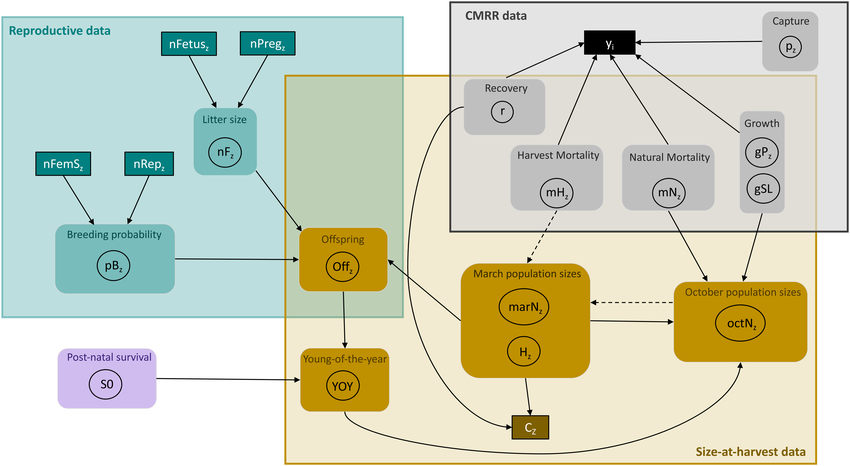
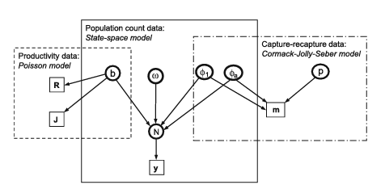

## Before we start

Packages we'll use:

-   `ASMbook`

    -   Applied Statistical Modeling for Ecologists book –\> Package contains both datasets and useful examples

-   `rstan`

## Before we start

Brief introductions 🐟

## Before we start

-   IPM book by Schaub and Kery



## This talk

-   Integrated models

-   Integrated population models

-   Discussion

-   Examples and code?

-   Make it successful! 😄 Participate and discuss

-   If you are interested... you should keep reviewing this!

::: notes
This is a very extensive topic. Not enough time to do a very nice example
:::

## What is an Integrated Model?

-   What is a model?

-   Integrated **Population** Model

-   What is an Integrated Model?

## Similar to hierarchical models

-   In hierarchical models, we can combine two or more GLM's in a sequence

-   $$
    Profit_i = \alpha_0 + \alpha_1 revenue_i - \alpha_2cost_i + \epsilon_{Profit, i} 
    $$

-   $$
     Revenue_i = \beta_0 + \beta_1Yield_i+\epsilon_{Revenue,i}
    $$

-   $$
    Cost_i = \gamma_0 + \gamma_1Labor_i + \epsilon_{Cost,i}
    $$

-   $$
    Yield = \zeta_0 + \zeta_1 Labor_i + \epsilon_{Yield_i} 
    $$

-   $$
    Labor_i = \delta_0 + \delta_1 Population_i + \epsilon_{labor_i}
    $$

-   $$
    Population \sim Poisson(\lambda)
    $$

## What is an Integrated Model?

-   What?

-   Why?

-   How?

-   When to use?/When to use not?

::: notes
What? Use all info

How are they different from hierarchical. Not sequence. Can branch off. Different than mixture models or other models, there is disparity in the data you collected.\
This means:we have multiple data that contains information about shared processes with some shared parameters

Why? Higher precision, more parameters u can estimate, use all predictors.

Most importantly why: ecologists... we rarely have complete data on all processess. Integration lets us use everything we have
:::

## Reasons to use them?

-   A survival dataset with low sample size → noisy estimates

-   A count dataset with imperfect detection → biased estimates

<!-- -->

-   A reproduction dataset that lacks survival context

-   We can join all together!

-   We could also (potentially) estimate new parameters!

```{mermaid}
flowchart LR
  A[Survival] --> B[Abundance]
  C[Reproduction] --> B
```

## What are IM's?

Statistical method to share information about some underlying process by combining data sets

-   How: Form joint likelihood with shared parameters among likelihoods of each data set

-   NOT ONLY WAY! (but we will focus on this)

-   Joint likelihood for two or more "disparate" data sets, with at least one shared parameter

-   

::: notes
Pacifici et al. Ecology paper 2017: there are many
:::

## IM's have a shared process

```{mermaid}

flowchart LR
  A[$$\theta$$] --$$\omega_1$$ --> B($$data_1$$)
  A[$$\theta$$] --$$\omega_2$$ --> C($$data_2$$)

```

```{mermaid}
flowchart LR
  subgraph Hidden
    A[$$\theta$$]
    B[$$\gamma$$]
    C[$$\lambda$$]
  end
  Hidden --$$\omega_1$$ --> E($$data_1$$)
  A--$$\omega_2$$ --> D($$data_2$$)

    style Hidden fill:#bdf1f1,stroke:#f66,stroke-width:2px,color:#fff,stroke-dasharray: 5 5 

```

::: notes
Box: hidden process data is our observations\
arrows are the observation process(with an associated parameter).
:::

## Integrated models



::: notes
IPMs specifically focus on the simultaneous estimation of both population abundance and demographic rates within a single analytical framework
:::

## IPM's

-   Special case of IM's: estimate abundance and demographic rates
-   Statistical method to share information about some underlying processes (abundance and demographic rates) by combining data sets

1.  Abundance data (counts)
2.  Productivity data (reproduction)
3.  Capture-reapture data (survival)

-   Often times rely on age or stage structure matrices

## Exercise

1.  Abundance data (counts)
2.  Productivity data (reproduction)
3.  Capture-reapture data (survival)

```{mermaid}
flowchart LR
  subgraph Hidden
    A[$$\theta$$]
    B[$$\gamma$$]
    C[$$\lambda$$]
  end
  Hidden --$$\omega_1$$ --> E($$data_1$$)
  A--$$\omega_2$$ --> D($$data_2$$)

    style Hidden fill:#bdf1f1,stroke:#f66,stroke-width:2px,color:#fff,stroke-dasharray: 5 5 
```

::: notes
Draw a normal looking IPM here
:::

## Exercise

CJS model:

```{mermaid}
flowchart LR
  A($$\phi$$) ---> C[y]
  D(p) ---> C
  
```

::: notes
z is a state process –\> 1 if alive and 0 if dead
:::

-   $$
    z_{i,f_i} = 1
    $$

-   $$
    z_{i,t+1} | z_{i,t} \sim Bernoulli(z_{i,t}\phi_{i,t})
    $$

-   $$
    y_{i,t} | z_{i,t} \sim Bernoulli(z_{i,t}p_{i,t})
    $$

## Exercise

1.  Abundance data (counts) –\>y
2.  Productivity data (reproduction; counts of eggs, counts of newborns) –\> R and J
3.  Capture-reapture data (survival): CJS –\> m

-   Make a diagram
-   Trying to estimate abundance (N) and other demographic rates
-   There can be as many processes as you want (parameters)
-   What are the shared processes?

## Exercise



::: notes
In the center is the **process model**, shown with a solid boundary because it represents the real underlying biology.

Inside it, θ and X(t) represent the *true but unobserved* demographic process—survival, reproduction, or population size.

Around the process model are three **observation models**, each shown with a dashed rectangle. These describe how each dataset—data₁, data₂, data₃—is generated.

Circles represent latent variables or parameters we estimate, squares represent observed data.

Arrows indicate which parameters influence which data sets. θ is shared, so each dataset contributes information about it.

Together, this structure forms an Integrated Population Model: multiple datasets, each with its own observation model, all connected to one underlying biological process.”
:::

##  

## Potential result



## 

{width="596"}

## Why and how?

How: Formulate the joint density of all observed data (and latent variables)

-   More data is better! Higher precision, more parameters
-   Larger datasets
-   **New parameters may become possible to estimate**

## When to run an IPM?

-   Should you always run an IPM when you have the available data? If it has so many benefits!

-   What should your philosophy be?

-   When should you NOT run an IPM?

## When not to run one

-   When data sources violate independence

-   When parameters become non-identifiable

## How to run?

Stack all models inside the same **stan** model statement


-   Important part: **Choose the same names for shared parameters**

-   Likelihood portion for each model

-   That's it!

-   **Important: You need to understand each model you run**

## What you should know before running an IPM

1.  Models for population size surveys
2.  Models for "productivity"
3.  Models for survival
4.  Matrix population models

::: notes
PROD: FECUNDITY

1- State space models, correction of detection bias, discrete models N mixture models

2- Poisson, zero inflated models. Unde and overdispersion zero inflation and zero truncation, nest survival models

3- CJS, Multistate
:::

## Most complicated aspect of a IPM

-   Understand each individual model

-   Understanding "shared" parameters



-   Theoretical acyclical graph

## Things to remember before running a model!

-   Separate `data`, `parameters`, `model`, `transformed parameters (generated quantities)` clearly

-   Build each model separately, then join

## Example of an IM

Let's go back to IM's and run an SDM

## Example in R

Common swifts in Switzerland


## Example

We have count data for common swifts at different altitudes.

## Example in R

```{r}
library(ggplot2)
library(cowplot)
countdata1<-read.csv("countdata1.csv")
countdata2<-read.csv("countdata2.csv")
detdata<-read.csv("detection.csv")

ggplot(data=countdata1, aes(x=elevation, y=counts))+
geom_point()+
  geom_smooth(method = glm, method.args = list(family = "poisson"))+
  xlab("Elevation (m)")+
  ylab("Counts")+
  
  theme_cowplot()


```

-   Dataset: countdata1

## What model should we run?

We are just wondering what the effect of elevation is on abundance (counts)

What model?

-   A GLM! Very easy to run using the `glm` function

## GLM

```{r echo=TRUE}
summary(fm1 <- glm(counts ~ selev, data= countdata1, family = poisson(link = "log")))
```

## Definition of negative log-likelihood for Poisson

```{r echo=TRUE}
library(ASMbook)
NLL1 <- function(param, y, x) {
  alpha <- param[1]
  beta <- param[2]
  lambda <- exp(alpha + beta * x)
  LL <- dpois(y, lambda, log = TRUE)                   # LL contribution for each datum
  return(-sum(LL))                                     # NLL for all data
}

# Minimize NLL
inits <- c(alpha = 0, beta = 0)                        # Need to provide initial values
sol1 <- optim(inits, NLL1, y = countdata1$counts, x = countdata1$selev, hessian = TRUE, method = 'BFGS')
tmp1 <- get_MLE(sol1, 4)


```

## We are lucky, and have a secondary (independent) dataset

-   Dataset of "birdwatchers"

-   Pretty reliable

-   They do not record zeroes!

-   What type of model?

-   A zero-truncated GLM! `VGAM` –\> we won't run the actual model, just maximizing likelihood

## Definition of negative log-likelihood (NLL) for the ztPoisson GLM

```{r echo=TRUE}
NLL2 <- function(param, y, x) {
  alpha <- param[1]
  beta <- param[2]
  lambda <- exp(alpha + beta * x)
  L <- dpois(y, lambda)/(1-ppois(0, lambda))           # L. contribution for each datum
  return(-sum(log(L)))                                 # NLL for all data
}

# Minimize NLL
inits <- c(alpha = 0, beta = 0)                        # Need to provide initial values
sol2 <- optim(inits, NLL2, y = countdata2$counts, x = countdata2$selev, hessian = TRUE, method = 'BFGS')
tmp2 <- get_MLE(sol2, 4)


```

## We are lucky, and have a third (independent) dataset

-   detdata

-   Detection/nondetection data

-   NOT COUNT DATA!

-   But, underlying abundance process affects the probability of detection!

-   Elevation affects the abundance! Abundance affects detection

-   What model?

-   GLM `glm`. Binomial! What type of link function?

-   clogclog

-   $$
    p(detect) = 1-e^{-\lambda r} 
    $$

-   r is probability of detection of each individual

-   $$
    log(-log(1-p))=log(\lambda r)
    $$

## Fitting cloglog Bernoulli GLM

```{r echo=TRUE}
summary(fm3 <- glm(y ~ selev,data=detdata, family = binomial(link = "cloglog")))
```

## Definition of negative log-likelihood for Bernoulli cloglog

```{r echo=TRUE}
NLL3 <- function(param, y, x) {
  alpha <- param[1]
  beta <- param[2]
  lambda <- exp(alpha + beta * x)
  psi <- 1-exp(-lambda)
  LL <- dbinom(y, 1, psi, log = TRUE)                  # L. contribution for each datum
  return(-sum(LL))                                     # NLL for all data
}

# Minimize NLL
inits <- c(alpha = 0, beta = 0)
sol3 <- optim(inits, NLL3, y = detdata$y, x = detdata$selev, hessian = TRUE, method = 'BFGS')
tmp3 <- get_MLE(sol3, 4)

```

## Fitting the IM with a joint likelihood

We are assuming the data are independent (BIG ASSUMPTION! Read about it!)

-   What is the shared process/parameter?

<!-- -->

-   $$
    L_{joint} = L_1L_2L_3
    $$

-   $$NLL_{joint}= - LL_1 - LL_2 -LL_3$$

```{r echo=TRUE}
NLLjoint <- function(param, y1, x1, y2, x2, y3, x3) {
  # Definition of elements in param vector (shared between data sets)
  alpha <- param[1]                                    # log-linear intercept
  beta <- param[2]                                     # log-linear slope
  # Likelihood for the Poisson GLM for data set 1 (y1, x1)
  lambda1 <- exp(alpha + beta * x1)
  L1 <- dpois(y1, lambda1)
  # Likelihood for the ztPoisson GLM for data set 2 (y2, x2)
  lambda2 <- exp(alpha + beta * x2)
  L2 <- dpois(y2, lambda2)/(1-ppois(0, lambda2))
  # Likelihood for the cloglog Bernoulli GLM for data set 3 (y3, x3)
  lambda3 <- exp(alpha + beta * x3)
  psi <- 1-exp(-lambda3)
  L3 <- dbinom(y3, 1, psi)
  # Joint log-likelihood and joint NLL: here you can see that sum!
  JointLL <- sum(log(L1)) + sum(log(L2)) + sum(log(L3)) # Joint LL
  return(-JointLL)                                      # Return joint NLL
}

# Minimize NLLjoint
inits <- c(alpha = 0, beta = 0)
solJoint <- optim(inits, NLLjoint, y1 = countdata1$counts, x1 = countdata1$selev, y2 = countdata2$counts, x2 = countdata2$selev,
  y3 =detdata$y, x3 = detdata$selev, hessian = TRUE, method = 'BFGS')

# Get MLE and asymptotic SE and print and save
(tmp4 <- get_MLE(solJoint, 4))
diy_est <- tmp4[,1]


```

## Not too different from an IPM!

-   You have the data

-   Challenge: Run a single integrated model in Stan

-   [https://rpubs.com/amolin](https://rpubs.com/amolina/im){.uri}[a](https://rpubs.com/amolina/ipm){.uri}[/ipm](https://rpubs.com/amolina/im){.uri}

-   <https://rpubs.com/amolina/im>
