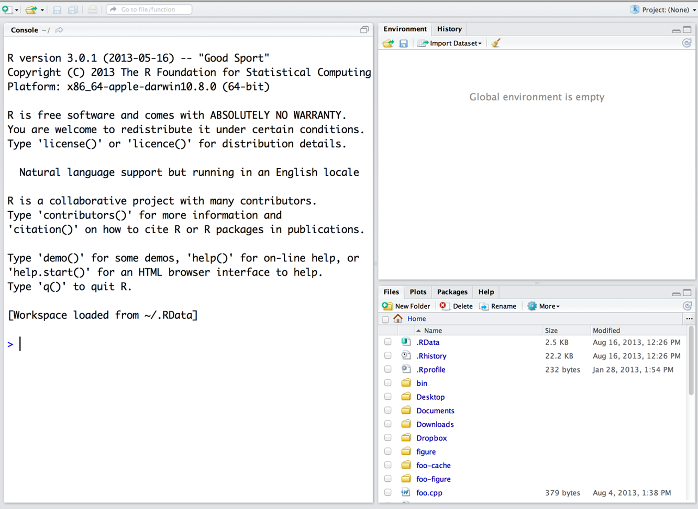

## Install R and RStudio

### Install R

R can be downloaded from the following page <https://cran.r-project.org/>, follow the instructions to download it.

#### Windows

To install R on Windows, click the “Download R for Windows” link. Then click the “base” link. Next, click the first link at the top of the new page.

#### Mac

To install R in a Mac the “Download R for Mac” link. Next, click on the `R-4.4.2` package link.

#### Chromebook

Chromebooks don’t allow you to install R or the RStudio program. However, there is an online platform that will allow you to run RStudio. If you go to <https://posit.cloud> , you should be able to create an account, and in your workspace you can open a new RStudio project. Your window will look the same as what we are working with, though there may be some quirks to getting

### Install RStudio

Go to <https://posit.co/download/rstudio-desktop/>

Click on the Download RStudio Desktop link. If you are using a Mac, you will need to scroll down a bit to see the download link.

## Explore R and RStudio

RStudio is a program, not different than Word. It works as a "wrapper" or "editor". You will write the code in RStudio, and it will run it in program R. You will *rarely* or maybe **never** open program R. You will do everything from RStudio!

::: callout-tip
RStudio needs R to function, so you need to download both programs!
:::

After you open RStudio, this is what you will see:



Now, you can code in R!

### Let's check R and RStudio!

Let's do a couple of things in R. Run the following lines (or similar, you can use different numbers!) on the **Console** (big screen on the left!)

First, let's do basic math:

```{r}
5+5
10*7
89-5
90/3
```

As you can see, we can use R as a calculator

Now, let's create a vector

```{r}
1:10
```

```{r}
120:170
```

::: callout-warning
# Try it! ✏️

Now, try to create a vector from 200 to 300
:::

Finally, let's roll a die!

We will roll a "D20" die (this is a die with 20 sides). First, we need to create this die. We can create objects in r using the following symbol: `<-` . Objects will save data, and we can use the object name to extract the data. We can create our dice using the following:

$$
\underbrace{D20}_{Object\; name} \; \; \; \underbrace{<-}_{arrow} \; \; \underbrace{1:20}_{Data}
$$

The arrow is created with these two symbols: `<` and `-` .

```{r}
D20<-1:20
```

Now, if you do the following:

```{r}
D20
```

You extract the data from the object. Pretty cool!

Now, let's roll our die!

```{r}
sample(x=D20, size=1)

```

Let's now roll 3 D20 dice:

```{r}
sample(x=D20, size=3, replace=TRUE)
```

::: callout-warning
## Think about it! 🧠

What do you think the `replace=TRUE` does?
:::
