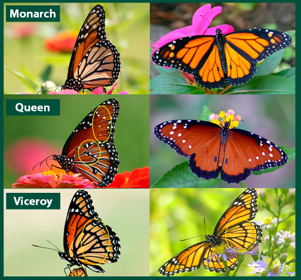

## Welcome to week 1

::: callout-important
If you are reading this file before class, it may not make a lot of sense to you. That's OK! We will go through it on Wednesday. More importantly, you will learn more about R on Friday.
:::

Before we get into the weeds of data analysis, coding, and R, we should remember some basics! On Friday we will learn (or refresh) some basic R skills! If you have a lot of experience in R, just hang in there, we will get more and more complex topics as we go on! If you're brand new, also hang in there, this may seem overwhelming and very time consuming. It will get easier!

We will figure out theory and coding as we go. For all assignments, we will use Quarto. It allows you to write some neat reports while using code and plots.

### R Projects

We will learn more about projects during class. We will have our first R assignment this Friday. For the time being, just trust me, and let's do the following:

1.  Open R Studio, go to file \> new project \> new directory \> new project

2.  Name it FWF693, and use a directory that makes sense to you

3.  Download the .qmd and the .csv files IN THE NEWLY CREATED PROJECT DIRECTORY

::: callout-important
If you are working on this before class, you can (and should) stop now
:::

### Statistics refresher

The following information will only make sense after class on Wednesday.

Open R and make sure your project is opened. Then open the .qmd file in R. We will continue there!

First of, we discussed some very important concepts during class. You can take notes here

What is statistics?

What is a population and a sample? Give examples

Data

Variable and observation

Types of data:

Categorical: Nominal and Ordinal

Numerical: Discrete and Continuous

Now, let's go back to the html file and follow the instructions to explore some different types of data.

### Data exploration

Download and read the butterfly file.

<div>

If you are comfortable with R basics, you can write the code for this exercise directly into Quarto. To add extra code chunks, write this symbols: \`\`\`{r}, if you are not comfortable with R, I recommend for the time being you open a new file and copy and paste the code there, and run it}

</div>

To read data, we use the following line:

```{r}
data<-read.csv("ButterflyData.csv", stringsAsFactors = T)
```

::: callout-note
This only works if the file is in the current working directory. Make sure you download the file to the projects folder!
:::

Let's look at some of the data, the head command shows us the top 5 rows:

```{r}
head(data)
```

So, we have data on three types of butterflies: Viceroy, Monarch, and Queen:

[](https://thegreenhour.org/activity/discover-monarchs/)

We have data on fore wing area, number of parasites, species, and status. For status we have numbers 1, 2, and 3, which represent the following:

1: poor

2: OK

3: Good

What types of variables are there? Identify each variable type. What are the variables and what are the observations?

Let's look at the structure of the file:

```{r}
str(data)
```

::: callout-note
Note that this data is a bit messy. We will learn how to clean data during the semester. But this is closer to what your data will look like initially!
:::

What is a factor?

Should any other variable be a factor?

```{r}
data$Status<-as.factor(data$Status)
```

What is a factor?

```{r eval=FALSE}
str(data)
```

You can look at the whole dataset using the following:

```{r eval=F}
print(data)
```

Look at the data. Do you think there is an effect of \# of parasites on wing growth? Do you think different species have different sizes? How can we tell?

### Inferential statistics

We can use inferential statistics to answer these questions! But why? What are inferential statistics, and what is special about inferential statistics? Discuss

Thoughts:

More on that next weeks.

### Plotting

Look at the data. Usually the best exploratory analysis is a visual one. We will learn about plotting during the course. We will learn about good plots, bad plots, and how to use R and ggplot to make some publication level plots.

For the purposes of this exercises, I want you to think about what type of plot you ant to make, and attempt to make it. You can use R, you can use excel, you can try to draw it. You can work in teams, but try to work mostly by yourself. We will revisit this dataset at the end of the course, and you will plot it again. Hopefully this will show some of the learning you have obtained!

### Probability

To understand inferential statistics, we need to understand probability.

Discuss and write a definition for probability:

What is a probability distribution? Give one example

### This is your file now!

Go to the top of the file, and replace the "author" name for yours. Try to Render the file, it will hopefully work and have all your notes :)

You can take notes on your Quarto files.

### Next class

Introduction to R, Projects, and Quarto.
