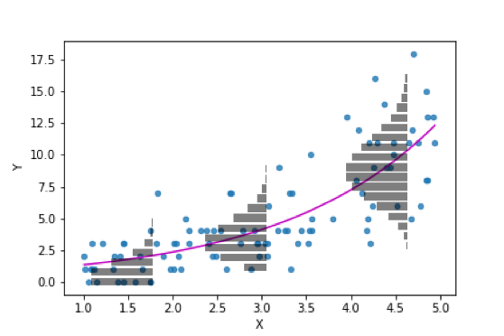

## Overdispersion

We generally use the Poisson distribution when we are dealing with counts. Poisson is used to model a positive, integer response variable. Some examples ow when we could use Poisson include the number of insect species present in a tree, number of bacteria in water, or some more complex questions, for example, is plant abundance influenced by presence of herbivore insects, or is flock size influenced by resource availability.

Those are all generally good examples of when to use Poisson, however, Poisson regression assumes that the mean $\lambda_i$ is equal to the residual variance.

This is different from the linear models where we have homoscedasticity (equal variance, denoted by $\sigma^2$ ), independently of the expected value of $y_i$. In the case of Poisson:

-   $\lambda_i$ is the expected value

-   $\lambda_i$ is the variance

Compare the following two figures.

Figure 1: Linear model (normal distribution of residuals)

```{r message=FALSE}
#| echo: false
#| warning: false

library(ggplot2)
  x5 <- runif(100, 0, 60)
  ey <- 10 + 1*x5 
  eps <- rnorm(100, 0, 3)
  y5 <- ey + eps
  df5 <- data.frame(x5, y5)
  lm_fit <- lm(y5 ~ x5, data = df5)
  
  k <- 2.5
  sigma <- sigma(lm_fit)
  ab <- coef(lm_fit); a <- ab[1]; b <- ab[2]
  
  x5 <- seq(-k*sigma, k*sigma, length.out = 50)
  y5 <- dnorm(x5, 0, sigma)/dnorm(0, 0, sigma) * 3
  
  x0 <- 5
  y0 <- a+b*x0
  path1 <- data.frame(x = y5 + x0, y = x5 + y0)
  segment1 <- data.frame(x = x0, y = y0 - k*sigma, xend = x0, yend = y0 + k*sigma)
  x0 <- 20
  y0 <- a+b*x0 
  path2 <- data.frame(x = y5 + x0, y = x5 + y0)
  segment2 <- data.frame(x = x0, y = y0 - k*sigma, xend = x0, yend = y0 + k*sigma)
  x0 <- 35
  y0 <- a+b*x0 
  path3 <- data.frame(x = y5 + x0, y = x5 + y0)
  segment3 <- data.frame(x = x0, y = y0 - k*sigma, xend = x0, yend = y0 + k*sigma)
  x0 <- 50
  y0 <- a+b*x0 
  path4 <- data.frame(x = y5 + x0, y = x5 + y0)
  segment4 <- data.frame(x = x0, y = y0 - k*sigma, xend = x0, yend = y0 + k*sigma)

   ggplot(df5, mapping = aes(x=x5, y=y5)) + 
    geom_point(color="#446E9B", alpha = 0.5) + 
    geom_smooth(method='lm', se=FALSE, color="#D47500", alpha = 0.5) + 
    geom_path(aes(x,y), data = path1, linewidth = 1, color = "#3CB521") + 
    geom_path(aes(x,y), data = path2, linewidth = 1, color = "#3CB521") + 
    geom_path(aes(x,y), data = path3, linewidth = 1, color = "#3CB521") +
    geom_path(aes(x,y), data = path4, linewidth = 1, color = "#3CB521") +
    geom_segment(aes(x=x,y=y,xend=xend,yend=yend), data = segment1, linewidth = 0.6, 
                 color = "#CD0200") +
    geom_segment(aes(x=x,y=y,xend=xend,yend=yend), data = segment2, linewidth = 0.6,
                 color = "#CD0200") +
    geom_segment(aes(x=x,y=y,xend=xend,yend=yend), data = segment3, linewidth = 0.6,
                 color = "#CD0200") +
    geom_segment(aes(x=x,y=y,xend=xend,yend=yend), data = segment4, linewidth = 0.6,
                 color = "#CD0200") +
    theme_classic()
 
```

Figure 2: glm (Poisson distribution of residuals)



This essentially shows that on the Poisson distribution, the variance depends on the predicted (or expected, or mean) value.

## So, what is the issue?

More often than not, the residual variance of is larger that the expected value. This is called over dispersion.

We can use a package called `performance` to check for it. So, that is a great thing! It is pretty easy to use.

After you run a model, you can simply do the following:

```{r}
#| eval: false

performance::check_overdispersion(model)
```

But, to make matters worse, overdispersion is far from the only issue when working with counts. Oftentimes we have more zeroes than expected

## Zero inflated data

Simply told, zero inflation happens when there are more zeroes in the response variable, than expected under the Poisson distribution (or, if we are working with other distributions, under other distributions).

Usually we have both issues, zero-inflation and overdispersion

::: callout-warning
## Think about it 🧠

We have discussed this, but think about reasons why we have zero-inflated data and overdispersion (more variance in the residuals than expected). Think particularly about your research topic and try to figure out if there are systems that would see such overdispersion and zero inflation
:::

Fortunately, testing it is as easy as testing for overdispersion.

```{r}
#| eval: false

performance::check_zeroinflation(model)
```

## Let's test for over-dispersion and zero-inflation

We will be working with the same example from class. We are exploring horseshoe crab data (available at: <https://users.stat.ufl.edu/>). You can download the data from Canvas (`crabs.txt`)

Here is an image of horseshoe crabs:

![Photo of two nesting pairs of horseshoe crabs at Seahorse Key, Florida, U.S.A. The females (F; the female on the right is partially buried) and their attached males (A) are indicated. One of the pairs has attracted no satellites (so the satellite group size is 0) whereas the other has attracted four satellites (the satellite group size is four). An unpaired male is approaching the group but he was not included as a member of the group since he was not touching the female, the attached male or a satellite that was touching the female or attached male.](images/clipboard-3226506163.png)

Photo and caption taken from Brockman et al 2017: <https://www.sciencedirect.com/science/article/pii/S0003347217303469>

In these crabs, females release pheromones and as a result a male attaches to the female using claws, and releases sperm. While this happens, other males (called satellites) follow the pair and try to also fertilize eggs. Let's start by doing the following:

1.  Download the dataset
2.  Read it into R (it is a .txt file, so use the `read.table` function. Make sure to set header as true!)
3.  Explore it (use `head`, `str` or `summary`)

These are the variables:

-   sat: Number of males that surround a female. This includes both attached and satellite males.

-   Weight: Female weight

-   Width: Carapace width,

-   Color: Female color;

    ```         
    1- light medium, 2 - medium, 3 - dark medium, 4 - dark
    ```

-   Spine: Female spine condition

    ```         
    1 - both good, 2 - one worn or broken, 3 - both worn or broken
    ```

The data is originally published in: Study of nesting horseshoe crabs (J. Brockman, Ethology, 1996).

After we explored the data, hopefully you noticed that we need to change two variables to factor:

4.  Change color to factor and change spine to factor

## Data analysis (Poisson)

Now, we will analyze the data. Let's assume you think Poisson is **always** correct when dealing with counts. We will run the same models and analysis as in the lecture.

We are wondering whether the color of the female has an effect on the amount of males it can attract.

::: callout-important
## Assignment question 1

1.  Write your null and alternative hypotheses.
2.  Run a Poisson `glm` with color as the explanatory variable and satellites as the response variable, and print the summary
3.  Run an Anova (remember, use the car package Anova function)
4.  Make a statistical decision (reject, or fail to reject)
5.  If you reject the null, then run a post-hoc test (you can use `emmeans`) and describe the results
6.  Write a "scientific" or "biological" conclusion
7.  Plot the estimated mean and CI's for each color. The x axis should be color, and the y axis should be number of satellite males. Use a point to represent the mean, and a CI to represent the confidence intervals. (you may need to google this, as we haven't done it before, but I trust you can figure it out)
:::

In other labs, you would have been done at this point. Actually, our Poisson lab had residuals that were very over-dispersed. But now, we know better, and we will check for overdispersion and zero-inflation

::: callout-warning
## Be aware!

In reality, we would test for over-dispersion and zero-inflation right after running the glm. No need to run `Anovas` or any other analyses if the data is severely over-dispersed.
:::

OK, so, let's check for over dispersion and zero-inflation

::: callout-important
## Assignment question 2

1.  Use the package `performance` and test for over dispersion and for zero inflation
2.  When you check for over-dispersion you get a p-value. This means you are running a test. What is the null hypothesis and what is the alternative hypothesis of this test?
:::

Sometimes it is hard to identify exactly what is zero-inflation. The `check_zeroinflation` function compares the expected number of zeroes with the observed ones. However, it is up to you to decide if the observed difference is acceptable or not. In this case, the difference is so large, that it is obvious that we have many more zeroes than expected.

## What next?

At this point you probably realized that we have over-dispersed residuals and way more zeroes than expected under a Poisson distribution. And we need to solve for it, particularly because it is affecting our p-value estimates and therefore our inferences.

We will explore some ways you can solve this.

### Quasipoison

Using a "quasipoisson" distribution is a good way to deal with overdispersed residuals. This distribution is similar to poisson, but the residual variance is $\lambda_i \phi$ where $\phi$ is a variance inflation factor. This helps with the variance estimations, but does nothing for zero inflation.

In this case, we would skip quasipoisson because of the zero-inflation and go straight to the next one. But, this is an assignment, so, we won't skip it.

::: callout-important
## Assignment question 3

1.  Run the same `glm`, but use the quasipoisson distribution this time, and print the summary
2.  Use the package `performance` and test for over dispersion and for zero inflation
:::

Notice how the quassipoisson summary gives you no AIC value? When there is overdispersion, our likelihood values are also affected.

If we are using a quasipoisson distribution to test multiple models then we need to use a QAIC (QuassiAIC) instead of AIC. The QAIC equation includes a $\hat{c}$ (you will generally see this described as c-hat), which is a variance inflation factor:

$$
QAIC = \frac{-2 * log-likelihood}{\hat{c}} + 2 * K
$$

You can estimate c-hat using the `AICcmodavg` package, but that package won't estimate the QAIC of any quasipoisson model (they are purists who believe this shouldn't be done). Anyway... pretty long tangent, and the take-home message is, quassipoison doesn't fix everything and can be a pain to use... let's skip to some **generally** better alternatives.

### Negative binomial

This is a distribution similar to Poisson. It is a discrete probability of only positive integers. This makes it great for counts. The difference is that while Poisson has a single parameter ($\lambda$) that represents both mean and variance, the Negative binomial has two: $\mu$ and $\theta$.

The mean or expected value is $\mu$ while the variance is $\mu + \frac{\mu^2}{\theta}$ . This makes sense, look at the first figure of the Poisson distribution (Fig 2), as the expected value (AKA mean) increases, so does the variance. When $\theta$ is very large, then negative binomial and Poisson converge. When we run a negative binomial glm, the link function is the same, the only thing that changes is that $\theta$ is estimated and the residuals are expected to have a negative binomial distribution.

Unfortunately, the negative binomial distribution is not included in the glm function. We need to use the `MASS` package. And we run it using the `glm.nb` function. This function works the same as `glm` but we do not have to specify the distribution.

::: callout-important
## Assignment Question 4

1.  Run a negative binomial glm with color as the explanatory variable and satellites as the response variable, and print the summary
2.  Use the package `performance` and test for over dispersion and for zero inflation. Compare it to the results from the Poisson model. How about the zeroes?
3.  Run an Anova (remember, use the car package Anova function)
4.  Make a statistical decision (reject, or fail to reject)
5.  If you reject the null, then run a post-hoc test (you can use emmeans) and describe the results
6.  Write a "scientific" or "biological" conclusion
7.  Compare the conclusion you got using this distribution to the one you got with the Poisson distribution
8.  Which one do you think is better?
:::

The negative binomial is usually the best compromise. But we will explore some other potential solutions.

### Hurdle models

Hurdle models are a "two-in-one" situation.

We essentially run a binomial model (with a logit link) where the response variables are either 0 (absence of satellite males) or 1 (presence of satellite males). Then, we use a count model (with either poisson distribution or negative binomial) to estimate the expected number of satellite males.

Why do this? This is when the process that creates zeroes is independent from the process that creates counts. In other words, when the count-based process cannot generate zeroes, but they are generated by a different process.

In biological terms, that would mean that females that release pheromones have **some number** of satellite males, while females that release pheromones all have **at least** one satellite.

This is how we run a hurdle model:

We need the `pscl` package for this.

To run a hurdle model with a Poisson distribution we do:

```{r message=F}
#| echo: false
#| warning: false

library(pscl)

crabs<-read.table("Crabs.txt",header=T)
crabs$color<-factor(crabs$color)
crabs$spine<-factor(crabs$spine)

```

```{r}
hurdmod<-hurdle(sat~color|color, data=crabs)
summary(hurdmod)
```

Here we are running two mini models, and each model can have its own set of covariates (separated by `|`). Covariates left of the `|` are part of the count model, while covariates to the right are part of the hurdle model (binomial).

To run it with a negative binomial distribution:

```{r}
hurmodnb<-hurdle(sat~color|color, data=crabs, dist="negbin")
summary(hurmodnb)
```

Like I said before, you can use different covariates (explanatory variables) in the count model and in the hurdle model.

::: callout-important
## Assignment Question 5

1- Run another hurdle model (with Poisson distribution) in which the explanatory variable for counts is color, but with different explanatory variables for the hurdle portion of the model. Check the data and make a decision on what explanatory variable (or variables) to use.

2- Run the same model using negative binomial as the count distribution

3- Use AICcmodavg to estimate the AICc of the four hurdle models, and decide which one is the best model.
:::

**We CANNOT test these models for overdispersion and zero inflation. But we do know the count residuals do have some overdispersion problems, so a negative binomial distribution is probably best.**

As I said before, these models are the best when the processes that cause zeroes are independent from the ones that cause counts. If the processes aren't independent (i.e., a crab with pheromones may not attract any males and therefore have 0 satellite males), then a mixture model is best.

### Zero-inflated Mixture models

These are similar to hurdle models. We have two mini-models, but the count portion of the model is allow to have zeroes as well.

We run zero-inflated mixture models just like we did hurdle models, but we use the `zeroinf` function rather than the `hurdle` one.

::: callout-important
## Assignment Question 6

Run the same four models that you ran for the last section (hurdle models) and compare them to the hurdle models.
:::

Again... **We CANNOT test these models for overdispersion and zero inflation. But we do know the count residuals have some overdispersion problems, so a negative binomial distribution is probably best.**

Now... sometimes when we run hurdle models and zero-inflated mixture models we essentially get the same result. We essentially get the same coefficients, same Likelihood, same AICc, same everything. If this is the case, then the processes that causes zeroes and ones is probably independent and we are better off with the hurdle models.

::: callout-note
## Package glmmTMB can also run hurdle and mixture models

You can run these models in package glmmTMB. This can be helpful if you are running multiple models that you want to compare. I shy away from overusing this package because it tends to have issues (as you experienced when trying to download and run it!) I do favor it for mixed effects models (next week's lab!).

The issues are related to the fact that it has a lot of dependencies, so it needs to download tons of packages to function. And if one of those packages gets an update, it might result in glmmTMB not working with that partiuclar version. Finally, it usually requires you to have a fairly recent version of R, and constantly updating R can be a pain and unnecessary most of the time
:::

## Which distribution/model should I pick?

There is not an easy and straightforward answer to this question (sorry!). A potential answer is... any model that is "*good enough*". I know I would definitely not pick the poisson glm (or the quasi-poisson one), and if I had my pick, I would probably go with a Hurdle binomial model in this case. However, I will tell you how **NOT TO** pick a model. You should not explore all "viable" models and go with the one that has the most interesting results or the one that is more publishable! So... how do we choose one?

I like to use a method to choose one. I also like to define the method "a priori" in order to not introduce my bias when selecting a model.

In this case, you will use AICc and make an AIC table and use that to choose the best model. **BUT BE AWARE!** This result does not tell us is the model is **good**. It only tells us if it's the best of the bunch (they could all be terrible, and you would still get a "best of the bunch" model). In other words: "The AIC comparisons only tell us which of our models is “best”, but they do not tell us if any of the models are actually any good" (Fieberg. Statistic for Ecologists. <https://fw8051statistics4ecologists.netlify.app/>).

We should do a a thing caled **GOODNESS OF FIT** which will tell us if our model is good. In next week's lab you will do a goodness of fit test for this dataset (and your best model) and will also do model validation. You will also do that for the beaches mixed effects model example that we ran in class.

Meanwhile, we will only choose an AICc model, and assume it is good (FYI... most published papers rarely have goodness of fit tests, and oftentimes just run a single model with an assumed distribution).

::: callout-important
## Assignment Question 7

Using the AICcmodavg package estimate AICc and $\Delta AICc$ for all of the models you ran (except quasipoisson) and publish a table.

**Be aware!** AICcmodavg won't allow you to use the `aictab` function on models that were obtained using different functions (`glm`, `glm.nb`, `hurdle`, `zeroinf`). So, I recommend you use `AICcmodavg::AICc` to estimate the AICc for each model, and then construct your own AIC table. Your table should include a column for k, which is the number of parameters (or coefficients). You can use the `summary(model)` function in order to count the parameters (or run `aictab` for a single model if you want the package to count them for you).

If you use `modelname$coefficients` to count the number of parameters you may be undercounting, as $log\theta$ is essentially a coefficient in the negative binomial distribution.

**Final question:** Explore and interpret the results using the best model.
:::
