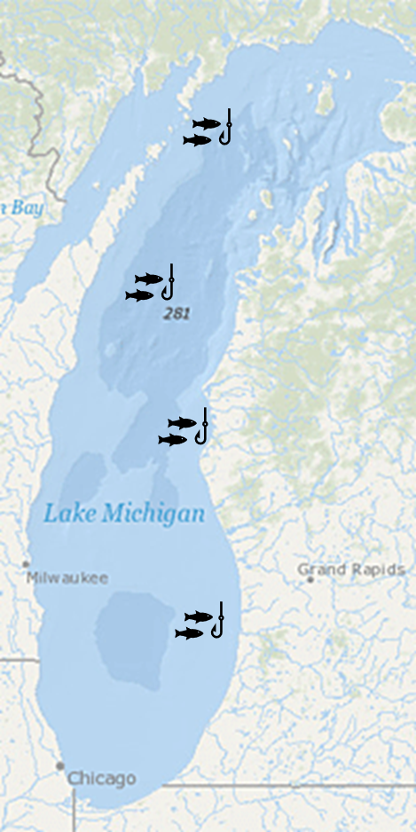

## Fish and mercury

During our initial linear mixed effects models lecture I gave an example of mercury concentration in fish (walleye). We will revisit that example, and hopefully, the logic behind mixed effects models will be clearer!

While last time we looked at the example of Walleye in a Lake Michigan, this time we will look into a completely different example. Let's assume we are still working with Walleye (or any other fish species of your choice, you can even rename it something else if you wish). We are still interested in mercury concentration based on size. However, we are looking at a completely different water body. This water body is only 20 acres!

Because, this water body is only 20 acres, we don't think there is any spatial heterogeneity, so, we don't have to worry too much about a spatial component. This makes our lives easier! We can simply set a net, catch the fish, and measure them without having to worry about mixed effects (for the time being).

Now, before we look at the data, we need to generate it. I don't have a great dataset for this, so we will be simulating the data in this study and in this whole assignment!

::: callout-warning
## My data doesn't look like yours!

This is OK. As we are simulating data, each run will be unique. This means each time you run a chunk of code it will give you a different result. Also, when you render your document, you will get a different result each time (each render runs each code chunk).

If you want to be able to replicate your example, you could set a seed `set.seed()`. I won't be setting a seed for my example,.
:::

::: callout-tip
## Simulating data

If you are doing complex models, I always recommend you simulate some data (with known parameters) to test the models. This way, you know if the model is doing what you want it to do, and how close the estimates are to the real parameters! We will be doing that in this assignment.
:::

### Fish sampling

The first step in our experiment is setting the net in the small-ish pond. The net should catch about 50 individuals. We will simulate our sampling using the following:

```{r}
n<-rpois(1,50)
n
```

Where n is the number of fish we got. You can run that line multiple times and see that we get a different number each time!

Now, let's check the size of our fish! Our net **won't** catch any individuals under 20cm and fish size is uniformly distributed (in this example), with the largest fish being 60 cm.

Let's check the size of teh fish we caught:

```{r}
size<-runif(n,20,60)
print(size)
```

Finally, let's simulate the mercury concentration. It is dependent on the size of the fish. Let's remember the linear model equation.

$$
y \sim \beta_0+\beta_{1}x_i + \epsilon
$$

Where,

$$
\epsilon \sim Normal(0,\sigma^2)
$$

Let's simulate the data for the mercury concentration.

We'll use 0.5 as our $\beta_0$ and 0.018 as our $\beta_1$ and 0.0064 as our variance (we will use standard deviation, so the square root).

Let's explore the data we obtained:

```{r}
 Hg<-0.5 + 0.018*size + rnorm(n,0,0.08)
 plot(Hg~size)
```

Looks good! Let's make a data frame with all of our data:

```{r}
df1<-data.frame(size=size,Hg=Hg)
```

And let's run a simple linear model:

```{r}
model1<-lm(Hg~size,data=df1)
summary(model1)
```

::: callout-important
## Assignment question 1

Look at the summary of your model, and answer: was the model good at estimating $\beta_0$ (intercept), $\beta_1$ (size) and the residual standard error?

Be aware that the results will change after you render, that is OK. You can leave your original answer here. Again, you can set the random seed, and have the results be reproducible if you want with `set.seed()` and putting a number.
:::

Finally, we can plot it:

```{r}
library(ggplot2)
pred1<-predict(model1,df1,interval = "c")
dfplot<-cbind(df1,pred1)

ggplot(data=dfplot, aes(x=size,y=Hg,ymin=lwr,ymax=upr))+
  geom_point()+
  geom_line(aes(y=fit))+
  geom_ribbon(alpha=0.2)+
  theme_classic()


```

## Multiple sites

Let's assume that we have three other ponds of the same size. So, we are going to do the same exact thing as we did in the first pond.

Let's also assume that the relationship (the covariance, or the slope) of size and Hg concentration is the same in all three sites. So, now, the equation would be:

$$
y \sim \beta_0+\beta_{1}x_{1i} + \beta_{2}x_{2i} +\beta_{3}x_{3i} +\beta_{4}x_{4i} \epsilon
$$

where,

$$ \epsilon \sim Normal(0,\sigma^2) $$

So, we have to come up with a value for $\beta_2$, $\beta_3$, and $\beta_4$,

::: callout-tip
## Simulating Data 2

The way I am simulating this dataset is a bit unconventional. Usually you would come up with an equation for each population (or have a random function that selects the parameters). You would very rarely do it this way, but I am trying to follow the linear regression equations to simulate the data.
:::

In this case, the values I am giving the betas are:

$\beta_2$: 0.025

$\beta_3$: 0.01

$\beta_4$: 0.1

Remember, a $\beta_j$ is the difference in the intercept between group j and group 1.

First, let''s create a vector with the betas

```{r}

beta<-c(0.025,0.01,0.1)

HgDat<-list(site1=df1)
```

Then, let's name our first pong region "A":

```{r}
df1$region<-"A"
```

And create a list where we will store all of our results:

```{r}
HgDat<-list(site1=df1)
```

Finally, we do what we did with site 1:

1.  "Set up the net" and "catch" our fish (n)
2.  Obtain the size with a uniform distribution
3.  Estimate Hg using the new beta
4.  Name the site
5.  Save it as a data frame

```{r}

for(i in 1:3){
 n<-rpois(1,50) 
  size<-runif(n,20,60)
  Hg<-0.5 + 0.018*size + rnorm(n,0,0.08)+beta[i]
  Region<-rep(LETTERS[i+1],n)
  HgDat[[i+1]]<-data.frame(size=size,Hg=Hg,region=Region)
}
```

We stored all the data as a list, let's now backtransform it to a data frame:

```{r}
HgDat_df<-dplyr::bind_rows(HgDat)
HgDat_df$region<-as.factor(HgDat_df$region)
head(HgDat_df)
```

Before we continue, I recommend you open the Hg_Dat dataframe and explore it.

Let's now run the model:

```{r}
model2<-lm(Hg~size+region,data=HgDat_df)
summary(model2)
```

and plot the data:

```{r}
pred2<-predict(model2,HgDat_df,interval = "c")
dfplot<-cbind(HgDat_df,pred2)

ggplot(data=dfplot, aes(x=size,y=Hg,ymin=lwr,ymax=upr,col=region,shape=region,fill=region))+
  geom_point()+
  geom_line(aes(y=fit))+
  geom_ribbon(alpha=0.2)+
  theme_classic()
```

::: callout-important
## Assignment question 2

Look at the summary of your model, and answer: was the model good at estimating $\beta_0$ (intercept), $\beta_1$ (size), $\beta_2$, $\beta_3$, $\beta_4$ and the residual standard error?

Run an Anova (in this case technically an Ancova, as there is covariance), and if there are region is significant, do a pairwise comparison.

We **know** (because we set the parameters) that every site is different. Is your pairwise comparison able to identify these differences among ALL groups? If it can't, explain why you think it is failing at doing so.

**Finally,** run a different model with the same exact data where there is an interactive effect between site and region (AKA, slope is different). Compare the AIC values of both models? Did AIC correctly choose the additive model as the "best model"?
:::

## Back to the Great Lakes

Let's go back to our original Michigan Lake example

{width="217"}

Here, we know there is a spatial effect of where we set our nets on the amount of mercury (still, the slope is the same). We will be placing four nets

And we don't want to bias our estimate by choosing where to place the nets.

Also, we don't care what site has a higher concentration of mercury. We care about the concentration lake-wide **and** about the variance introduced by the spatial heterogeneity.

Also, we don't want to estimate a $\beta$ for every net, we simply want to estimate the variance introduced by the spatial component (we don't want to estimate 99 $\beta's$ if we are setting 100 nets!). So, we are doing a mixed model (with a mixed intercept). As a reminder, this is the equation:

$$ Hg_{ij} \sim \underbrace{(\beta_0 +\underbrace{\gamma_j}_{\text{Random intercept}})}_{intercept} + \underbrace{\beta_1size_{i}}_{slope} +\underbrace{\epsilon}_\text{ind var} $$

where: $\gamma_j \sim Normal(0,\sigma_\gamma)$ and $\epsilon \sim Normal(0,\sigma)$.

Let's say the variance introduced by the selection of site is 0.0625 (standard deviation of 0.25).

Then, we can create an object called $\gamma$:

```{r}
nsites<-4
gamma <- rnorm(n=nsites,mean=0,sd=0.25) 
```

Notice how I am not selecting the $\beta's$ values? All I am providing is the standard deviation (think of this as teh variability introduced by where you place the nets. And using rnorm (random normal) I am obtaining 4 random values that affect the intercept. This is why this is a random component of the intercept.

Each time you run that line, you will get different values, because it is a random process (different than when we had 4 sites!)

```{r}
HgDatmixed<-list()
for(i in 1:4){
 n<-rpois(1,50) 
  size<-runif(n,20,60)
  Hg<- (0.5+gamma[i]) + 0.018*size + rnorm(n,0,0.08)
  Net<-rep(LETTERS[i],n)
  HgDatmixed[[i]]<-data.frame(size=size,Hg=Hg,net=Net)
}
HgDatmixed<-dplyr::bind_rows(HgDatmixed)
HgDatmixed$net<-as.factor(HgDatmixed$net)
```

Now, let's run the mixed model:

```{r}
library(glmmTMB)

m3<-glmmTMB(Hg~size +(1|net), data=HgDatmixed)

summary(m3)

```

::: callout-important
## Assignment question 3

Look at the summary of your model, and answer: was the model good at estimating $\beta_0$ (intercept), $\beta_1$ (size), and $\gamma$?
:::

Now, let's plot it. To plot it, we need two steps. First, we need to plot the data with the random intercepts:

```{r}
preddata3 <- HgDatmixed
preddata3$predHg <- predict(m3, HgDatmixed)

plot2<- ggplot(data=HgDatmixed, aes(x=size, y=Hg, col=net, shape=net)) +
    geom_point() +
    geom_line(data=preddata3, aes(x=size, y=predHg, col=net))+
   theme_classic()

plot2
```

However, we also want to estimate the relationship between size and Hg for a "typical" individual. To do so, we set all random effects to 0 (we only estimate the fixed effects). We can do so with:

```{r}
preddata3$predHg_population <- predict(m3, preddata3, re.form=~0)
```

See how we added `re.form=~0`. That's how we tell the function to predict the values given no random effects. We add this to our plot:

```{r}
plot2<- ggplot(data=HgDatmixed, aes(x=size, y=Hg, col=net, shape=net)) +
    geom_point() +
    geom_line(data=preddata3, aes(x=size, y=predHg, col=net))+
    geom_line(data=preddata3, aes(x=size, y=predHg_population),
            col='black',linewidth=1.5) +
   theme_classic()

plot2
```

::: callout-important
## Assignment question 4

Run all the code in the "back to the Great Lakes" section again (actually do it 2 or 3 more times, no need to re-write it, just run it again). You should see how the random intercepts change each time you run them. Why do you think that happens?

Repeat the "back to the Great Lakes" section again, but this time you are setting 25 nets. Look the summary of that new model, and answer: was the model good at estimating $\beta_0$ (intercept), $\beta_1$ (size), and $\gamma$?

Finally, repeat that experiment, but this time there is **no random** intercept, but there is a **random slope. Show the summary of the model**
:::

## Model cross-validation

We can use cross-validation to test whether our model is good. To run it, we need to run the model as a linear model (i.e., just fixed effects):

```{r}
library(caret)
ctrl <- trainControl(method= 'cv', number= 10)

tr <- train(Hg~size +net, data=HgDatmixed, trControl= ctrl,method="lm")

tr
```

We obtain a value of RMSE. The good thing is that this value actually has meaning and can be interpreted! It is the root mean square variation. It essentially measures the average differences between predicted and observed values. And it is in the same units (mg of Hg in this case). In this case the average difference was of 0.077. Whether that is good or bad depends on your system, but you should have enough knowledge of your system to reach a conclusion!

------- Now we are done with linear models! ——–
