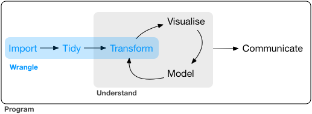
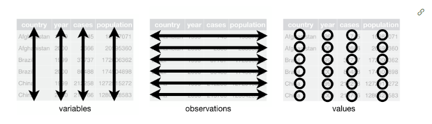
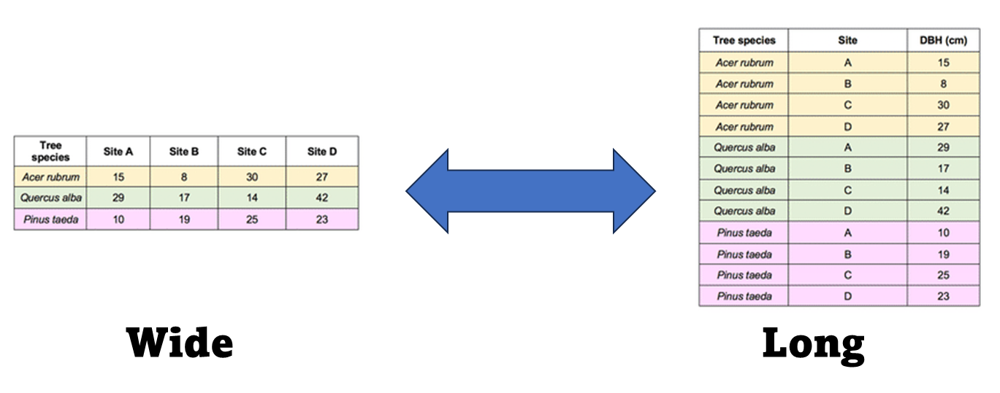

## Next week

Next week we will talk about **Generalized** Linear Models and might start looking at **Mixed** effects models as well.

More importantly, so far I have been telling you *what* to run and *when* to run it. Going forward it will be your decision to think what test or model to run depending on what the *research question* is. I hope that at that point everything will start to make more sense.

Please, send me emails or see me if you have any questions of whether you are making the "right" models or tests!

## This assignment

This assignment was written based on the following literature:

1.  R for Data Science (2e) written by Hadley Wickham, Mine Çetinkaya-Rundel, and Garrett Grolemund. And available online (for free!) at: <https://r4ds.hadley.nz/> Please be aware that this book is the **second** edition and has changed dramatically from the first edition. I highly recommend it! Even if you have read the first edition
2.  The original "Tidy Data" paper: Hadley Wickham. 2014. “Tidy Data.” *The Journal of Statistical Software* 59 (10). <http://www.jstatsoft.org/v59/i10/>.
3.  Scott J. 2021. Data Science in R: A Gentle Introduction: <https://bookdown.org/jgscott/DSGI/>
4.  The Tidy Data vignette: <https://tidyr.tidyverse.org/articles/tidy-data.html>
5.  The dplyr vignette: <https://dplyr.tidyverse.org/>
6.  Endless video like the following: <https://www.youtube.com/watch?v=1ELALQlO-yM&ab_channel=PositPBC>

I hope this is a useful assignment for you, and I highly recommend you check all of those tools! Hadley Wickham is the chief scientist at RStudio and he is the creator of ggplot, dplyr, and many other great tools.

The tidyverse is an opinionated [collection of R packages](#0) designed for data science. All packages share an underlying design philosophy, grammar, and data structures. The tidyverse is “opinionated” in that it is fairly rigid about input types and output types, and most functions are designed to accomplish one specific task. This makes it easier for users to avoid some of the sneakier bugs that are hard to notice (for example: different output types of the apply functions). It also tends to make analyses more reproducible.

The packages are:

1.  ggplot2: You have been using this already!
2.  dplyr: In my mind the most important package in the tidyverse. Plenty of tools
3.  tidyr: Make tidy data: every variable goes in a column, and every column is a variable
4.  readr: I rarely use this one, but you can read csv's and other dataframes into "tibbles" (tidy's idea of a data frame)
5.  purrr: Provides a set of tools for working with vectors and functions
6.  tibble: Modern re-imagining of the data frame, keeping what time has proven to be effective, and throwing out what it has not
7.  stringr: Helps when working with strings (aka words and letters)
8.  forcats: Solves some issues with factors and provides tools to work with them (remember, a factor is a "grouping variable"

You can install all of them using the following:

```{r eval=F}
install.packages("tidyverse")
```

You can also load ALL of them using the following:

```{r eval=F}
library(tidyverse)
```

::: callout-warning
## What are all these conflicts?

When you load the package, you will see a lot of conflicts. This is normal in `r` and it becomes pretty common the more packages you use.

Sometimes, different packages name their functions the same (for example `some()` is a function on dplyr, as well as a basic function in the package car).\
If you want to force `r` to use the function in the package `car` you can code it the following way: `car::some()` and if you want to use the purrr versions use: `purrr::some()`

I recommend doing this, particularly if you are collaborating on a project, using version control, creating websites or apps.
:::

While loading all the packages at once is useful, I recommend you load the specific packages you want!

## Additional tidy packages

I also recommend you use the package `lubridate` if you ever work with dates!

## My thoughts

Before continuing I do want to admit to the fact that I generally prefer a combination of baseR and the tidyverse, and I will continue supplying code in `baseR`. I also really enjoy using `data.table` which is faster and has some great functionality, and I recommend you check it out after you master tidy. However, I do recognize that a majority of users prefer the tidyverse, and have fully transitioned to using it.

Particularly, most users find that the syntax can be easier to understand and write, as it is written from left to right (instead of inside-out). You are free to use any package or any syntax that works best for you.

While early in the semester I had some sections in which I expected you to run some specific code (with the idea of showcasing some of `baseR` syntax), going forward the focus will be in the results. If you identify the analysis needed, and you do it, it will be correct! No matter hoe you get there!

::: callout-tip
## Tibble, data.frame, what's the difference?

I don't want you to focus on this too much. These two types of objects have different structures, and the tidyverse uses tibble. There isn't anything too fundamentally different between them, so for the time being, just think of them as equal. I will continue to refer to them as data.frame
:::

## Data Wrangling

There are three main parts for data analysis:

1.  Managing (or Wrangling) the data
2.  Analyzing it (vi visualization and modeling)
3.  Communicating the results

I like this figure from the **first edition** of R for Data Science: <https://r4ds.had.co.nz/index.html>

**note: please make sure you are reading the html or published online document to see the figure**



We have been working on visualizing and modeling data (mostly modeling though). Now, we need to focus on *wrangling* data.

As you see in the image, there are three main important sections when wrangling data:

1.  Import
2.  Tidy
3.  Transform

### Import

::: callout-tip
## read.csv vs read_csv

In the last \~5 years there has been a migration from `read.csv()` to `read_csv()`. Main differences are: 1) `read.csv()` doesn't require a package and creates a data.frame, while `read_csv()` creates a tibble
:::

You have so far been importing data using the `read.csv` function by saving the file in the same directory as the `quarto` file. However you should be able to do all of the following:

-   Create a project and load files from within the project

-   Add a folder to the project and read files from the folder, not the `root` of the directory

-   Open an R script (not quarto, not in a project) and import a dataset

-   Change the working directory and check the working directory from within `R`

If you can do all of that, congrats! You have 1/3 of the skills needed to wrangle data in `R` 😃 and you can **skip the first assignment question.**

If you don't know how to do these things, here is your first **assignment question**: go to <https://www.statology.org/import-csv-into-r/> and follow the first two methods and make sure you can do all these things

### Tidy and transform

Let's talk about probably the biggest change using tidy.

For this we will use a "pre-loaded" data set in R. The `iris` dataset. This dataset is included with `baseR` and you can call it using the `data()` function:

```{r}
data(iris)
summary(iris)
```

If we wanted to get a dataframe with only *setosa* species, add a new column where we multiply the width of the pedal by 10 (to change units) we would do the following in baseR:

```{r}
Setosa<-iris[iris$Species=="setosa",]
Setosa$widthm<-Setosa$Sepal.Width*10
mean(Setosa$widthm)
```

If we used the tidyverse

```{r}
library(tidyverse)
```

We would do the following:

```{r}
iris %>% filter(Species=="setosa") %>% mutate(widthm = Sepal.Width*10) 
```

So, there are two main differences. `tidy` reads "left to right", so, you filter the data, and the mutate it. But maybe the main difference is the use of a piping operator `%>%`.

R pipes are a way to chain multiple operations together in a concise and expressive way. They are so popular thar `R` introduced them to their base use as: `|>`.

Now, imagine you want to

1\) add the widthm column to the original dataset

2\) estimate all of the following for each of the three species **and** each of the columns:

Mean, median, maximum value, and minimum value.

That seems like a lot of coding using `baseR`! However, using pipes and the powerful dplyr, we can do the following:

```{r}
iris %>% group_by(Species) %>% mutate(widthm = Sepal.Width*10) %>% summarise_all(list(mean=mean,median=median,max=max,min=min))
```

### Wide and long data

One of the most important transformation is changing your data from wide to long format (or long to wide).

While we generally have this structure in our data:



If we have some repeated measures (think, an individual gets measured weekly), we can have each week be a column, or we can have a column named "week" and a column for the "value".

Think about the following example: You are traveling to four sites and measuring the diameter at breast height for 3 species of tree. You do this at four sites. There are two ways you can present these data:



Both can be useful! And we can go back and from using R.

```{r}
tree<-read.csv("trees.csv")
head(tree)
```

Let's make the dataset longer! We need to make all columns (except species) into two columns, one for the site, one for the value:

```{r}
treelong<- tree%>% pivot_longer(!Species,names_to = "site", values_to = "meanDBH")
head(treelong)
```

And let's make this "long" dataset into a wide form:

```{r}
treewide<- treelong%>% pivot_wider(names_from = "site", values_from = "meanDBH")
treewide
```

Easy! This will be useful for you in the future!

**Please read careful before starting to work on the assignment:** For this week's assignment, you need to go to: <https://bookdown.org/jgscott/DSGI/data-wrangling.html> and read chapter 6. Reality is, this "tutorial" and this book as well as the *R for Data Science* book are better written and have better information than what I could do for this class, and I think it will be more useful to you!. **If you are new** to `R` **and the** `tidyverse` your assignment I recommend you open a new r script and follow the "tutorial". You can ask me questions. The assignment will be to just let me know in Canvas whether you like this way (or baseR) better. **If you are experienced** in tidy, and you know the basics, then, I recommend you read chapter 17 <https://bookdown.org/jgscott/DSGI/probability-models.html>. (Actually, everyone should read it, if you have time). If you understand probability, then you understand statistics, whether they are frequentist, Bayesian, multivariate, etc. You can also read any other chapter if you find it more useful. Your assignment is telling me what chapter you worked on.

------------------------------------------------------------------------
