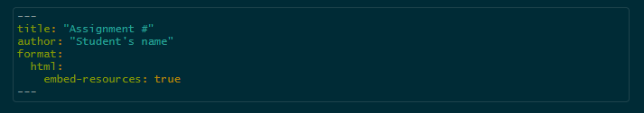
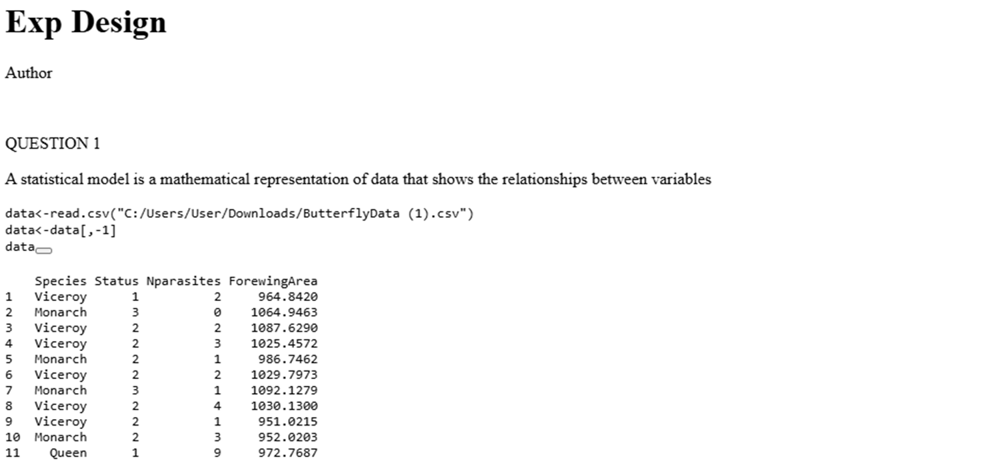

Make sure your headers have ALL of the following information:

I recommend you download this file and use the headers that I provide here.

Otherwise, I WON'T BE ABLE TO SEE YOUR PLOTS. Also, if you do not use these options, when you upload your html's, they will look like this:

In order for them to look nicer, add the `embed-resources` option.

## Use headers

You should answer the questions writing in quarto

And use the code to run it.
