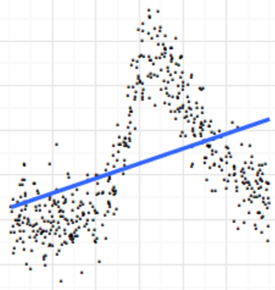
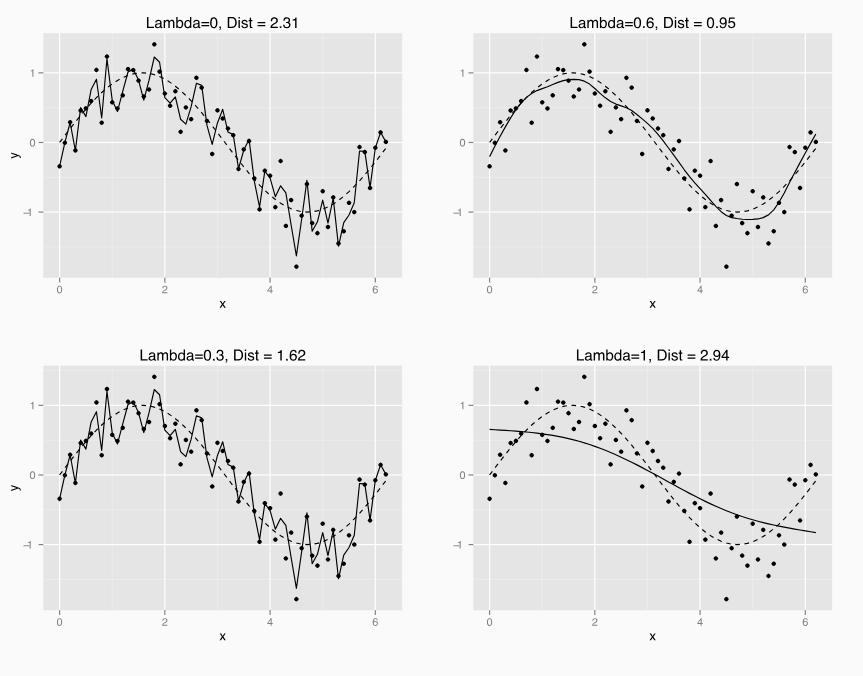
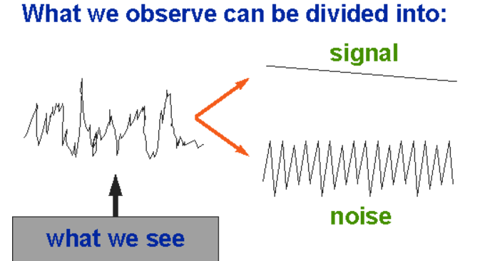
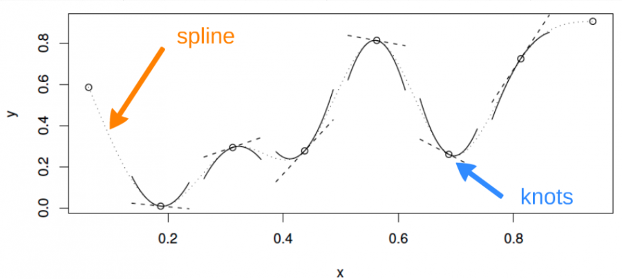
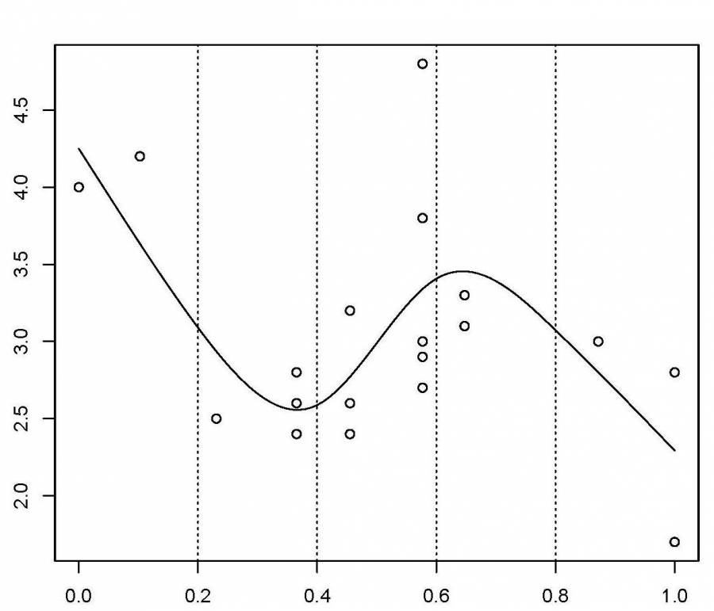
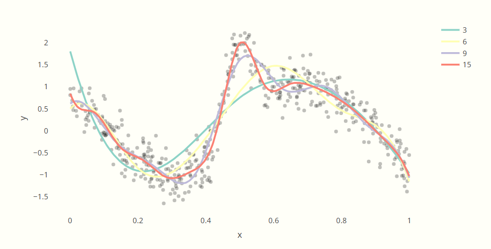
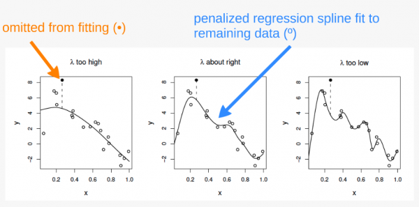
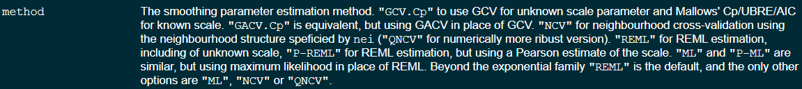
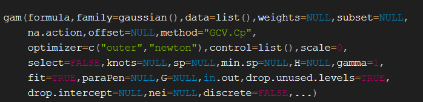

## Generalized Additive Models

As a general comment, they are being less used in data science (but still "state of the art" in many biological fields)

Machine learning is a general replacement

-   Understanding GAM's is a great way to understand Machine Learning

-   All your potential issues with GAM's (aren't we just overfitting? are worse with machine learning)

-   Machine learning models are data-driven rather than explicitly designed by humans

## Linear models

Linear models work great and are super powerful when assumptions are met!

```{r}

library(ggplot2)
library(cowplot)
x <- runif(500,0,5)
y <- 0 + 3.5 * x + rnorm(500, 0, 1)
mu <- 0 + 3.5 * x
resid <- y - mu
df <- data.frame(x = x, y = y, mu = mu, Residuals = resid)

ggplot(df, aes(x, y)) + 
  geom_smooth(method='lm', color = "#245D0B", size = 1.5) +
scale_y_continuous(expression(mu)) +
geom_point(color = "#D49950", alpha = 0.75)+
  theme_cowplot()


```

## What happens when they are not met?

Non normal error

```{r}
library(ggplot2)
library(cowplot)
x <- runif(500,0,5)
y <- -1 + 3.5 * x + rexp(500, 1)
mu <- -1 + 3.5 * x
resid <- y - mu
df <- data.frame(x = x, y = y, mu = mu, Residuals = resid)

ggplot(df, aes(x, y)) + 
geom_abline(slope = 3.5, intercept = 0, color = "#245D0B", size = 1.5) +
scale_y_continuous(expression(mu)) +
geom_point(color = "#D49950", alpha = 0.75)+
  theme_cowplot()

```

## What happens when they are not met?

Not homoscedastic

```{r}
library(ggplot2)
library(cowplot)
x <- runif(500,0,5)
y <- 0 + 3.5 * x + (rnorm(500, 0, 1)*(0.5*x))
mu <- 0 + 3.5 * x
resid <- y - mu
df <- data.frame(x = x, y = y, mu = mu, Residuals = resid)

lm1<-lm(y~x,data = df)

ggplot(df, aes(x, y)) + 
  geom_smooth(method='lm', color = "#245D0B", size = 1.5) +
scale_y_continuous(expression(mu)) +
geom_point(color = "#D49950", alpha = 0.75)+
  theme_cowplot()
```

No equal variance

## What happens when they are not met?



Non linear

## What can we do?

-   Sometime we can add a polygon term

-   Sometimes we can transform the data

-   GLM

-   Mixed model?

-   GAMS

## Example

We will work with a dataset from the *Quebec Centre for Biodiversity Science.*

If you want to work with it, you can load the ISIT dataset and look at it

This dataset is comprised of bioluminescence levels (`Sources`) in relation to depth, seasons and different stations

## Example

We will work with a dataset from the *Quebec Centre for Biodiversity Science.*

Load the ISIT dataset and look at it

```{r}
library(kableExtra)
isit <- read.csv("ISIT.csv")
kable(head(isit))
```

This dataset is comprised of bioluminescence levels (`Sources`) in relation to `depth`, `seasons` and different `stations`

What may affect bioluminiscence?

::: notes
bioluminiscence
:::

## Data analysis

Subset the data to only look at season 2.

Run a linear model:

```{r echo=T, eval=F}
linear_model <- lm(Sources ~ SampleDepth, data = isit2)

```

## Data analysis

```{r}
isit2 <- subset(isit, Season == 2)
linear_model <- lm(Sources ~ SampleDepth, data = isit2)
summary(linear_model)


```

::: notes
R squared?

P-values?

Is it good?
:::

## Plot the model

```{r}
data_plot <- ggplot(data = isit2, aes(y = Sources, x = SampleDepth)) +
    geom_point() + geom_line(aes(y = fitted(linear_model)), colour = "red",
    size = 1.2) + theme_cowplot()
data_plot
```

-   How does this look?

::: notes
This is why I aLWAYS have you plot the model
:::

## Plot

```{r}
data_plot <- ggplot(data = isit2, aes(y = Sources, x = SampleDepth)) +
    geom_point() + geom_line(aes(y = fitted(linear_model)), colour = "red",
    size = 1.2) + theme_cowplot()
data_plot
```

1.  There is a strong *non-linear* relationship between `Sources` and `SampleDepth`.

2.  The error is *not* normally distributed.

3.  The variance of the error is *not* homoscedastic.

4.  The errors are *not* independent of each other.

## Plot

```{r}
data_plot <- ggplot(data = isit2, aes(y = Sources, x = SampleDepth)) +
    geom_point() + geom_line(aes(y = fitted(linear_model)), colour = "red",
    size = 1.2) + theme_cowplot()
data_plot
```

How can we deal with this? In a non-GAM way?

::: notes
Have them discuss this
:::

## Plot

Let's diagnose this plot!

```{r}
data_plot
```

## Will compare that to:

```{r}
x <- runif(500,0,5)
y <- 0 + 3.5 * x + rnorm(500, 0, 1)
mu <- 0 + 3.5 * x
resid <- y - mu
df <- data.frame(x = x, y = y, mu = mu, Residuals = resid)

lm1<-lm(y~x,data = df)

ggplot(df, aes(x, y)) + 
  geom_smooth(method='lm', color = "#245D0B", size = 1.5) +
scale_y_continuous(expression(mu)) +
geom_point(color = "#D49950", alpha = 0.75)+
  theme_cowplot()

```

## Plots

```{r}
plot(linear_model,which=1)

```

## 

```{r}
plot(lm1,which=1)
```

## Plots

```{r}
plot(linear_model,which=2)
```

## 

```{r}
plot(lm1,which=2)
```

## Plots

```{r}
plot(linear_model,which=3)
```

## 

```{r}
plot(lm1,which=3)
```

## As a reminder

-   LM's:

-   $y_i \sim \beta_0 +\beta_1(x_{1,i}) + \beta_2(x_{2,i}) + ... + \epsilon$

-   And GLM:

-   $g(E[y_i]) = \beta_0 +\beta_1(x_{1,i}) + \beta_2(x_{2,i})$

-   $y_i \sim dist(E[y_i])$

## As a reminder

-   GAMs are effectively a nonparametric form of regression where the $\beta x_i$ of a linear regression is replaced by a smooth function of the explanatory variables $f(x_i)$, so:

-   $y_i \sim f(x_i) + \epsilon$

## GAM's

-   $E[y_i] = \beta_0 + f(x_i)$

-   where $f$ is the smooth function

-   $y_i \sim DistExpoFam(E[y_i],...)$

## How to run?

```{r echo=TRUE, eval=FALSE}
library(mgcv)
gam_model <- gam(Sources ~ s(SampleDepth), data = isit2)
summary(gam_model)
```

## How to run?

```{r echo=TRUE}
library(mgcv)
gam_model <- gam(Sources ~ s(SampleDepth), data = isit2)
summary(gam_model)
```

## Let's compare them!

```{r}
data_plot <- data_plot + geom_line(aes(y = fitted(gam_model)),
    colour = "blue", size = 1.2)
data_plot
```

## We can plot them easily using mgcv

```{r}
plot(gam_model)

```

## Comparing them using AICc

```{r echo=TRUE}
linear_model <- gam(Sources ~ SampleDepth, data = isit2)
gam_model <- gam(Sources ~ s(SampleDepth), data = isit2)

bbmle::AICctab(linear_model,gam_model,weights=T,base=T)
```

## Comparing them using AICc

You can also use:

```{r echo=TRUE}
AIC(linear_model,gam_model)
```

## Discussions

When to run a GAM vs a GLM?

How can we avoid overfitting in GLMs and particularly GAMs?

If GAMs can deal with both linear and not linear data why not just run a GAM instead of a GLM?

How can we assess the fit of a Generalize linear model (GLM) or Generalize additive model (GAM)?

How do I interpret the results of a generalized additive model, especially when we use smooth functions? *you will do this for the assignment... do not discuss right now*

What does an actual equation in the GAM formulation look like? Instead of just g(u)=f(X)

How is scatterplot smoothing not just overfitting the data?

It seems like a GAM is just a GLM with a transformation to help smooth out the data. Could you not just transform the data yourself in the GLM? Would the GAM transform the data in a way that is not appropriate for everyone's analysis?

What does "smooth functions of features" mean and how is it different from linear features?

How do we select number of splines or knots? How do we select basis functions

Is there some approach to model selection to approximate an appropriate basis function from the basis space?

::: notes
Cross validation is a way.
:::

## Discussion: today

If GAMs can deal with both linear and not linear data why not just run a GAM instead of a GLM?

When to run a GAM vs a GLM?

How can we avoid overfitting in GLMs and particularly GAMs?

How is scatterplot smoothing not just overfitting the data?

::: notes
Smoothing Splines Control Complexity

GAMs use penalized splines (e.g., thin plate splines, cubic splines) to fit the data. The smoothness of the function is controlled by a smoothing parameter ( 𝜆 λ), which prevents the model from following every tiny fluctuation in the data.

A large 𝜆 λ forces a simpler (smoother) function, while a small 𝜆 λ allows for more flexibility.

Degrees of Freedom (Effective Degrees of Freedom, EDF)

Instead of fitting a high-degree polynomial that overfits, GAMs control flexibility using the effective degrees of freedom (EDF), which determines how much each smooth function can "wiggle."

A low EDF means a nearly linear trend, while a higher EDF allows for more curvature.

Cross-validation and Generalization

GAMs often use techniques like Generalized Cross-Validation (GCV) or Restricted Maximum Likelihood (REML) to choose an optimal 𝜆 λ, ensuring that the model generalizes well rather than overfits.

These techniques help find the sweet spot between underfitting (too smooth) and overfitting (too wiggly).

Additive Structure

Unlike a fully flexible machine learning model, GAMs maintain an additive structure, meaning they model relationships as sums of smooth functions instead of an arbitrary complex function. This makes them more interpretable and resistant to overfitting compared to black-box models.

\
**Interpretability\
Assumptions matter\
Computational Efficiency\
Risk of Overfitting\
Data Requirements**
:::

## Season 2

How to plot this?

```{r}
data_plot
```

## Season 2

```{r echo=TRUE}
gam_model <- gam(Sources ~ s(SampleDepth), data = isit2)
ggplot(data = isit2, aes(y = Sources, x = SampleDepth)) +
    geom_point() +
 geom_line(aes(y = fitted(gam_model)), colour="blue", size=1.2)+
             theme_classic()
```

## Season 1

Do the same thing for season #1

Run the GAM and compare it to a linear model

```{r}
isit1 <- subset(isit, Season == 1)
linear_model1 <- lm(Sources ~ SampleDepth, data = isit1)
gam_model1 <- gam(Sources ~ s(SampleDepth), data = isit1)


ggplot(data = isit1, aes(y = Sources, x = SampleDepth)) +
    geom_point() + geom_line(aes(y = fitted(linear_model1)), colour = "red",
    size = 1.2) + 
  geom_line(aes(y = fitted(gam_model1)),
    colour = "blue", size = 1.2)+
  theme_cowplot()
```

## Are they overfitted?

```{r}
data_plot
```

Some of you said **yes!**

Some of you said, how is this different than overfitting a linear model?

::: notes
What is overfitting?
:::

-   What is overfitting?

## Discussion

How can we avoid overfitting in GLMs and GAMs?

How is scatterplot smoothing not just overfitting the data?

-   What is overfitting?

## Overfitting

-   What is overfitting?

-   What if data is *"wiggly"*? Because the underlying hidden process (parameter/ population) data IS wiggly?

-   Remember... it is all about the underlying real process (AKA real population parameter)

## Example



## Another example

<https://m-clark.github.io/generalized-additive-models/case_for_gam.html#polynomial-regression-1>

::: notes
polygon
:::

## Overfitting



## Overfitting

I don't love the "signal vs noise" definition

-   In my mind:

-   Overfitting happens when you are modelling the error rather than the parameter

-   You are always seeking a balance between variance and bias

-   Under fitting a complex process (given by $f(x)$ is also not good!

## Overfitted models and cross validation

-   Overfitted models have a **GREAT FIT** with the training dataset

-   Bad or mediocre fit with the testing set

-   We will test this!

## More on this point

Let's remember our simulations of data:

-   We simulate x

<!-- -->

-   $y_i = \beta_0 + \beta_1x + \epsilon$
-   $\epsilon \sim N(0, 0.5)$
-   What if the data is explained by
-   <https://m-clark.github.io/generalized-additive-models/case_for_gam.html#polynomial-regression-1>

## Why run a GAM? (When?)

-   A linear model doesn't work great for all datasets

-   If the underlying process is not linear (or can't be made linear with a specific link-function)

-   Using a line to fit these complex data / systems would underfit

-   We assume that the data is a good/ok representation of the population/process. If not... you have bigger problems than simply modeling

## GAM

GAM can capture complexe relationships by fitting a **non-linear smooth function** through the data, while controlling how wiggly the smooth 

## How do they work?

What does an actual equation in the GAM formulation look like? Instead of just g(u)=f(X)

-   $y_i = \beta_0 + \beta_1x + \epsilon$

-   $y_i = f(x_i) + \epsilon_i$

-   $f(x) = \sum_{j=i}^q b_j(x) \beta_j +\epsilon$

-   $f(x) = \sum_{j=i}^d F_j(x) \beta_j +\epsilon$

-   Each $F_j$ (or $b_j$) is a basis function (transformed x)

-   If $f$ is a fourth order polynomial, then:

-   $b_0(x) = 1, \ b_1(x) = x, \ b_2(x) = x^2, \ b_3(x) = x^3, \ b_4(x) = x^4$

## Polynomial Spline

We separate the data in many small pieces



Think of this a piecewise polynomial.

However, we’ll end up with a smoother and connected result when all is said and done

<https://m-clark.github.io/generalized-additive-models/building_gam.html>

::: notes
 a curve constructed from sections of a cubic polynomial joined together so that they are continuous in value. Each section of cubic has different coefficients.
:::

-   How is it any different than the piecewise polynomial?

-   See: <https://m-clark.github.io/generalized-additive-models/technical.html#a-detailed-example>

## splines and knots

-   **Splines**: These are the smooth, flexible functions used to approximate relationships between predictor variables and the response variable. They are piecewise polynomial functions that fit different segments of the data while ensuring smooth transitions between them. In GAMs, splines are commonly used to model non-linear relationships.

<!-- -->

-   **Knots**: These are the specific points in the range of the predictor variable where the pieces of the spline function connect. The number and placement of knots determine the flexibility of the spline. More knots allow for more flexibility, but too many can lead to overfitting.

## Piecewise polynomial?

-   Smoother than the piecewise and CONNECTED!

## How many knots?

How do we select number of splines or knots?



This have 5 knots... but that's not usually what it's done

We (or the package) control the model’s smoothness by adding a “wiggleness” penalty

How can we choose the number of knots? And where to place them

## Number of knots

-   How to choose where and how many knots?

-   Is there a good way?

-   We use a term $\lambda$ to penalize for wiggliness (Monday!) Many ways to estimate it... but what is important is that we are **NOT TRYING TO MINIMIZE residuals!**

-   More knots potentially means more ‘wiggliness’



## Decide number of knots

The odds of you knowing beforehand the number of knots and where to put them is somewhere between slim and none

-   We could do it by hand... or let the package do it. There are many ways that "penalties" can get decided. I would not estimate them by hand

## Number of knots and penalties

-   Penalize for wiggliness which affects the base polynomial and the number of knots

<!-- -->

-   The penalty regards the complexity of the model, and specifically the size of the coefficients for the smooth terms. The practical side is that it will help to keep us from overfitting the data, where our smooth function might get too wiggly.

<!-- -->

-   Balance between minimizing "residuals" and wiggleness

-   Fit model by minimizing:

-   $||y-XB||^2 + \lambda \int_{0}^1 [f'' (x)]^2 dx$

-   As $\lambda$ increases it tends towards linearity

## Cross validation

Cross validation is another way to find a good fit (REML in mgvc)



## Smoothnees

Trying to find a balance between bias and variance

You want to minimize residuals while also explaining "the signal"

-   In GAMS EDF give us the "wiggliness"

## Smoothness

```{r echo=TRUE}
summary(gam_model)
```

-   EDF tells us how "wiggly" our model is

-   Essentially, more EDF imply more complex, wiggly splines

-   EDF close to 1 –\> close to linear term (probably better running a linear model)!

## Can I do it myself?

It seems like a GAM is just a GLM with a transformation to help smooth out the data. Could you not just transform the data yourself in the GLM? Would the GAM transform the data in a way that is not appropriate for everyone's analysis?

See: <https://m-clark.github.io/generalized-additive-models/technical.html#a-detailed-example>

## Questions to think about

If a GAM can handle linear and non-linear relationships, why not run a GAM first and pivot to a GLM if necessary?

Is there some approach to model selection to approximate an appropriate basis function from the basis space?


## Let's look at another example

We can combine linear and smooth terms!

::: notes
mention reml, they should focus
:::

```{r echo=TRUE}
isit$Season <- as.factor(isit$Season)
model_seasons <- gam(Sources ~ Season + s(SampleDepth), data = isit,
    method = "REML")

summary(model_seasons)

plot(model_seasons)

```

## Example

```{r echo=TRUE}
plot(model_seasons, all.terms = TRUE)
```

## Example

Run a model with Season (season should be a factor!), Sample Depth (smooth), and relative depth (linear) and explore it

```{r}
model_seasonsrel <- gam(Sources ~ Season + s(SampleDepth) +RelativeDepth, data = isit,
    method = "REML")

plot(model_seasonsrel, all.terms = TRUE)
```

## Analysis of variance (ANOVA)

```{r echo=TRUE}
anova(model_seasonsrel)
```

## Interpreting a GAM

-   GAM vs GLM debate. What is easier to interpret?

-   I personally would not run a GAM unless absolutely necessary!

## How can I modify the smoothness?

The smoothness is chosen using a cross-validation (prediction error) or likelihood based method.

-   You generally won't be selecting it (unless you do it by hand and develop your own optimization technique).

-   This package offers multiple methods for smoothing.

## How can I modify the smoothness?



## How can I modify the smoothness?

I tried all of them in multiple datasets and the differences are minuscule. I prefer REML because it uses cross validation and maximum likelihood

## How about the basis dimensions?

We can choose these and actually do model selection! The package usually "selects one". Increasing it gives us "more flexibility" and increases edf (assignment)

## More about the `gam` function

As always... you should read the documentation of the package and the help file!

-   You can specify a "family" and can run Poisson, Binomial, etc.



## Assignment

I uploaded a GAM assignment to Canvas.

## Announcements

Sorry about the grading!

I teach 3 (4) classes this semester and have been drowning in work. Will get to it!

Grades secondary, but I want to give you good feedback.

## Final Exam

Let's talk about it

## Other topics

Bayesian statistics. We will start talking about it

Some multivariate towards the end.
