```{r}
library(ggplot2)
library(dplyr)
library(glmmTMB)
library(car)
```

## Back to our example

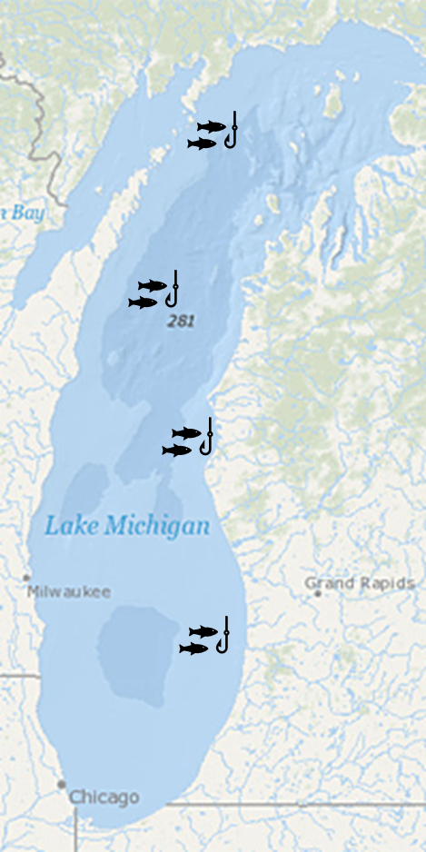{width="365"}

## Back to our example

-   We set 4 nets

-   Sites were randomly chosen

-   We are interested in the content of Hg in Walleye

-   Hg is correlated with size. The bigger the fish, the higher Hg content it has

-   So, normally we could do one thing:

-   $E(Hg_i) = \beta_0 + \beta_1*size_{i}$

::: notes
i -\> what does it stand for?
:::

## Linear model

```{r}
gamma <- rnorm(n=4,mean=0,sd=0.35) 
N<- round(rnorm(4,15,2))
HgDat<-list()
for(i in 1:4){
  x<-runif(N[i],20,60)
  y<-0.5 + 0.018*x + gamma[i] + rnorm(N[i],0,0.05)
  Region<-rep(LETTERS[i],N[i])
  HgDat[[i]]<-data.frame(size=x,Hg=y,region=Region)
}
HgDat_df<-bind_rows(HgDat)
HgDat_df$region<-as.factor(HgDat_df$region)
m1<- lm(Hg~size, data=HgDat_df)
preddata <- HgDat_df
predict2<-predict(m1, preddata, interval = "c")
preddata <- cbind(preddata,predict2)
ggplot(data=preddata, aes(x=size, y=Hg,ymin=lwr,ymax=upr)) +
    geom_point() +
  geom_line(aes(y=fit))+
  geom_ribbon(alpha=0.2)+
  theme_classic() 

```

## Linear model

```{r}
summary(m1)
```

-   Use coefficients to estimate size at over 1.1 $\mu g$ .

-   Limit fish of that size

## The variance can affect the slope, the intercept, or both

-   Random effects introduce variance.

-   It can introduce variance to the intercept or to the slope

```{r}


m1<- lm(Hg~size, data=HgDat_df)
preddata <- HgDat_df
preddata$predHg <- predict(m1, preddata)
ggplot(data=preddata, aes(x=size, y=Hg, col=region)) +
    geom_point(size=2) +
  geom_line(aes(y=predHg),lwd=2,col="black")+
  theme_classic() 
```

## Mixed model

-   No mixed model:

-   $$
    Hg_i \sim \beta_0 + \beta_1size_{i} + \epsilon
    $$

-   i individuals, j sites (4), mixed intercept:

-   $$
    Hg_{ij} \sim \underbrace{(\beta_0 +\underbrace{\gamma_j}_{\text{Random intercept}})}_{intercept} + \underbrace{\beta_1size_{i}}_{slope} +\underbrace{\epsilon}_\text{ind var}
    $$

-   Variance comes from random "selection" of fish within a net

-   Variance comes from random "selection" of sites

-   What does a mixed intercept mean?

::: notes
i?

j?
:::

## Mixed model with random intercept

This is the result of a mixed model:

```{r}
library(glmmTMB)
m2<- glmmTMB(Hg~size +(1|region), data=HgDat_df)
preddata2 <- HgDat_df
preddata2$predHg <- predict(m2, preddata)
preddata2$predHg_population <- predict(m2, preddata2, re.form=~0)

plot2<- ggplot(data=HgDat_df, aes(x=size, y=Hg, col=region)) +
    geom_point() +
    geom_line(data=preddata2, aes(x=size, y=predHg, col=region))+
  geom_line(data=preddata2, aes(x=size, y=predHg_population),
            col='black',linewidth=1.5) +
  theme_classic()
plot2
```

-   What does the random intercept mean?
-   Why not simply do:
-   $Hg_i \sim \beta_0 + \beta_1size_{i} + \beta_2rB_{i} + \beta_3rC_{i} + \beta_4rD_{i} \epsilon$
-   Model with effect of site

## Mixed model with random intercept

::: notes
Really show that how far each point is from the mean depends on two things: Variance of site and variance of points.

Show that the fixed effects would really just predict the main line, then, the actual observations are because of that variance
:::

```{r}
summary(m2)
```

$$
Hg_{ij} = \underbrace{(\beta_0 +\underbrace{\gamma_j}_{\text{Random intercept}})}_{intercept} + \underbrace{\beta_1size_{i}}_{slope} +\underbrace{\epsilon}_\text{ind var}
$$

-   Where:

-   $$
    \epsilon \sim N(0,\sigma^2)
    $$

-   $$
    \gamma_j \sim N(0,\sigma^2_\gamma)
    $$

## Mixed effects models: how to run them?

```{r}
#| echo: true
library(glmmTMB)
m2<- glmmTMB(Hg~size +(1|region), data=HgDat_df)
```

-   Random effects are specified as $x|g$

-   x is an effect

-   g is grouping factor (categorical)

-   $1|region$

-   Effect -\> 1 (intercept)\
    Grouping factor -\> region

::: notes
Categorical!!!!
:::

## Mixed effects model output

```{r}
summary(m2)
```

```{r}
plot2
```

## Mixed model with random intercept and random slope

-   $$ Hg_i \sim \beta_0 + \beta_1size_{i} + \epsilon $$

-   i individuals, j sites (4)

-   $$ Hg_{ij} \sim \underbrace{(\beta_0 +\underbrace{\gamma_j}_{\text{Random intercept}})}_{intercept} + \underbrace{(\beta_1+\underbrace{\psi_j}_{\text{Random  slope}})size_{i}}_{slope} +\underbrace{\epsilon}_\text{ind var} $$

-   Variance comes from random "selection" of fish within a net

-   Variance comes from random "selection" of sites

-   Where,

-   $$
    \epsilon \sim N(0,\sigma^2)
    $$

-   $$
    \gamma_j ~ N(0,\sigma^2_\gamma)
    $$

-   $$
    \Psi_j ~ N(0,\sigma^2_\psi)
    $$

## Random slope and intercept

```{r}
gamma <- rnorm(n=4,mean=0,sd=0.25) 
psi<- rnorm(n=4,mean=0.005,sd=0.012) + (scale(gamma)[1:4]-min(scale(gamma)[1:4]))*0.0008
N<- round(rnorm(4,20,2))
HgDat2<-list()
for(i in 1:4){
  x<-runif(N[i],20,60)
  y<-1 + (0.018+psi[i])*x + gamma[i] + rnorm(N[i],0,0.08)
  Region<-rep(LETTERS[i],N[i])
  HgDat2[[i]]<-data.frame(size=x,Hg=y,region=Region)
}
HgDat2_df<-bind_rows(HgDat2)
HgDat2_df$region<-as.factor(HgDat2_df$region)
```

```{r}
#| echo: true
m3<-glmmTMB(Hg~size +(1+size|region), data=HgDat2_df)
summary(m3)
```

-   Random effects are specified as $x|g$

-   x is an effect

-   g is grouping factor (categorical)

-   $1 + size|region$

-   Effect -\> 1 (intercept) + size\
    Grouping factor -\> region

::: notes
Size is continuous!!!!! --\> slope Region categorical
:::

## Random slope and intercept

```{r}
preddata3 <- HgDat2_df
preddata3$predHg <- predict(m3, preddata3)
preddata3$predHg_population <- predict(m3, preddata3, re.form=~0)

plot2<- ggplot(data=HgDat2_df, aes(x=size, y=Hg, col=region)) +
    geom_point() +
    geom_line(data=preddata3, aes(x=size, y=predHg, col=region))+
  geom_line(data=preddata3, aes(x=size, y=predHg_population),
            col='black',linewidth=1.5) +
  theme_classic()
plot2
```

## Only random slope

```{r}

gamma <- rnorm(n=4,mean=0,sd=0.25) 
psi<- rnorm(n=4,mean=0.005,sd=0.012) 
N<- round(rnorm(4,20,2))
HgDat2<-list()
for(i in 1:4){
  x<-runif(N[i],20,60)
  y<-1 + (0.018+psi[i])*x + rnorm(N[i],0,0.08)
  Region<-rep(LETTERS[i],N[i])
  HgDat2[[i]]<-data.frame(size=x,Hg=y,region=Region)
}
HgDat2_df<-bind_rows(HgDat2)
HgDat2_df$region<-as.factor(HgDat2_df$region)
m3<-glmmTMB(Hg~size +(0+size|region), data=HgDat2_df)


preddata3 <- HgDat2_df
preddata3$predHg <- predict(m3, preddata3)
preddata3$predHg_population <- predict(m3, preddata3, re.form=~0)

plot2<- ggplot(data=HgDat2_df, aes(x=size, y=Hg, col=region)) +
    geom_point() +
    geom_line(data=preddata3, aes(x=size, y=predHg, col=region))+
  geom_line(data=preddata3, aes(x=size, y=predHg_population),
            col='black',linewidth=1.5) +
  ylab (expression(paste("Hg (",mu,"g)")))+
  xlab("size (g)")+
  theme_classic()
plot2

```

```{r}
m3<-glmmTMB(Hg~size +(0+size|region), data=HgDat2_df)
summary(m3)
```

## Example

1.  Zuur, A., Ieno, E. N., Walker, N., Saveliev, A. A. & Smith, G. M. Mixed Effects Models and Extensions in Ecology with R. (Springer New York, 2009).

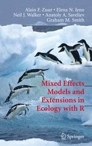

<https://www.highstat.com/>

## RIKZ data

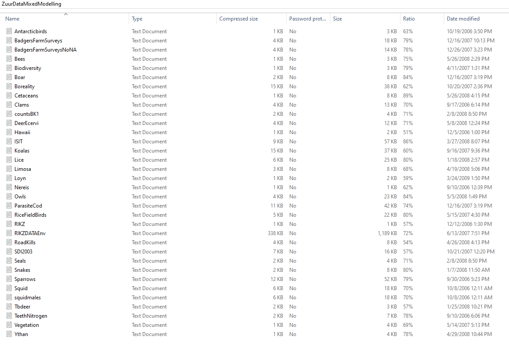

## RIKZ data

-   RIKZ institute

-   Inter-tidal area (AKA beach): 9

-   In each beach, 5 samples were taken

-   Response variable: macro-fauna richness (AKA number of species)

-   NAP: height of sampling station compared to mean tidal level

-   Exposure (index). Of multiple environmental conditions. Treated as categorical, as there are three levels

## RIKZ data

```{mermaid}
%%| fig-width: 10

flowchart TD

  A[RIKZ DATA] --> B(Beach 1)
  A --> C(Beach 2)
  A --> E(Beach 9)
  B --> F(site 1)
  B --> G(site 2)
  B --> H(site 3)
  B --> I(site 4)
  B --> J(site 5)
  C --> K(site 1)
  C --> L(site 2)
  C --> M(site 3)
  C --> N(site 4)
  C --> O(site 5)
  E --> P(site 1)
  E --> Q(site 2)
  E --> R(site 3)
  E --> S(site 4)
  E --> T(site 5)
 
```

## Let's work on this example

```{r}
rikz<-read.table(file = "RIKZ.txt", header = TRUE, dec = ",")
rikz$NAP<-as.numeric(rikz$NAP)
rikz$Beach<-factor(rikz$Beach)
rikz$Exposure<-factor(rikz$Exposure)


```

## Objective

```{mermaid}
%%| fig-width: 10

flowchart TD

  A[RIKZ DATA] --> B(Beach 1)
  A --> C(Beach 2)
  A --> E(Beach 9)
  B --> F(site 1)
  B --> G(site 2)
  B --> H(site 3)
  B --> I(site 4)
  B --> J(site 5)
  C --> K(site 1)
  C --> L(site 2)
  C --> M(site 3)
  C --> N(site 4)
  C --> O(site 5)
  E --> P(site 1)
  E --> Q(site 2)
  E --> R(site 3)
  E --> S(site 4)
  E --> T(site 5)
 c
```

-   Exploring whether there is a relationship between richness and the two factors: NAP and exposure

-   We have an N of 45... but do we?

-   We have multiple potential alternatives: there is an effect of NAP, an effect of Exposure, an effect of both, of neither

-   Also... there are mixed effects

-   Random intercept, random slope, both? –\> let's wait to discuss this

-   Step 1: Read the data... there is a potential issue

```{r}
#| echo: true
#| eval: false

rikz<-read.table(file = "RIKZ.txt", header = TRUE, dec = ",")
str(rikz)
```

-   Step 2: decide our analysis! 🤔 Any ideas? any details?

::: notes
rikz\<-read.table(file = "RIKZ.txt", header = TRUE, dec = ",")

rikz\$NAP\<-as.numeric(rikz\$NAP)

rikz\$Beach\<-factor(rikz\$Beach)

rikz\$Exposure\<-factor(rikz\$Exposure)
:::

## The data

```{r}
ggplot(data=rikz, aes(x=NAP, y=Richness, col=Beach)) +
    geom_point() +
    theme_classic()
```

## The data

```{r}
ggplot(data=rikz, aes(x=NAP, y=Richness, col=Beach)) +
    geom_point() +
    theme_classic()
```

-   There seems to be an effect of NAP...

-   how about... a random effect of beach?

-   step 3: how do we decide random effects?

-   step 3: random effects of NAP, Exposure? or both?

-   What do we do?

## Model selection with random models

WE CANNOT TEST FIXED AND RANDOM EFFECTS AT THE SAME TIME

-   Test mixed effects first.

-   We use the "global" or saturated fixed model

-   How many models?

-   Use AIC

-   What model structure?

::: notes
Talk about Zuur's weird non-Poisson, and normal analysis
:::

## Model selection with random models

```{r}
model1<-glmmTMB(Richness~NAP*Exposure, data = rikz, family = poisson)
model2<-glmmTMB(Richness~NAP*Exposure + (1|Beach), data = rikz, family = poisson)
model3<-glmmTMB(Richness~NAP*Exposure + (0+NAP|Beach), data = rikz, family = poisson)
model4 <-glmmTMB(Richness~NAP*Exposure + (1+NAP|Beach), data = rikz, family = poisson)
AICcmodavg::aictab(list(model1,model2,model3,model4))
```

Are the AIC values the same?

## Notes on AIC

I recommend using the AICcmodavg package and making a list!

```{r}
#| echo: true
#| eval: false

AICcmodavg::aictab(list(model1,model2,model3,model4))

```

## Next step: let's explore the model (factors!)

How do you explore the best model?

## Next step: let's explore the model (factors!)

```{r}
#| echo: true
Anova(glm(Richness~NAP*Exposure, data = rikz, family = poisson))
```

-   Talk about Zuur's approach here

## Next step?

```{r}
model1<-glm(Richness~NAP*Exposure, data = rikz, family = poisson)
model2<-glm(Richness~NAP+Exposure, data = rikz, family = poisson)
model3<-glm(Richness~NAP, data = rikz, family = poisson)
model4<-glm(Richness~Exposure, data = rikz, family = poisson)
model5<-glm(Richness~1, data = rikz, family = poisson)

modeltab<-AICcmodavg::aictab(list(model1,model2,model3,model4,model5))
modeltab
```

## Evidence ratios

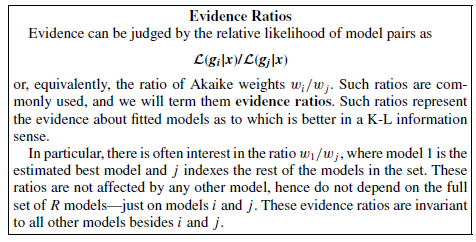{width="516"}

Burnham and Anderson

## Evidence ratios

```{r}
AICcmodavg::evidence(modeltab)
```

-   Raffle tickets

## Last step: Model validation

Of the best model.

## Other steps?

Check assumptions (if normal)

## Mixed effects models pt 2

For some of the other examples

An alternative to mixed models can be repeated measures methods

1.  Split-plot with adjustments
2.  Profile analysis
3.  Linear mixed models with correlations

## Mixed effects models pt 2

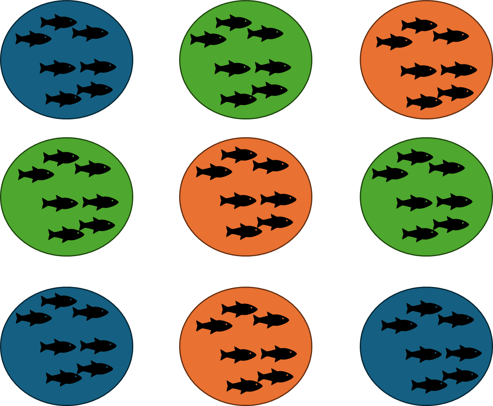

## Split plot with adjustments

Repeated measures ANOVA

Model:

$$
y_{ijk} = \mu + \alpha_i + \beta_j + \alpha \beta_{ij} + \delta_{ik} + \epsilon_{ijk}  
$$

::: notes
mu = grand mean

α i = effect of the i th treatment level

β j = effect of the j th level of time

α β i j = interaction effect between treatment and time

δ i k = subject effect

ϵ i j k = residual, unexplained variation
:::

## Split plot

You need to adjust the p-value!

It is the best method to use for well-balanced, experimental data. Also, simplest to do and interpret

You get p-values for time, for treatment and for the interaction

## Profile analysis

-   Step 1: Run a MANOVA (what even is this?) –\> Multivariate

-   Step 2: Run multiple ANOVAS one for each time period

## Mixed models with correlation

More about this on Friday's lab

## Wednesday class homework

-   We will talk about visualization

-   We can discuss plots, or figure out how to make some plots that are important for you

-   Send a figure of a plot that you may not understand or want to learn how to plot it

## Data visualization

-   My favorite part of stats/data analysis/ etc

-   You can be creative! but be smart and ethical.

-   Plots are easy to "manipulate"

-   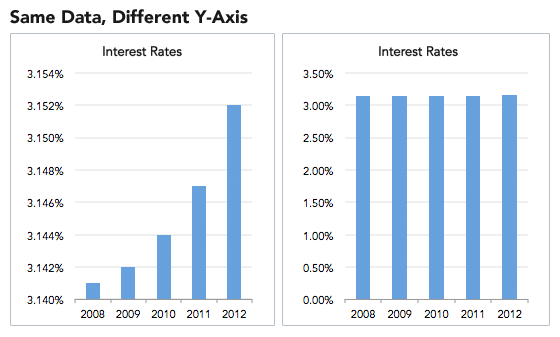

## Misleading plots

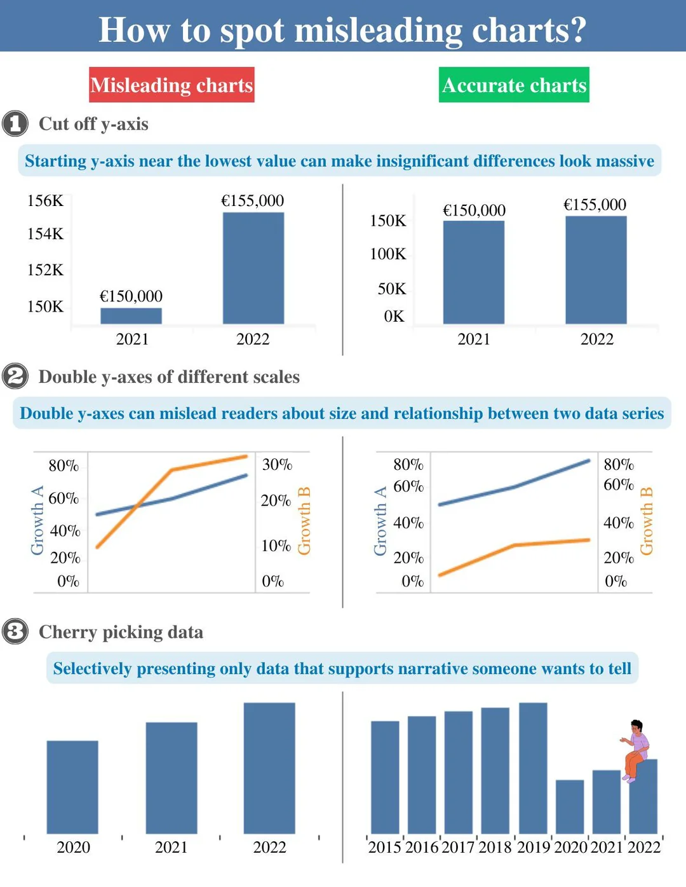

## Incorrect and misleading plots

-   Pie chart with total over 100

-   Avoid pie charts. Grouped barplots are potentially teh best solution for "parts of a whole". Stacked barplot can be challenging to distinguish.

## Plotting

-   Estimate (point) and CI

-   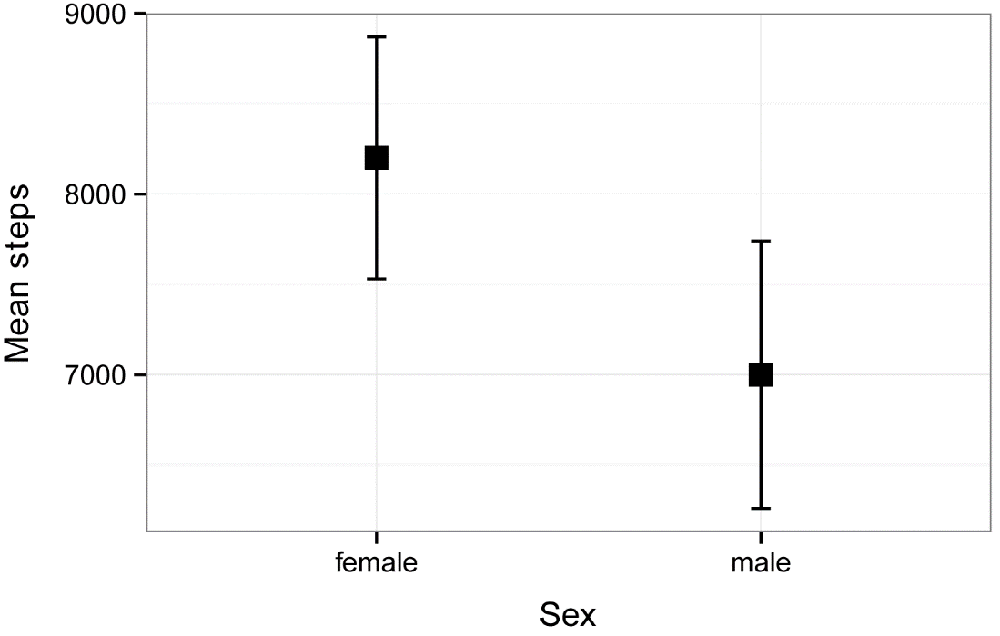

-   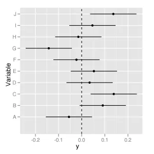

-   Similar to a line and CI

## Plots

-   Distribution

-   Correlation

-   Ranking

-   Part of a whole

-   Evolution (time series, line plot)

-   Map

-   Flows

## Distribution

-   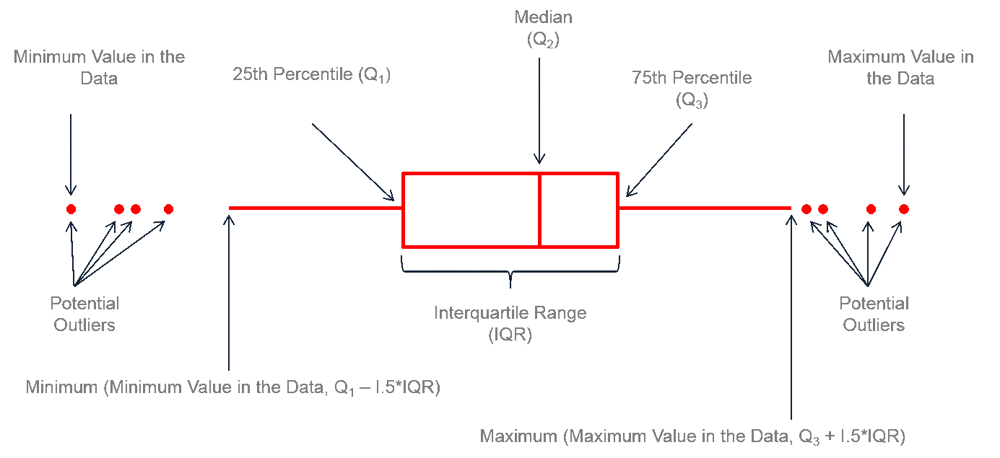

```{r}
library(ggplot2)
library(dplyr)
library(hrbrthemes)
library(viridis)

# create a dataset
data <- data.frame(
  name=c( rep("A",500), rep("B",500), rep("B",500), rep("C",20), rep('D', 100)  ),
  value=c( rnorm(500, 10, 5), rnorm(500, 13, 1), rnorm(500, 18, 1), rnorm(20, 25, 4), rnorm(100, 12, 1) )
)

# sample size
sample_size = data %>% group_by(name) %>% summarize(num=n())

# Plot
data %>%
  left_join(sample_size) %>%
  mutate(myaxis = paste0(name, "\n", "n=", num)) %>%
  ggplot( aes(x=myaxis, y=value, fill=name)) +
    geom_violin(width=1.4) +
    geom_boxplot(width=0.1, color="grey", alpha=0.2) +
    scale_fill_viridis(discrete = TRUE) +
    theme_ipsum() +
    theme(
      legend.position="none",
      plot.title = element_text(size=11)
    ) +
    ggtitle("A Violin wrapping a boxplot") +
    xlab("")
```

## Reminder

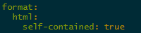{width="400"}
