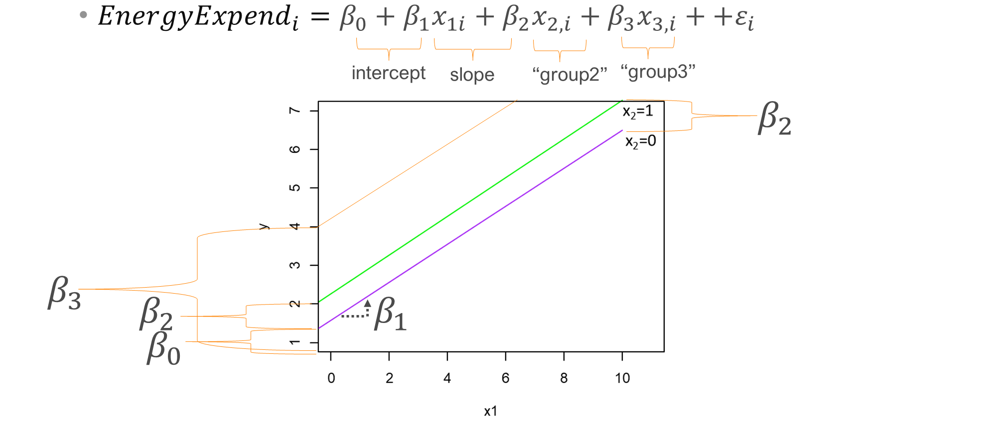
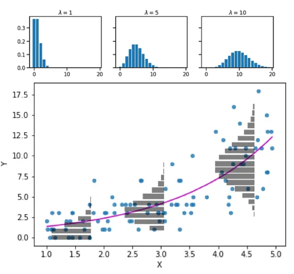
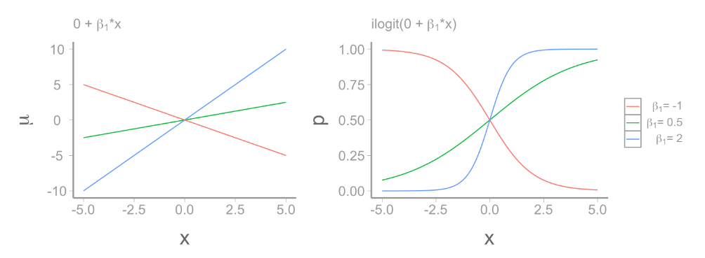
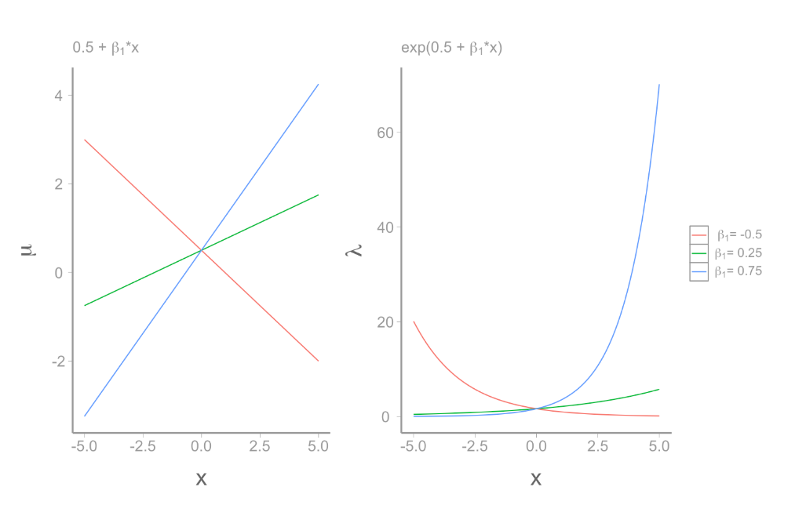
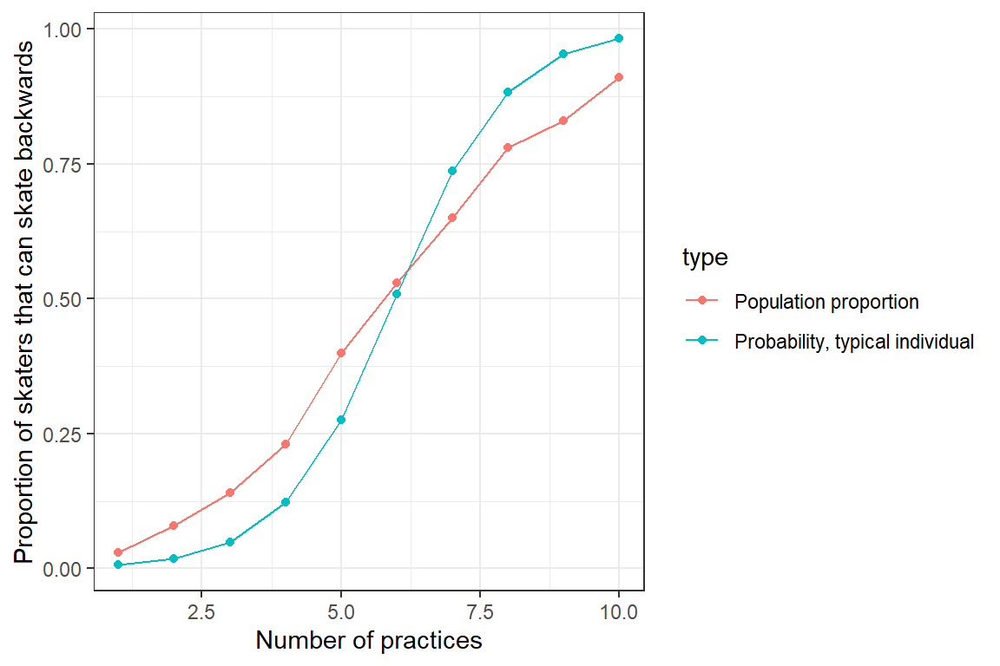
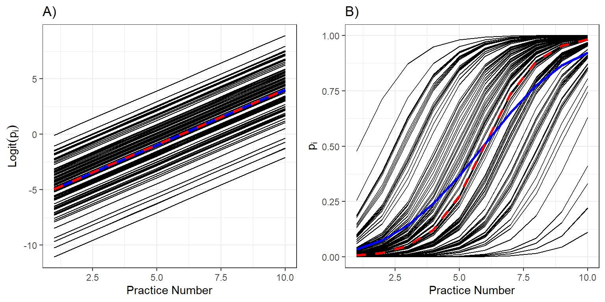

## Review

-   Simple linear model

-   Deterministic: $E[y_i] = \beta_0 + \beta_1x$

-   Stochastic: $y_i \sim Normal(E[y_i], \sigma)$

-   If it's continuous:

-   

    ```{r}
    library(ggplot2)
    x <- rnorm(100)
    y <- 7 + 3.5 * x + rnorm(100, 0, 1)
    mu <- 7 + 3.5 * x
    resid <- y - mu
    df <- data.frame(x = x, y = y, mu = mu, Residuals = resid)

    ggplot(df, aes(x, y)) + 
    geom_abline(slope = 3.5, intercept = 7, color = "#245D0B", size = 1.5) +
    scale_y_continuous(expression(mu)) +
    geom_point(color = "#D49950", alpha = 0.75)


    ```

## Review

-   Simple linear model

-   Deterministic: $E[y_i] = \beta_0 + \beta_1x$

-   Stochastic: $y_i \sim Normal(E[y_i], \sigma)$

-   If it's discrete:

-   

    ```{r}

    x <- rbinom(100, size = 1, prob = 0.5)
    y <- 7 + 3.5 * x + rnorm(100, 0, 1)

    df <- data.frame(x = x, y = y)

    mod1<-lm(y~x)
    #summary(mod1)

    ggplot(df, aes(x, y, group = as.factor(x))) +
      geom_segment(aes(x = -0.1, xend = 0.1, y = mod1$coefficients[1], yend = mod1$coefficients[1]), color = "#245D0B", size = 1.5) +
      geom_segment(aes(x = 0.9, xend = 1.1, y = mod1$coefficients[1] + mod1$coefficients[2], 
                       yend = mod1$coefficients[1] + mod1$coefficients[2]), color = "#245D0B", size = 1.5) +
      scale_y_continuous(expression(mu)) +
      scale_x_continuous(breaks = c(0, 1)) +
      geom_point(color = "#D49950", alpha = 0.25)+
      theme_classic()


    ```

-   Where $x_1$ = 1 or 0

```{r}
mod1$coefficients
```

## Review

-   Multiple groups

-   Deterministic: $E[y_i] = \beta_0 + \beta_1x_{1,i} + \beta_2x_{2,i}$

-   Stochastic: $y_i \sim Normal(E[y_i], \sigma)$

-   

    ```{r}

    x <- sample(1:3, 150, rep=T)
    y <- 7 + 3.5 * x + rnorm(150, 0, 1)

    df <- data.frame(x = x, y = y)
      

    ggplot(df, aes(x, y, group = as.factor(x))) +
      geom_segment(aes(x = 0.9, xend = 1.1, y = 7+3.5, yend = 7+3.5), color = "#245D0B", size = 1.5) +
      geom_segment(aes(x = 1.9, xend = 2.1, y = 10.5+3.5, yend = 10.5+3.5), color = "#245D0B", size = 1.5) +
      geom_segment(aes(x = 2.9, xend = 3.1, y = 14+3.5, yend = 14+3.5), color = "#245D0B", size = 1.5) +

      scale_y_continuous(expression(mu)) +
      scale_x_continuous(breaks = 1:3) +
      geom_point(color = "#D49950", alpha = 0.25)+
      theme_classic()


    ```

-   Where $x_1$ = 1 or 0

-   And $x_2$ = 1 or 0

-   

    | Group | Value of x1 | Value of x2 |
    |-------|-------------|-------------|
    | 1     | 0           | 0           |
    | 2     | 1           | 0           |
    | 3     | 0           | 1           |

## Review

We can have multiple regression

-   Deterministic: $E[y_i] = \beta_0 + \beta_1x_{1,i} + \beta_2x_{2,i}$

-   Stochastic: $y_i \sim Normal(E[y_i], \sigma)$

```{r}
library(ggplot2)
x <- rnorm(200)
g<- rbinom(200,1,0.5)
y <- 7 + 3.5 * x + 2.5 *g+ rnorm(100, 0, 1)
mu1 <- 7 + 3.5 * x
mu2 <- 9.5 + 3.5 * x
resid <- y - mu
df <- data.frame(x = x, y = y, mu = mu, Residuals = resid)

 
ggplot(df, aes(x, y,color=factor(g))) + 
geom_abline(slope = 3.5, intercept = 7, color = "#245D0B", size = 1.5) +
geom_abline(slope = 3.5, intercept = 9.5, color = "#A45D0B", size = 1.5) +
  
scale_y_continuous(expression(mu)) +
geom_point(alpha = 0.75)+
  scale_color_manual(values=c("#245D0B","#A45D0B"))


```

-   x1 = continuous

-   x2 = 1 or 0

## Image



## Linear models can be very complex

-   As many $\beta s$ as you want (limit n-1)
-   Continuous and categorical
-   Polynomial
-   multiple continuous variables that are interactive

## Assumptions

-   Linearity

-   Normality

-   Independence

-   Equal variance

## GLM's

-   Generalized linear models

{width="563"}

-   How many assumptions does it break?

## GLM's

```{r}
x<-rnorm(50,0,5)
fate<-rbinom(50,1,plogis(-1+x*0.75))
df<-data.frame(x=x,fate=fate)

ggplot(data=df,aes(x = x, y = fate)) +
  geom_point() +
  scale_y_continuous("Hatch", breaks = c(0, 1)) +
  scale_x_continuous("Mother index") +
  stat_smooth(method = "lm")+
  theme_classic()

```

-   How many assumptions does it break?

## Glm's

What do Glm's do?

1.  Transform the response to linear
2.  Have a different distribution of the residuals

If normal:

-   $$
    \underbrace{E[y_i]}_{\text{expected value}} = \underbrace{\beta_0 + \beta_1x_{1,i} + ... \beta_mx_{m,i}}_{deterministic}
    $$

-   $$ y_i \sim \underbrace{N(mean=E[y_i], var=\sigma^2)}_{stochastic} $$

-   Poisson glm:

-   $$ \underbrace{log(\lambda)}_{\text{link function}} = \underbrace{\beta_0 + \beta_1x_{1,i} + ... \beta_mx_{m,i}}_{deterministic} $$

    $$ y_i \sim \underbrace{Poisson(\lambda)}_{stochastic} $$

-   Negative Binomial glm:

-   $$ \underbrace{log(\lambda)}_{\text{link function}} = \underbrace{\beta_0 + \beta_1x_{1,i} + ... \beta_mx_{m,i}}_{deterministic} $$

    $$ y_i \sim \underbrace{NB(\mu,\theta)}_{stochastic} $$

-   $variance = \frac{\theta}{\mu+\theta}$

## GLM's

::::: columns
::: column
```{r}
ggplot(data=df,aes(x = x, y = fate)) +
  geom_point() +
  scale_y_continuous("Hatch", breaks = c(0, 1)) +
  scale_x_continuous("Mother index") +
  stat_smooth(method = "lm")+
  theme_classic()
```
:::

::: column
```{r}
ggplot(data=df,aes(x = x, y = fate)) +
  geom_point() +
  scale_y_continuous("Hatch", breaks = c(0, 1)) +
  scale_x_continuous("Mother index") +
  stat_smooth(method = "glm",  method.args = list(family = "binomial"))+
  theme_classic()
```
:::
:::::

## GLM's



## GLM's


## GLM's



## Glm's


## Hurdle models

-   Create two datasets: One with zeroes and ones $Z_i$

-   $Z_i \sim Bernoulli (p_i)$

-   $logit(pi) = \beta_0  + ...$

-   and then a Poisson or negative binomial

## Mixed effects


-   Set nets on each of those sites

-   Measure 50, 43, 67, and 90 fish. For mercury concentration

-   What assumptions are we breaking?

## We don't do this

-   $E(Hg_i) = \beta_0 + \beta_1*size_{i}$

-   Pseudoreplication

-   $E(Hg_i) = \beta_0 + \beta_1size_{i} + \beta_2 site2_i + \beta_3 site3_i + \beta_4 site4_i$

-   We don't care about the specific sites... we want whole population-wide!

## What do we want to know?

-   Mercury concentration population-wide

-   Variance introduces by placement of the nets

-   $$ Hg_{ij} \sim \underbrace{(\beta_0 +\underbrace{\gamma_j}_{\text{Random intercept}})}_{intercept} + \underbrace{(\beta_1+\underbrace{\psi_j}_{\text{Random  slope}})size_{i}}_{slope} +\underbrace{\epsilon}_\text{ind var} $$

-   $\gamma_j \sim Normal(0,\sigma_\gamma)$

-   $\psi_j \sim Normal(0,\sigma_\psi)$

-   $\epsilon \sim Normal(0,\sigma)$

## Mixed models

```{r}
gamma <- rnorm(n=4,mean=0,sd=0.25) 
psi<- rnorm(n=4,mean=0.005,sd=0.012) + (scale(gamma)[1:4]-min(scale(gamma)[1:4]))*0.0008
N<- round(rnorm(4,20,2))
HgDat2<-list()
for(i in 1:4){
  x<-runif(N[i],20,60)
  y<-1 + (0.018+psi[i])*x + gamma[i] + rnorm(N[i],0,0.08)
  Region<-rep(LETTERS[i],N[i])
  HgDat2[[i]]<-data.frame(size=x,Hg=y,region=Region)
}
HgDat2_df<-dplyr::bind_rows(HgDat2)
HgDat2_df$region<-as.factor(HgDat2_df$region)
library(glmmTMB)
m3<-glmmTMB(Hg~size +(1+size|region), data=HgDat2_df)
preddata3 <- HgDat2_df
preddata3$predHg <- predict(m3, preddata3)
preddata3$predHg_population <- predict(m3, preddata3, re.form=~0)

plot2<- ggplot(data=HgDat2_df, aes(x=size, y=Hg, col=region)) +
    geom_point() +
    geom_line(data=preddata3, aes(x=size, y=predHg, col=region))+
  geom_line(data=preddata3, aes(x=size, y=predHg_population),
            col='black',linewidth=1.5) +
  theme_classic()
plot2
```

If we set all random effects to zero, we get population mean, and predicted value for a random individual

## Mixed effects


-   Set nets on each of those sites

-   Measure 50, 43, 67, and 90 fish. For number of parasites OR presence of parasites?

-   What assumptions are we breaking?


```{r}

x<-rnorm(50,0,5)
fate<-rbinom(50,1,plogis(-1+x*0.75))
df<-data.frame(x=x,fate=fate)

ggplot(data=df,aes(x = x, y = fate)) +
  geom_point() +
  scale_y_continuous("parasite presence", breaks = c(0, 1)) +
  scale_x_continuous("Mother index") +
  stat_smooth(method = "lm")+
  theme_classic()
```

## Generalized linear mixed effects models

-   Linear portion of the Mixed effects models have a deterministic and stochastic component

-   Count data

-   Binary data (1, 0)

-   Multinomial response variable

## Generalized linear mixed effects models

-   We talked last week about overdispersion

-   Poisson, Negative Binomial, Bernoulli and Binomial are not parameterized in terms of separate mean and variance parameters

-   Normal distribution is: $Normal(\mu, \sigma)$

-   Mean and variance of Poisson are $\lambda$

-   Mean and variance of Bernoulli are a function of *p*

-   $Mean = p$ and $variance=p(1-p)$

## GLMM's

-   How can we run mixed effects models?

-   Easy way: Add random effects to the linear predictor, leading to generalized linear mixed effect models

-   Essentially, you have two sources of variation

-   One is normally dsitributed, the other one is distributed according to a different distribution

## Example

A poisson glm:

-   $log(\lambda) = \beta_0 + \beta_1x_i$

-   $y_i \sim Poisson(\lambda)$

-   A glmm: Poisson-normal

-   $log(\lambda) = (\beta_0+\gamma) + (\beta_1+\psi)x_{ij}$

-   $\gamma \sim N(0,\sigma_\gamma)$ , $\psi\sim N(0,\sigma_\psi)$

-   $y_i \sim Poisson(\lambda)$

## Example

Log norm

## Parameter interpretation

-   Not easy to interpret!

-   In random effects if we set all random effects to 0, then we estimate the mean for a "typical" individual

-   "typical means subject, site, individual, etc."

-   The variances are in different distributions

-   Typical individual does not equal "population average response"

## Example



-   Both curves are not lining up

-   Due to non-logit transformations (random effects are normal)

## Interpreting data



-   Individual response curves (black), the response curve for a typical individual with random effects at zeroes, and the population mean response curve (blue) and on the logit and probability scales

## Take away

If you do glmm's be very careful about interpretation

-   In general, transforming data can be risky

## Solutions?

-   Package `GLMMadaptive` estimates marginal means

-   How can we run mixed effects models?

-   Easy way: Add random effects to the linear predictor, leading to generalized linear mixed effect models

-   Hard way: Generalized Estimating Equations

-   <https://fw8051statistics4ecologists.netlify.app/gee>

## 
