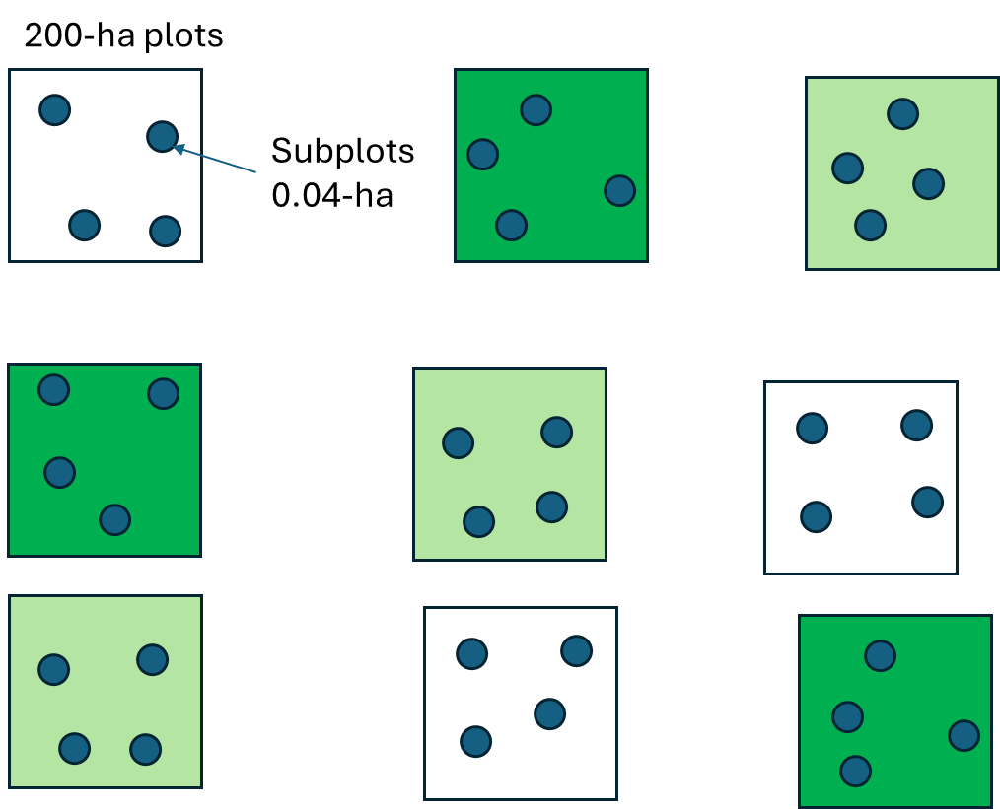

# This assignment

This is just the first section of the assignment. The second one (dealing with data) will be uploaded at some point tomorrow (Tuesday 15).

::: callout-note
## Important dates 📆

Wednesday 4/15/2025: No lecture. However, I will be in the classroom in case anyone needs help with the assignment. Also, available to answer any questions

Friday 4/17/2025: Spring recess (No class)

Friday 4/25/2025: NO CLASS (TAKE HOME EXAM UPLOADED). I can meet with you and help with this current assignment. Assignments due

Monday 5/5/2025: Exam due

Wednesday 5/14/2025: Final Exam. This will be \~1 hour
:::

# Section 1

## Instructions

I will be describing 5 experiments. For each of them:

1.  Identify the design
2.  Identify the main plot and subplot factors (if applicable).
3.  Identify the experimental and observational unit for each factor.
4.  Write either:
    1.  A linear model equation or
    2.  An ANOVA model equation

You will do this on a Quarto document.

# Experiments

Read the information for each of the following 5 experiments. Answer the 4 questions posted in instructions for **each** experiment.

::: {.panel-tabset style="background-color: #dcf0f2; border: 1px solid white; .tabs{         border-right: 2px solid #636363;       border-top: 2px solid #636363;       border-bottom: 2px solid #636363; }"}
## Irrigation and Fertilizer 🥬

A researcher is testing two irrigation methods (drip vs. spray) and three fertilizer types (A, B, C) on crop yield of a leafy green. Each irrigation method is randomly assigned to fields. Within each field, all three fertilizers are applied randomly to plots

## Chick Feed and Temperature 🐔

Two feed types (standard vs. high-protein) are randomly assigned to pens of chickens. Within each pen, cages are randomly assigned to one of two temperatures (cool vs. warm). Weight is recorded after 4 weeks. Weight is not recorded prior to the four weeks.

## Plant Genotypes 🌱

A plant breeder tests 4 genotypes of wheat across 4 blocks in the field. Each genotype appears once per block. Each block has a slightly different soil, as there is a gradient change in soil type. Yield is recorded at harvest.

## Weight of Chickens 🐔

Weights of chicks are recorded weekly for 6 weeks. Each chick is randomly assigned to one of three diets. Chick ID is recorded.

## Soil Type and Watering Frequency 🎑

A greenhouse experiment tests the effect of **soil type** (clay, loam, sand) and **watering frequency** (daily vs. every 3 days) on seedling height. 6 replicates of each treatment combination are assigned randomly to individual pots.
:::

## How to write equations in Quarto?

You can use double dollar signs: \$\$ to write an equation.

You can also right-click on any equation from any assignment and select Latex math to see how I wrote the equation. For example:

$$
y_{ij} = \mu + \alpha_i + \beta_j + \alpha\beta_{ij} + \epsilon_{ij}
$$

where,

$$
\epsilon_{ij} \sim N(0,\sigma^2) 
$$

try right-clicking on one equation.

------------------------------------------------------------------------

# Section 2

## Factorial

### Quantitative and qualitative

You have already run a quantitative and qualitative factorial design in this class. Open your assignment 4 file, and go to the "Model with categorical and continuous variables" section. You ran the following example:

In this case, you are working for a food company that is developing a drug that lowers sugar consumption in rats. You are testing 3 doses: control, mid, and high. You do this in rats that are being fed ad-libitum. You also record the daily consumption of food "pre-trial", and finally the daily consumption of food "post trial". Download and read the data file used for that model `drug_rat.csv`. You shoulds already have this dataset.

In this case you ran an additive linear model.

::: callout-warning
## Question 1 ✏️

1.  Run the same model as before but with `aov` rather than `lm`. Compare your results with your previous model. Did the results changed? Remember to look at the `summary` of your `aov` model.
2.  Run the same model, but with an interaction. Was the interaction significant?
3.  Run `TukeyHSD` on that last model. You should get some warning messages. Why do you think you are getting them?
4.  Write the Anova equation (the additive equation) for this
:::

### Two qualitative

In this experiment, you are looking at grass yield for five different varieties, and three different fertilizers.

Load the `grassvarieties.csv` file into R. Run a factorial Anova using `aov`. Make sure to include the interactions.

::: callout-warning
## Question 2 ✏️

1.  Run the same model as before but with `aov` rather than `lm`. Compare your results with your previous model. Did the results changed?
2.  Run the same model, but with an interaction. Was the interaction significant?
3.  Run `TukeyHSD` on the last model

**EXTRA CREDIT: Contrast analysis.** You are interested in looking at comparisons for fertilizer A for Midland and Fertilizer A for Mohawk. Also, variety B in Yukon and Rivera vs variety B in Midland and Mohawk. Do a contrast analysis only for these comparisons.
:::

## Randomized Complete Block design

Download the `mdat.csv` file and explore it. Make sure to transform Region to a factor.

You are looking at data on abundance of moth larvae following one of three treatments: Control, Bt, and Dimilin. You have four plots, and each plot was divided in 3 and a random treatment was given to each subplot. However, your plots are in very different regions. Look at figure 1.


::: callout-warning
## Question 3 ✏️

1.  Run an anova using `aov` . **ONLY** test the effects of treatment (ignore the potential regional effect). Look at the summary ans interpret.

2.  Run the same model, but add the effect of region (as a fixed effect). What changed? Why? Interpret the results.

3.  Now, let's run the same model with region as a random effect. In this case, we do it using the following equation:

    ```         
    av1<-aov(Larvae~Treatment+Error(Region),data=mdat)
    ```

    Do you see any differences with including he blocking factor as random or fixed? Why?
:::

## Nested Design

You have been given access to a new field research access where you can replicate the last experiment, but hopefully with lower regional effects, as you have plots that are closer to each other.

You have access to 9 plots. You apply a treatment to each plot (3 treatments, so each treatment gets replicates in 3 plots).



Download the `mdat2.csv` datafile

::: callout-warning
## Question 4 ✏️

1.  Run an anova using `aov` . **ONLY** test the effects of treatment. Look at the results using `summary`. Explain why this is the wrong approach to analyzing this data.
2.  Run the same model, but add the effect of plot (as a fixed effect). This is also the incorrect approach, as we want plot to be a random effect.
3.  Run the same model, with plot as a random effect `Error(Plot)`. This is the correct model. Explain why, and look at the `summary` and describe the results.
4.  Write the additive (ANOVA) equation for the correct model and describe it
:::

## Split plot design

### Anova (aov)

Download and read the `coffee.csv` file and explore it. Describe what each column means. You can look at the slides. This dataset contains a column called WU. This is used in order to estimate $\delta_ik$ which is the residual error at the whole unit level. We have 16 total "whole-units" (and 4 measurements per unit)

You will use the following code to run it as an Anova:

```{r eval=F}
#Step 1: make sure plot and WU are factors:

coffee$plot<-factor(coffee$plot)
coffee$WU<-factor(coffee$WU)
coffeeaov<-aov(y~cover_crop+fertilizer+cover_crop:fertilizer+plot+Error(WU), data=coffee)
summary(coffeeaov)

```

We used the effect of plot as fixed (even though is random) because `aov` only allows for one random effect.

::: callout-warning
## Question 5 ✏️

1.  Explore the data and describe it
2.  Explore the summary of the model and describe it.
3.  Write the equation (anova)
4.  Check whether we estimated the degrees of freedom correctly on the slideshow
5.  Why is plot random?

Extra credit: Plot the results and describe them.
:::

### Linear Model (lme)

In these models I recommend running a linear model instead of an aov analysis because it allows for multiple random effects.

Outside of Quarto install the `nlme` package.

Load `nlme` and run:

```{r eval=FALSE}
library(nlme)
lme.coffee <- lme(y ~ fertilizer*cover_crop,
                data = meatdata,
                correlation = corCompSymm(), # To make results same as aov()
                random = ~1|plot/WU)
```

::: callout-warning
## Question 6 ✏️

1.  Run a summary on the linear model, also run an anova using `anova(lme.coffee`) and interpret the results.
:::

How do we look at the interaction? How do we explore the differences? We will talk about that after Spring recess 😃.

We will also work on the repeated measures lab.
