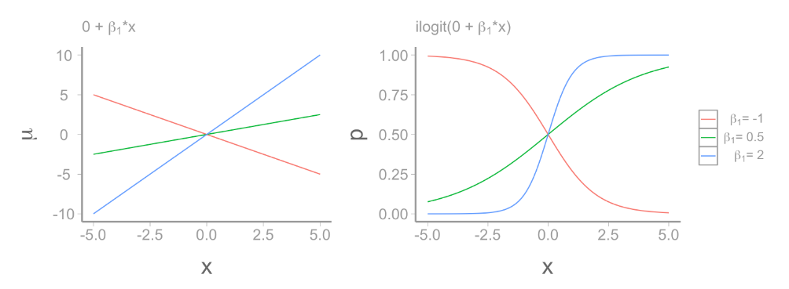
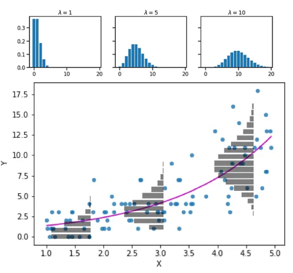
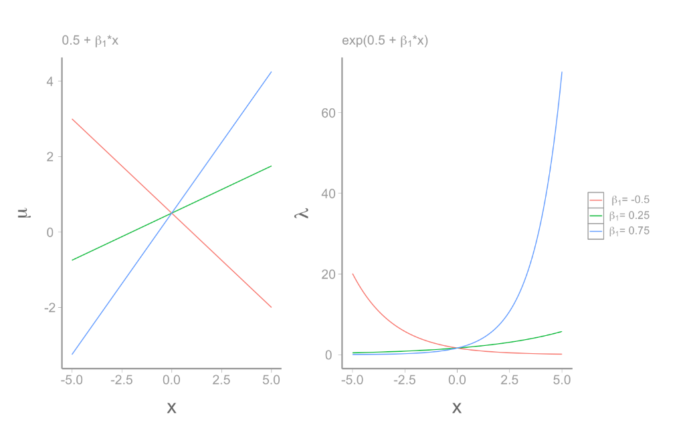
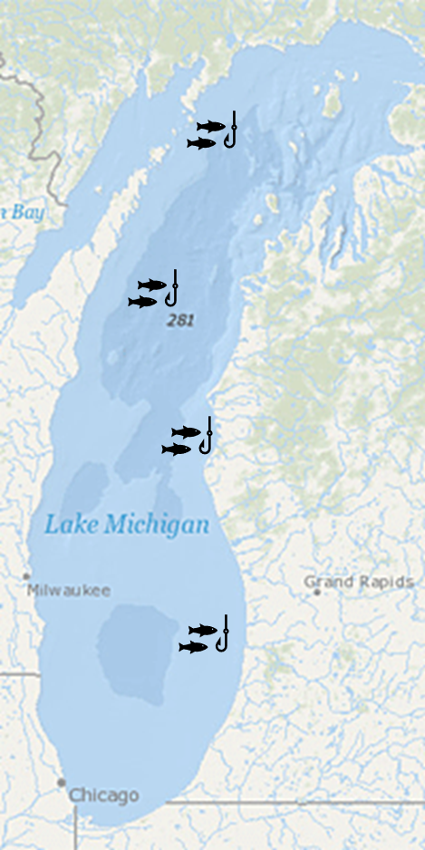
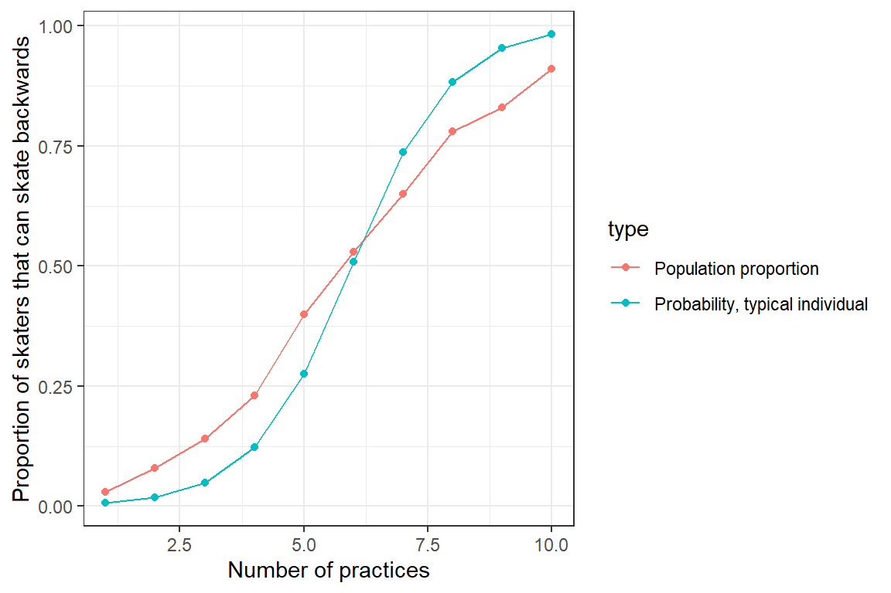
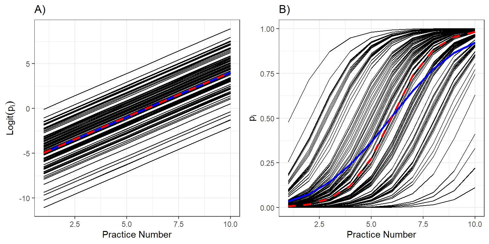
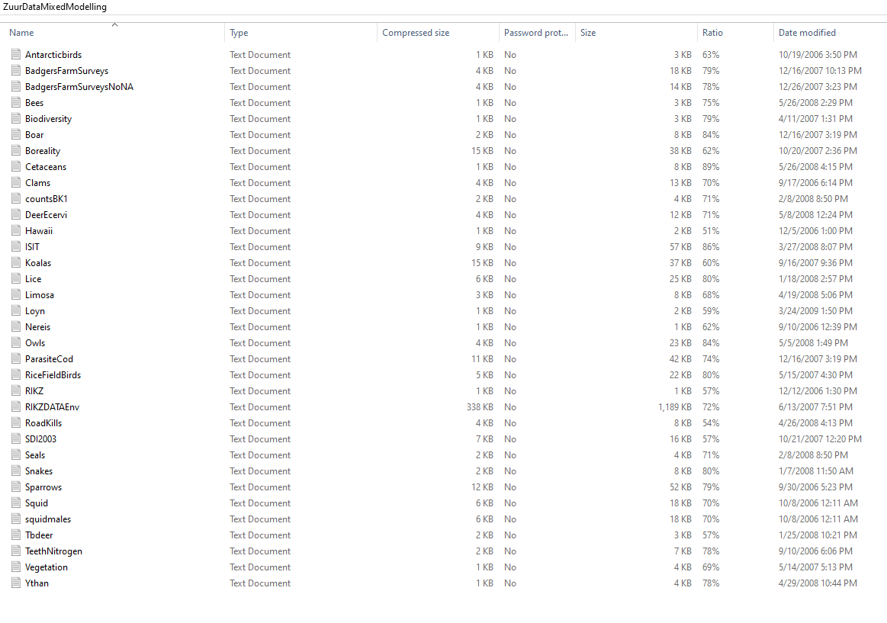

```{r}
library(ggplot2)
library(dplyr)
library(glmmTMB)
library(car)

set.seed(145)
```

## Announcements

Mixed Effects Models this week (lab) –\> One "lab" with me

Next week: Generalized Mixed Effects Models (No Lab)

Next week (Friday): Work on your plot

## Back to our example

{width="150"}

## Back to our example

-   We set 4 nets

-   Sites were randomly chosen

-   We are interested in the content of Hg in Walleye

-   Hg is correlated with size. The bigger the fish, the higher Hg content it has

-   So, normally we could do one thing:

-   $E[Hg_i] = \beta_0 + \beta_1 \times size_{i}$

-   $y_i \sim N(mean = E[Hg_i], \sigma)$

::: notes
i -\> what does it stand for?
:::

## Linear model

```{r}
gamma <- rnorm(n=4,mean=0,sd=0.35) 
N<- round(rnorm(4,15,2))
HgDat<-list()
for(i in 1:4){
  x<-runif(N[i],20,60)
  y<-0.5 + 0.018*x + gamma[i] + rnorm(N[i],0,0.05)
  Region<-rep(LETTERS[i],N[i])
  HgDat[[i]]<-data.frame(size=x,Hg=y,region=Region)
}
HgDat_df<-bind_rows(HgDat)
HgDat_df$region<-as.factor(HgDat_df$region)
m1<- lm(Hg~size, data=HgDat_df)
preddata <- HgDat_df
predict2<-predict(m1, preddata, interval = "c")
preddata <- cbind(preddata,predict2)
ggplot(data=preddata, aes(x=size, y=Hg,ymin=lwr,ymax=upr)) +
    geom_point() +
  geom_line(aes(y=fit))+
  geom_ribbon(alpha=0.2)+
  theme_classic() 

```

## Linear model

```{r}
summary(m1)
```

-   Use coefficients to estimate size at over 1.1 $\mu g$ .

-   Limit fish of that size

## Assumptions of a Linear Model

Normality

Homoschedasticity

Linearity

Independence –\> of data

Independence –\> of error (or residuals)

## Linear Model

```{r}
ggplot(data=preddata, aes(x=size, y=Hg,ymin=lwr,ymax=upr)) +
    geom_point() +
  geom_line(aes(y=fit))+
  geom_ribbon(alpha=0.2)+
  theme_classic() 
```

## If we plot the "sites"?

```{r}
m1<- lm(Hg~size, data=HgDat_df)
preddata <- HgDat_df
preddata$predHg <- predict(m1, preddata)
ggplot(data=preddata, aes(x=size, y=Hg, col=region)) +
    geom_point(size=2) +
  geom_line(aes(y=predHg),lwd=2,col="black")+
  theme_classic() 
```

## The variance can affect the slope, the intercept, or both

-   Random effects introduce variance.

-   It can introduce variance to the intercept or to the slope

```{r}
#| out-width: "70%"
#| out-height: "400px"

ggplot(data=preddata, aes(x=size, y=Hg, col=region)) +
    geom_point(size=2) +
  geom_line(aes(y=predHg),lwd=2,col="black")+
  theme_classic() 
```

## Mixed model

-   No mixed model:

-   $$
    Hg_i \sim \beta_0 + \beta_1size_{i} + \epsilon_i
    $$

-   What is i?

-   We have two sources of variance (error): The fish (i) and the net (j)

-   i individuals, j sites (4)

## Mixed model

No mixed model:

$$Hg_i \sim \beta_0 + \beta_1size_{i} + \epsilon_i
$$

-   Mixed model: i individuals and j sites introduced as error.

-   We can do a mixed model with mixed intercept or mixed slope

-   mixed intercept (nets only affect the intercept) –\> analogous to additive model:

-   $$
    Hg_{ij} \sim \underbrace{(\beta_0 +\underbrace{\gamma_j}_{\text{Random intercept}})}_{intercept} + \underbrace{\beta_1size_{i}}_{slope} +\underbrace{\epsilon_i}_\text{ind var}
    $$

-   Variance comes from random "selection" of fish within a net

-   $\epsilon_i \sim N(0, \sigma)$

-   Variance comes from random "selection" of sites

-   $\gamma_j \sim N(0,\sigma_j)$

-   What does a mixed intercept mean?

::: notes
i?

j?
:::

## Mixed model with random intercept

This is the result of a mixed model:

```{r}
#| out-width: "70%"
#| out-height: "400px"

library(glmmTMB)
m2<- glmmTMB(Hg~size +(1|region), data=HgDat_df)
preddata2 <- HgDat_df
preddata2$predHg <- predict(m2, preddata)
preddata2$predHg_population <- predict(m2, preddata2, re.form=~0)

plot2<- ggplot(data=HgDat_df, aes(x=size, y=Hg, col=region)) +
    geom_point() +
    geom_line(data=preddata2, aes(x=size, y=predHg, col=region))+
  geom_line(data=preddata2, aes(x=size, y=predHg_population),
            col='black',linewidth=1.5) +
  theme_classic()
plot2
```

-   What does the random intercept mean?
-   Why not simply do:
-   $Hg_i \sim \beta_0 + \beta_1size_{i} + \beta_2rB_{i} + \beta_3rC_{i} + \beta_4rD_{i}+ \epsilon_i$
-   Model with effect of site

## Mixed model with random intercept

::: notes
Really show that how far each point is from the mean depends on two things: Variance of site and variance of points.

Show that the fixed effects would really just predict the main line, then, the actual observations are because of that variance
:::

```{r}
summary(m2)
```

$$
Hg_{ij} = \underbrace{(\beta_0 +\underbrace{\gamma_j}_{\text{Random intercept}})}_{intercept} + \underbrace{\beta_1size_{i}}_{slope} +\underbrace{\epsilon_i}_\text{ind var}
$$

-   Where:

-   $$
    \epsilon_i \sim N(0,\sigma^2)
    $$

-   $$
    \gamma_j \sim N(0,\sigma^2_\gamma)
    $$

## Mixed effects models: how to run them?

```{r}
#| echo: true
library(glmmTMB)
m2<- glmmTMB(Hg~size +(1|region), data=HgDat_df)
```

-   Random effects are specified as $x|g$

-   x is an effect

-   g is grouping factor (categorical)

-   $1|region$

-   Effect -\> 1 (intercept)\
    Grouping factor -\> region

::: notes
Categorical!!!!
:::

## Mixed effects model output

```{r}
summary(m2)
```

```{r}
#| out-width: "70%"
#| out-height: "400px"
plot2
```

## Mixed model with random intercept and random slope

-   $$ Hg_i \sim \beta_0 + \beta_1size_{i} + \epsilon_i $$

-   i individuals, j sites (4)

-   $$ Hg_{ij} \sim \underbrace{(\beta_0 +\underbrace{\gamma_j}_{\text{Random intercept}})}_{intercept} + \underbrace{(\beta_1+\underbrace{\psi_j}_{\text{Random  slope}})size_{i}}_{slope} +\underbrace{\epsilon_i}_\text{ind var} $$

-   Variance comes from random "selection" of fish within a net

-   Variance comes from random "selection" of sites

-   Where,

-   $$
    \epsilon_i \sim N(0,\sigma^2)
    $$

-   $$
    \gamma_j \sim N(0,\sigma^2_\gamma)
    $$

-   $$
    \psi_j \sim N(0,\sigma^2_\psi)
    $$

## Random slope and intercept

```{r}
gamma <- rnorm(n=4,mean=0,sd=0.25) 
psi<- rnorm(n=4,mean=0.005,sd=0.012) + (scale(gamma)[1:4]-min(scale(gamma)[1:4]))*0.0008
N<- round(rnorm(4,20,2))
HgDat2<-list()
for(i in 1:4){
  x<-runif(N[i],20,60)
  y<-1 + (0.018+psi[i])*x + gamma[i] + rnorm(N[i],0,0.08)
  Region<-rep(LETTERS[i],N[i])
  HgDat2[[i]]<-data.frame(size=x,Hg=y,region=Region)
}
HgDat2_df<-bind_rows(HgDat2)
HgDat2_df$region<-as.factor(HgDat2_df$region)
```

```{r}
#| echo: true
m3<-glmmTMB(Hg~size +(1+size|region), data=HgDat2_df)
summary(m3)
```

-   Random effects are specified as $x|g$

-   x is an effect

-   g is grouping factor (categorical)

-   $1 + size|region$

-   Effect -\> 1 (intercept) + size\
    Grouping factor -\> region

::: notes
Size is continuous!!!!! --\> slope Region categorical
:::

## Random slope and intercept

::: notes
DATA HUNGRY!!!!!
:::

```{r}
preddata3 <- HgDat2_df
preddata3$predHg <- predict(m3, preddata3)
preddata3$predHg_population <- predict(m3, preddata3, re.form=~0)

plot2<- ggplot(data=HgDat2_df, aes(x=size, y=Hg, col=region)) +
    geom_point() +
    geom_line(data=preddata3, aes(x=size, y=predHg, col=region))+
  geom_line(data=preddata3, aes(x=size, y=predHg_population),
            col='black',linewidth=1.5) +
  theme_classic()
plot2
```

## Only random slope

::: notes
Less hungry
:::

```{r}

#| out-width: "70%"
#| out-height: "400px"

gamma <- rnorm(n=4,mean=0,sd=0.25) 
psi<- rnorm(n=4,mean=0.005,sd=0.012) 
N<- round(rnorm(4,20,2))
HgDat2<-list()
for(i in 1:4){
  x<-runif(N[i],20,60)
  y<-1 + (0.018+psi[i])*x + rnorm(N[i],0,0.08)
  Region<-rep(LETTERS[i],N[i])
  HgDat2[[i]]<-data.frame(size=x,Hg=y,region=Region)
}
HgDat2_df<-bind_rows(HgDat2)
HgDat2_df$region<-as.factor(HgDat2_df$region)
m3<-glmmTMB(Hg~size +(0+size|region), data=HgDat2_df)


preddata3 <- HgDat2_df
preddata3$predHg <- predict(m3, preddata3)
preddata3$predHg_population <- predict(m3, preddata3, re.form=~0)

plot2<- ggplot(data=HgDat2_df, aes(x=size, y=Hg, col=region)) +
    geom_point() +
    geom_line(data=preddata3, aes(x=size, y=predHg, col=region))+
  geom_line(data=preddata3, aes(x=size, y=predHg_population),
            col='black',linewidth=1.5) +
  ylab (expression(paste("Hg (",mu,"g)")))+
  xlab("size (g)")+
  theme_classic()
plot2

```

```{r}
m3<-glmmTMB(Hg~size +(0+size|region), data=HgDat2_df)
summary(m3)
```

## We don't do this

-   $E(Hg_i) = \beta_0 + \beta_1*size_{i}$

-   Pseudoreplication

-   $E(Hg_i) = \beta_0 + \beta_1size_{i} + \beta_2 site2_i + \beta_3 site3_i + \beta_4 site4_i$

-   We don't care about the specific sites... we want whole population-wide!

## What do we want to know?

-   Mercury concentration population-wide

-   Variance introduces by placement of the nets

-   $$ Hg_{ij} \sim \underbrace{(\beta_0 +\underbrace{\gamma_j}_{\text{Random intercept}})}_{intercept} + \underbrace{(\beta_1+\underbrace{\psi_j}_{\text{Random  slope}})size_{i}}_{slope} +\underbrace{\epsilon}_\text{ind var} $$

-   $\gamma_j \sim Normal(0,\sigma_\gamma)$

-   $\psi_j \sim Normal(0,\sigma_\psi)$

-   $\epsilon \sim Normal(0,\sigma)$

## GLM's

```{r}
x<-rnorm(50,0,5)
fate<-rbinom(50,1,plogis(-1+x*0.75))
df<-data.frame(x=x,fate=fate)

ggplot(data=df,aes(x = x, y = fate)) +
  geom_point() +
  scale_y_continuous("Hatch", breaks = c(0, 1)) +
  scale_x_continuous("Mother index") +
  stat_smooth(method = "lm")+
  theme_classic()

```

-   How many assumptions does it break?

## Glm's

What do Glm's do?

1.  Transform the response to linear
2.  Have a different distribution of the residuals

If normal:

-   $$
    \underbrace{E[y_i]}_{\text{expected value}} = \underbrace{\beta_0 + \beta_1x_{1,i} + ... \beta_mx_{m,i}}_{deterministic}
    $$

-   $$ y_i \sim \underbrace{N(mean=E[y_i], var=\sigma^2)}_{stochastic} $$

-   Poisson glm:

-   $$ \underbrace{log(\lambda)}_{\text{link function}} = \underbrace{\beta_0 + \beta_1x_{1,i} + ... \beta_mx_{m,i}}_{deterministic} $$

    $$ y_i \sim \underbrace{Poisson(\lambda)}_{stochastic} $$

-   Negative Binomial glm:

-   $$ \underbrace{log(\lambda)}_{\text{link function}} = \underbrace{\beta_0 + \beta_1x_{1,i} + ... \beta_mx_{m,i}}_{deterministic} $$

    $$ y_i \sim \underbrace{NB(\mu,\theta)}_{stochastic} $$

-   $variance = \frac{\theta}{\mu+\theta}$

## GLM's

::::: columns
::: column
```{r}
ggplot(data=df,aes(x = x, y = fate)) +
  geom_point() +
  scale_y_continuous("Hatch", breaks = c(0, 1)) +
  scale_x_continuous("Mother index") +
  stat_smooth(method = "lm")+
  theme_classic()
```
:::

::: column
```{r}
ggplot(data=df,aes(x = x, y = fate)) +
  geom_point() +
  scale_y_continuous("Hatch", breaks = c(0, 1)) +
  scale_x_continuous("Mother index") +
  stat_smooth(method = "glm",  method.args = list(family = "binomial"))+
  theme_classic()
```
:::
:::::

## GLM's



## GLM's



## GLM's



## Mixed models

```{r}
gamma <- rnorm(n=4,mean=0,sd=0.25) 
psi<- rnorm(n=4,mean=0.005,sd=0.012) + (scale(gamma)[1:4]-min(scale(gamma)[1:4]))*0.0008
N<- round(rnorm(4,20,2))
HgDat2<-list()
for(i in 1:4){
  x<-runif(N[i],20,60)
  y<-1 + (0.018+psi[i])*x + gamma[i] + rnorm(N[i],0,0.08)
  Region<-rep(LETTERS[i],N[i])
  HgDat2[[i]]<-data.frame(size=x,Hg=y,region=Region)
}
HgDat2_df<-dplyr::bind_rows(HgDat2)
HgDat2_df$region<-as.factor(HgDat2_df$region)
library(glmmTMB)
m3<-glmmTMB(Hg~size +(1+size|region), data=HgDat2_df)
preddata3 <- HgDat2_df
preddata3$predHg <- predict(m3, preddata3)
preddata3$predHg_population <- predict(m3, preddata3, re.form=~0)

plot2<- ggplot(data=HgDat2_df, aes(x=size, y=Hg, col=region)) +
    geom_point() +
    geom_line(data=preddata3, aes(x=size, y=predHg, col=region))+
  geom_line(data=preddata3, aes(x=size, y=predHg_population),
            col='black',linewidth=1.5) +
  theme_classic()
plot2
```

If we set all random effects to zero, we get population mean, and predicted value for a random individual

## Mixed effects



Set nets on each of those sites

-   Measure 50, 43, 67, and 90 fish. For number of parasites OR presence of parasites?

```{r}

x<-rnorm(50,0,5)
fate<-rbinom(50,1,plogis(-1+x*0.75))
df<-data.frame(x=x,fate=fate)

ggplot(data=df,aes(x = x, y = fate)) +
  geom_point() +
  scale_y_continuous("parasite presence", breaks = c(0, 1)) +
  scale_x_continuous("Mother index") +
  stat_smooth(method = "lm")+
  theme_classic()
```

## Generalized linear mixed effects models

-   Linear portion of the Mixed effects models have a deterministic and stochastic component

-   Count data

-   Binary data (1, 0)

## GLMM's

-   How can we run mixed effects models?

-   Easy way: Add random effects to the linear predictor, leading to generalized linear mixed effect models

-   Essentially, you have two sources of variation

-   One is normally dsitributed, the other one is distributed according to a different distribution

## Example

A poisson glm:

-   $log(\lambda) = \beta_0 + \beta_1x_i$

-   $y_i \sim Poisson(\lambda)$

-   A glmm: Poisson-normal

-   $log(\lambda) = (\beta_0+\gamma) + (\beta_1+\psi)x_{ij}$

-   $\gamma \sim N(0,\sigma_\gamma)$ , $\psi\sim N(0,\sigma_\psi)$

-   $y_i \sim Poisson(\lambda)$

## Parameter interpretation

-   Not easy to interpret!

-   In random effects if we set all random effects to 0, then we estimate the mean for a "typical" individual

-   "typical means subject, site, individual, etc."

-   The variances are in different distributions

-   Typical individual does not equal "population average response"

## Example



Both curves are not lining up

-   Due to non-logit transformations (random effects are normal)

## Interpreting data



-   Individual response curves (black), the response curve for a typical individual with random effects at zeroes, and the population mean response curve (blue) and on the logit and probability scales

## In other words

-   A glmm: Poisson-normal

-   $log(\lambda) = (\beta_0+\gamma) + (\beta_1+\psi)x_{ij}$

-   $\gamma \sim N(0,\sigma_\gamma)$ , $\psi\sim N(0,\sigma_\psi)$

-   $y_i \sim Poisson(\lambda)$

-   Because of non linearity if we set $\gamma$ and $\psi$ to 0's, the end result will be different than if we get the mean of the overall response

## Take away

If you do glmm's be very careful about interpretation

-   In general, transforming data can be risky

## Solutions?

-   Package `GLMMadaptive` estimates marginal means

-   How can we run mixed effects models?

-   Easy way: Add random effects to the linear predictor, leading to generalized linear mixed effect models

-   Hard way: Generalized Estimating Equations

-   <https://fw8051statistics4ecologists.netlify.app/gee>

## 

## Example

1.  Zuur, A., Ieno, E. N., Walker, N., Saveliev, A. A. & Smith, G. M. Mixed Effects Models and Extensions in Ecology with R. (Springer New York, 2009).


<https://www.highstat.com/>

## RIKZ data



## RIKZ data

-   RIKZ institute

-   Inter-tidal area (AKA beach): 9

-   In each beach, 5 samples were taken

-   Response variable: macro-fauna richness (AKA number of species)

-   NAP: height of sampling station compared to mean tidal level

-   Exposure (index). Of multiple environmental conditions. Treated as categorical, as there are three levels

## RIKZ data

```{mermaid}
%%| fig-width: 10

flowchart TD

  A[RIKZ DATA] --> B(Beach 1)
  A --> C(Beach 2)
  A --> E(Beach 9)
  B --> F(site 1)
  B --> G(site 2)
  B --> H(site 3)
  B --> I(site 4)
  B --> J(site 5)
  C --> K(site 1)
  C --> L(site 2)
  C --> M(site 3)
  C --> N(site 4)
  C --> O(site 5)
  E --> P(site 1)
  E --> Q(site 2)
  E --> R(site 3)
  E --> S(site 4)
  E --> T(site 5)
 
```

## Let's work on this example

```{r}
rikz<-read.table(file = "RIKZ.txt", header = TRUE, dec = ",")
rikz$NAP<-as.numeric(rikz$NAP)
rikz$Beach<-factor(rikz$Beach)
rikz$Exposure<-factor(rikz$Exposure)


```

## Objective

```{mermaid}
%%| fig-width: 10

flowchart TD

  A[RIKZ DATA] --> B(Beach 1)
  A --> C(Beach 2)
  A --> E(Beach 9)
  B --> F(site 1)
  B --> G(site 2)
  B --> H(site 3)
  B --> I(site 4)
  B --> J(site 5)
  C --> K(site 1)
  C --> L(site 2)
  C --> M(site 3)
  C --> N(site 4)
  C --> O(site 5)
  E --> P(site 1)
  E --> Q(site 2)
  E --> R(site 3)
  E --> S(site 4)
  E --> T(site 5)
 
```

-   Exploring whether there is a relationship between richness and the two factors: NAP and exposure

-   We have an N of 45... but do we?

-   We have multiple potential alternatives: there is an effect of NAP, an effect of Exposure, an effect of both, of neither

-   Also... there are mixed effects

-   Random intercept, random slope, both? –\> let's wait to discuss this

-   Step 1: Read the data... there is a potential issue

```{r}
#| echo: true
#| eval: false

rikz<-read.table(file = "RIKZ.txt", header = TRUE, dec = ",")
str(rikz)
```

-   Step 2: decide our analysis! 🤔 Any ideas? any details?

::: notes
rikz\<-read.table(file = "RIKZ.txt", header = TRUE, dec = ",")

rikz\$NAP\<-as.numeric(rikz\$NAP)

rikz\$Beach\<-factor(rikz\$Beach)

rikz\$Exposure\<-factor(rikz\$Exposure)
:::

## The data

```{r}
ggplot(data=rikz, aes(x=NAP, y=Richness, col=Beach)) +
    geom_point() +
    theme_classic()
```

## The data

```{r}
#| out-width: "80%"
#| out-height: "350px"
ggplot(data=rikz, aes(x=NAP, y=Richness, col=Beach)) +
    geom_point() +
    theme_classic()
```

-   There seems to be an effect of NAP...

-   how about... a random effect of beach?

-   step 3: how do we decide random effects?

-   step 3: random intercept? Or random slope? Or both? Or non

-   What do we do?

-   Exposure is categorical... so no random slope 😃

## Model selection with random models

WE CANNOT TEST FIXED AND RANDOM EFFECTS AT THE SAME TIME

-   Test randomeffects first.

-   We use the "global" or saturated fixed model

-   How many models?

-   Use AIC

-   What model structure?

::: notes
Talk about Zuur's weird non-Poisson, and normal analysis
:::

## Model selection with random models

Four models. Run all with glmmTMB

Step 1: install the glmmTMB package

## Model selection with random models

Fixed effects: NAP\*Exposure

Family: Poisson

```{r}
model1<-glmmTMB(Richness~NAP*Exposure, data = rikz, family = poisson)
model2<-glmmTMB(Richness~NAP*Exposure + (1|Beach), data = rikz, family = poisson)
model3<-glmmTMB(Richness~NAP*Exposure + (0+NAP|Beach), data = rikz, family = poisson)
model4 <-glmmTMB(Richness~NAP*Exposure + (1+NAP|Beach), data = rikz, family = poisson)

AICcmodavg::aictab(list(model1,model2,model3,model4))
```

Are the AIC values the same?

## Notes on AIC

I recommend using the AICcmodavg package and making a list!

```{r}
#| echo: true
#| eval: false
library(AICcmodavg)
aictab(list(model1,model2,model3,model4))

```

## Next step: let's explore the model (factors!)

How do you explore the best model?

## Let's look at the summary

```{r}
Anova(model1)
```

## Next step: let's explore the model (factors!)

```{r}
#| echo: true
Anova(model1)
```

-   Talk about Zuur's approach here

## Next step?

```{r echo=T}
model1<-glm(Richness~NAP*Exposure, data = rikz, family = poisson)
model2<-glm(Richness~NAP+Exposure, data = rikz, family = poisson)
model3<-glm(Richness~NAP, data = rikz, family = poisson)
model4<-glm(Richness~Exposure, data = rikz, family = poisson)
model5<-glm(Richness~1, data = rikz, family = poisson)

modeltab<-AICcmodavg::aictab(list(model1,model2,model3,model4,model5))
modeltab
```

## Evidence ratios

{width="516"}

Burnham and Anderson

## Evidence ratios

```{r}
AICcmodavg::evidence(modeltab)
```

-   Raffle tickets

## Last step: Model validation

Of the best model.

## Other steps?

Check assumptions (if normal)

## 
