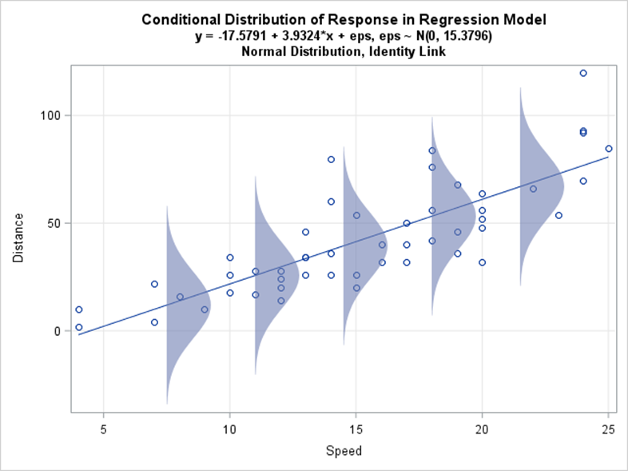
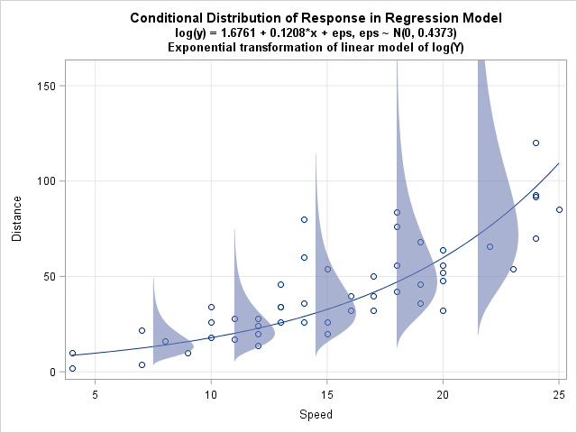
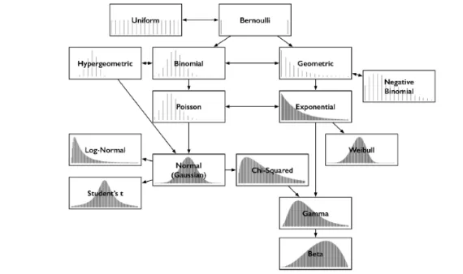

## Generalized Linear Models

-   In Linear models $Y_i$ is normally distributed with mean $\mu_i$ and variance $\sigma^2$

-   $$
    Y_i \sim N(mean=\mu_i, var=\sigma)
    $$

-   $$ \mu_i = \beta_0 + \beta_1x_{1,i} + \beta_2x_{2,i} ... $$

-   Assumptions: Linearity, homoscedasticity, normality

-   GLM's link one response variable with predictor variables:

-   $$
    Y_i \sim some \ distribution(\mu_i)
    $$

-   $$ link(\mu_i) = \beta_0 + \beta_1x_{1,i} + \beta_2x_{2,i} 
    $$

## When do we use them?

Sometimes, the assumptions for a linear model are not met. We can sometimes do a transformation to make it linear, homoscedastic (equal variance).

## Why not transform the data?

We **can** transform the data. If the data is exponential as in the following example:

## Why not transform the data?

We **can** transform the data. If the data is exponential as in the following example:

```{r}
#| echo: false
x<-runif(300,0,10)
loglambda<-1+0.35*x
lambda<-exp(loglambda)
y<- rpois(300,lambda) + 1
library(ggplot2)
dat<-data.frame(x,y)
```

```{r}
ggplot(dat,aes(x=x,y=y))+
  geom_point()+
  xlab("flow")+
  ylab("N (fish)")+
  ggtitle("Fish passage \n N of fish")+
  theme_classic()+
  theme(plot.title = element_text(hjust=0.5))
```

## Assumptions {.scrollable}

```{r}
ggplot(dat,aes(x=x,y=y))+
  geom_point()+
  xlab("flow")+
  ylab("N (fish)")+
  ggtitle("Fish passage \n N of fish")+
  theme_classic()+
  theme(plot.title = element_text(hjust=0.5))
```

-   Draw an "imaginary" line through the center of the plot. Is the variance equal?

-   Variance? Think how far each point is from your imaginary line! The variance should be the same independently of the value of x!

## Assumptions {.scrollable}

```{r}
ggplot(dat,aes(x=x,y=y))+
  geom_point()+
  xlab("flow")+
  ylab("N (fish)")+
  ggtitle("Fish passage \n N of fish")+
  theme_classic()+
  theme(plot.title = element_text(hjust=0.5))
```

::: nonincremental
-   Draw an "imaginary" line through the center of the plot. Is the variance equal?

-   Variance? Think how far each point is from your imaginary line! The variance should be the same independently of the value of x!

-   Clearly! **IT IS NOT HOMOSCEDASTIC! (let's start calling this non-equal variance!)**, also not linear...
:::

## We can transform the data

```{r}
#| echo: true
dat$logy<-log(dat$y+0.00001)
```

## We can transform the data

```{r eval=F}
#| echo: true
dat$logy<-log(dat$y+0.00001)
```

```{r}
ggplot(dat,aes(x=x,y=logy))+
  geom_point()+
  xlab("flow")+
  ylab("N (fish)")+
  ggtitle("Fish passage \n N of fish")+
  theme_classic()+
  theme(plot.title = element_text(hjust=0.5))
```

## We can transform the data

```{r eval=F}
#| echo: true
dat$logy<-log(dat$y+0.00001)
```

```{r}
ggplot(dat,aes(x=x,y=logy))+
  geom_point()+
  xlab("flow cubic m")+
  ylab("N (fish)")+
  ggtitle("Fish passage \n N of fish")+
  theme_classic()+
  theme(plot.title = element_text(hjust=0.5))
```

-   **Ooops! We have a problem! It is linear now, which is good... but there is an issue**

-   What is it?

-   Yeah, we are transforming the variance as well! We need a different solution!

## We can transform the data

However, at least it is linear! so, we can estimate a lm:

```{r}
#| echo: true
model<-lm(logy~x, data=dat)
predictedmodel<-predict.lm(model,dat,interval = "co")
datpred<-cbind(dat,predictedmodel)
```

```{r}
ggplot(datpred,aes(x=x,y=logy,ymin=lwr,ymax=upr))+
  geom_point()+
  geom_line(aes(y=fit),lwd=2)+
  xlab("flow")+
  ylab("N (fish)")+
  ggtitle("Fish passage \n N of fish")+
  theme_classic()+
  theme(plot.title = element_text(hjust=0.5))
```

## We can transform the data

However, at least it is linear! so, we can estimate a lm:

```{r}
#| echo: true
model<-lm(logy~x, data=dat)
predictedmodel<-predict.lm(model,dat,interval = "co")
datpred<-cbind(dat,predictedmodel)
```

```{r}
ggplot(datpred,aes(x=x,y=logy,ymin=lwr,ymax=upr))+
  geom_point()+
  geom_ribbon(alpha=0.5)+
  xlab("flow")+
  ylab("N (fish)")+
  ggtitle("Fish passage \n N of fish")+
  theme_classic()+
  theme(plot.title = element_text(hjust=0.5))
```

## Distribution

Transformations will linearize the data, but if the response variable has a differentt distribution around the model than normal, then a glm is the way to go:

{width="464"}

{width="479"}

## We can do a glm!

This a Poisson distribution... why?

-   Only integers

-   Counts

-   It could also be negative binomial, zero-inflated, etc... but in this case it is binomial!

## We can do a glm!

This a Poisson distribution... Let's do a Poisson GLM:

Glm's have:

1.  Linear Predictor

2.  Link Function

3.  Probability Distribution

## We can do a glm!

This a Poisson distribution... Let's do a Poisson GLM:

Linear Predictor:

$$
\beta_0 + \beta_1x_1
$$

$$
\beta_0 + \beta_1flow
$$

## We can do a glm!

This a Poisson distribution... Let's do a Poisson GLM:

Link function:

$$log(\lambda_i) = \beta_0 + \beta_1x_1 $$

$$ log(\lambda_i) =  \beta_0 + \beta_1flow $$

## Data

```{r}
ggplot(dat,aes(x=x,y=y))+
  geom_point()+
  xlab("flow")+
  ylab("N (fish)")+
  ggtitle("Fish passage \n N of fish")+
  theme_classic()+
  theme(plot.title = element_text(hjust=0.5))
```

## Generalized Linear Model

We can estimate a glm:

```{r}
#| echo: true
model<-glm(y~x, family=poisson, data=dat) 
summary(model)
```

## Model

```{r}
#| echo: true
predictedmodel<-predict.glm(model,dat, se.fit = T) 
datpred2<-cbind(dat,predictedmodel)
```

## It is essentially transforming it!

```{r}
ggplot(datpred2,aes(x=x,y=log(y),ymin=fit-2*se.fit,ymax=fit+2*se.fit))+
  geom_point()+
  geom_line(aes(y=fit),lwd=1)+
    geom_ribbon(alpha=0.2)+
  xlab("flow")+
  ylab("log (N fish)")+
  ggtitle("Fish passage \n N of fish")+
  theme_classic()+
  theme(plot.title = element_text(hjust=0.5))
```

## GLM equation: poisson

-   $$log(\mu_i) = \beta_0 + \beta_1x_i $$

-   $$ y_i \sim Poisson(\lambda = \mu_i)$$

-   $$ \mu_i = e^{\beta_0 + \beta_1x_i}$$

## GLM equation: poisson

-   $$log(\mu_i) = \beta_0 + \beta_1x_i => log(\mu_i) = \beta_0 + \beta_1flow_i  $$

-   $$ y_i \sim Poisson(\lambda = \mu_i) => Nfish_i \sim Poisson(\lambda = \mu_i)$$

-   $$ \mu_i = e^{\beta_0 + \beta_1x_i} => \mu_i = e^{\beta_0 + \beta_1flow_i} $$

## Model Summary

```{r}
summary(model)
```

## Link function

$$
ln ( \lambda_i )= \beta_0+\beta_1x_1  \iff \lambda_i =exp(\beta_0+\beta_1x_1)
$$

```{r}
#| echo: false
model<-glm(y~x, data=dat,,family=poisson(link ="log"))
predictedmodel<-predict.glm(model,dat,se.fit = T)
ci_lwr <- with(predictedmodel, exp(fit + qnorm(0.025)*se.fit))
ci_upr <- with(predictedmodel, exp(fit + qnorm(0.975)*se.fit))
datpred2<-cbind(dat,predictedmodel)
datpred2$fit2<-exp(datpred2$fit)
datpred2$lwr<-ci_lwr
datpred2$upr<-ci_upr
```

```{r}
ggplot(datpred2,aes(x=x,y=y,ymin=exp(fit-2*se.fit),ymax=exp(fit+2*se.fit)))+
  geom_point()+
  geom_line(aes(y=exp(fit)),lwd=1)+
 
  xlab("flow")+
  ylab("log (N fish)")+
  ggtitle("Fish passage \n N of fish")+
  theme_classic()+
  theme(plot.title = element_text(hjust=0.5))
```

## Probability distribution

$$
Y_i \sim Poisson(\lambda_i)
$$

```{r}
ggplot(datpred2,aes(x=x,y=y,ymin=exp(fit-2*se.fit),ymax=exp(fit+2*se.fit)))+
  geom_point()+
  geom_line(aes(y=exp(fit)),lwd=1)+
 
  xlab("flow")+
  ylab("log (N fish)")+
  ggtitle("Fish passage \n N of fish")+
  theme_classic()+
  theme(plot.title = element_text(hjust=0.5))
```

## Probability distribution

Not normally distributed! This is OK! This is the point of a glm! It maps the error to the actual distribution

```{r}
ggplot(datpred2,aes(x=x,y=y,ymin=exp(fit-2*se.fit),ymax=exp(fit+2*se.fit)))+
  geom_point()+
  geom_line(aes(y=exp(fit)),lwd=1)+
    geom_ribbon(alpha=0.2)+
  xlab("flow")+
  ylab("log (N fish)")+
  ggtitle("Fish passage \n N of fish")+
  theme_classic()+
  theme(plot.title = element_text(hjust=0.5))
```

## Success!

Look at the error!

```{r}
ggplot(datpred2,aes(x=x,y=y,ymin=exp(fit-2*se.fit),ymax=exp(fit+2*se.fit)))+
  geom_point()+
  geom_line(aes(y=exp(fit)),lwd=1)+
    geom_ribbon(alpha=0.2)+
  xlab("flow")+
  ylab("log (N fish)")+
  ggtitle("Fish passage \n N of fish")+
  theme_classic()+
  theme(plot.title = element_text(hjust=0.5))
```

## How to plot:

```{r echo=TRUE}
ggplot(datpred2,aes(x=x,y=log(y),ymin=fit-2*se.fit,ymax=fit+2*se.fit))+
  geom_point()+
  geom_line(aes(y=fit),lwd=1)+
    geom_ribbon(alpha=0.2)+
  xlab("flow")+
  ylab("log (N fish)")+
  ggtitle("Fish passage \n N of fish")+
  theme_classic()+
  theme(plot.title = element_text(hjust=0.5))
```

## How to plot:

```{r echo=TRUE}
ggplot(datpred2,aes(x=x,y=y,ymin=exp(fit-2*se.fit),ymax=exp(fit+2*se.fit)))+
  geom_point()+
  geom_line(aes(y=exp(fit)),lwd=1)+
    geom_ribbon(alpha=0.2)+
  xlab("flow")+
  ylab("log (N fish)")+
  ggtitle("Fish passage \n N of fish")+
  theme_classic()+
  theme(plot.title = element_text(hjust=0.5))
```

## Distributions



## Normal Distribution

-   Linear Models

-   Continuous

-   Theoretically from -inf to inf

-   Bell curve shapes

-   2 parameters: mean and variance

## Poisson Distribution

-   It is discrete

-   Only positive

-   Usually counts (usually rate)

-   It has only one parameter

## Poisson distributions

```{r fig.width=8, fig.height=4}
x <- seq(0, 50, by = 1)
df <- data.frame(y = c(dpois(x, lambda = 1),dpois(x, lambda = 5), dpois(x, lambda = 20), dpois(x, lambda = 30)),
                 x = x,
                 lambda = factor(rep(c( "lambda = 1", "lambda = 5", "lambda = 20", "lambda = 30"), each = length(x)),
                                 levels = c("lambda = 1", "lambda = 5", "lambda = 20", "lambda = 30")))
ggplot(df, aes(x = x, y = y, fill = lambda)) +
  geom_col(alpha = 0.75, color = "grey", linewidth = 0.1, position = "dodge") +
  scale_y_continuous("Probability density") +
  scale_x_continuous("y") +
  scale_fill_discrete(labels = c(expression(paste(lambda, "= 1")),
                                  expression(paste(lambda, "= 5")), 
                                 expression(paste(lambda, "= 20")), 
                                 expression(paste(lambda, "= 30"))))+
  theme_classic()
```

## Binomial distributions

The binomial distribution is also a discrete probability distribution with support from 0 to $N$. It is often used to model count data where there is an upper limit (e.g., \# of heads from $N$ coin flips)

## Binomial distributions

The binomial distribution has two parameters $N$ (# of trials) and $p$ (probability of success). The mean is $Np$ and the variance is $np(1-p)$

## Binomial distributions

```{r fig.width=8, fig.height=4}
x <- seq(0, 40, by = 1)
df <- data.frame(y = c(dbinom(x, size = 5, prob = 0.25), dbinom(x, size = 10, prob = 0.8), dbinom(x, size = 20, prob = 0.5), dbinom(x, size = 35, prob = 0.8)),
                 x = x,
                 lambda = rep(c("N = 5, p = 0.25", "N = 10, p = 0.8", "N = 20, p = 0.5", "N = 35, p = 0.8"), each = length(x)))
ggplot(df, aes(x = x, y = y, fill = as.factor(lambda) )) +
  geom_col(alpha = 0.75, color = "grey", linewidth = 0.1, position = "dodge") +
  scale_y_continuous("Probability density") +
  scale_x_continuous("Number of successes") 

```

## Binomial

Note that $N$ is often fixed and known. We are interested in estimating $p$

## bernoulli distribution

The Bernoulli distribution is a special case of the binomial distribution where $N = 1$. What are the possible values of $y$?

The Bernoulli distribution is very useful for data where the response variable is binary in nature (e.g., dead/alive, presence/absence, ). The parameter we estimate is $p$ - the probability of "success"

```{r fig.width=8, fig.height=4}
x <- c(0,1)
df <- data.frame(y = c(dbinom(x, size = 1, prob = 0.2), dbinom(x, size = 1, prob = 0.5), dbinom(x, size = 1, prob = 0.8)),
                 x = x,
                 p = rep(c("p = 0.2", "p = 0.5", "p = 0.8"), each = length(x)))
ggplot(df, aes(x = x, y = y, fill = as.factor(p) )) +
  geom_col(alpha = 0.75, width = 0.1,color = "grey", linewidth = 0.1, position = "dodge") +
  scale_y_continuous("Probability density") +
  scale_x_continuous("", breaks = c(0, 1)) 

```

# bernoulli distribution

```{r echo = TRUE}
rbinom(n = 10, size = 1, p = 0.1)
```

```{r echo = TRUE}
rbinom(n = 10, size = 1, p = 0.5)
```

```{r echo = TRUE}
rbinom(n = 10, size = 1, p = 0.9)
```

## How to run a glm?

Let's go back to the Poisson example

## Poisson glm code

```{r eval=FALSE}
#| echo: true
model<-glm(y~x, data=dat,,family=poisson(link ="log"))

```

```{r}
summary(model)
```

## Poisson glm code

```{r eval=FALSE}
#| echo: true
model<-glm(y~x, data=dat,,family=poisson(link ="log"))
predictedmodel<-predict.glm(model,dat,se.fit = T)
ci_lwr <- with(predictedmodel, exp(fit + qnorm(0.025)*se.fit))
ci_upr <- with(predictedmodel, exp(fit + qnorm(0.975)*se.fit))
datpred2<-cbind(dat,predictedmodel)
datpred2$fit2<-exp(datpred2$fit)
datpred2$lwr<-ci_lwr
datpred2$upr<-ci_upr
```

## Binomial glm code

```{r eval=F}
#| echo: true
model<-glm(y~x, data=dat,,family=binomial(link = "logit"))
```

\##

```{r}
#| echo: true
dat<-read.csv("parasitecod.csv")
model<-glm(Prevalence~Weight, data=dat,,family=binomial(link ="logit"))
predictedmodel<-predict.glm(model,dat,se.fit = T)
ci_lwr <- with(predictedmodel, plogis(fit + qnorm(0.025)*se.fit))
ci_upr <- with(predictedmodel, plogis(fit + qnorm(0.975)*se.fit))
datpred2<-cbind(dat,predictedmodel)
datpred2$fit2<-plogis(datpred2$fit)
datpred2$lwr<-ci_lwr
datpred2$upr<-ci_upr
```

```{r}
ggplot(datpred2,aes(x=Weight,y=Prevalence,ymin=lwr,ymax=upr))+
  geom_point()+
  geom_line(aes(y=fit2))+
  geom_ribbon(alpha=0.5)+
  xlab("flow")+
  ylab("N (fish)")+
  ggtitle("Fish passage \n N of fish")+
  theme_classic()+
  theme(plot.title = element_text(hjust=0.5))
```
