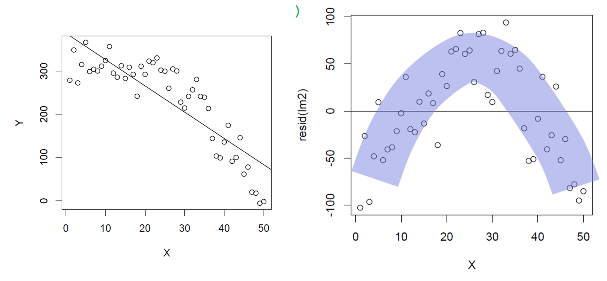
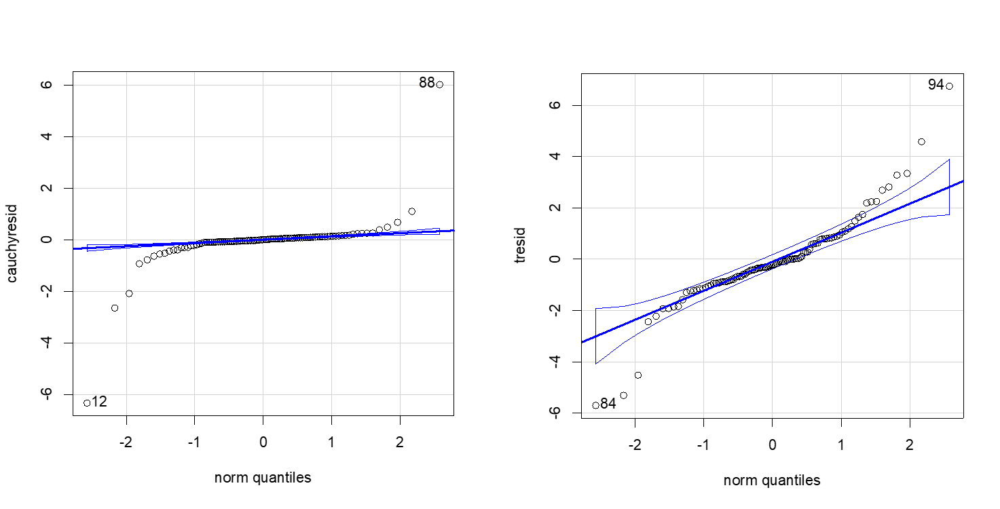
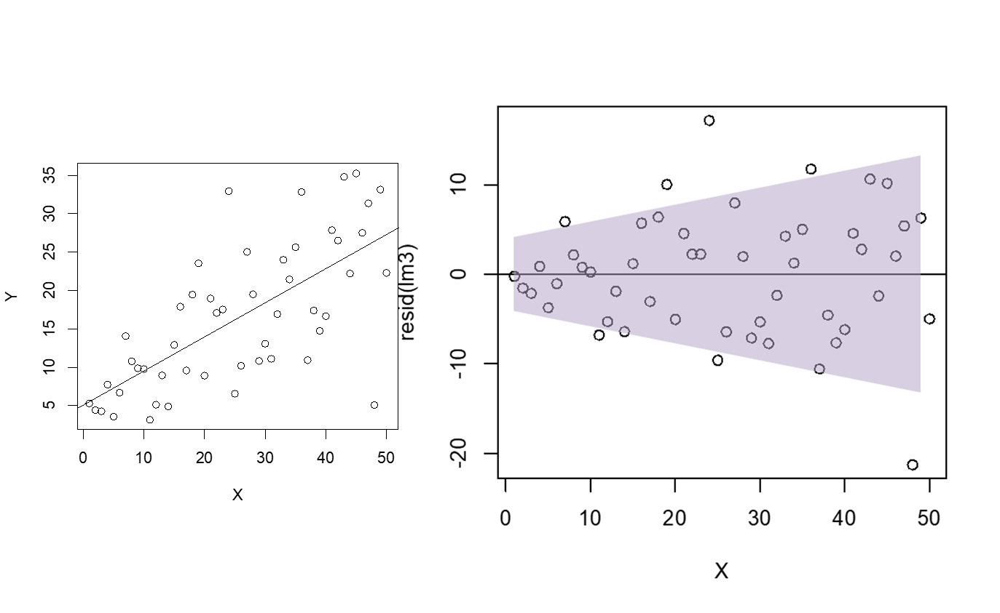
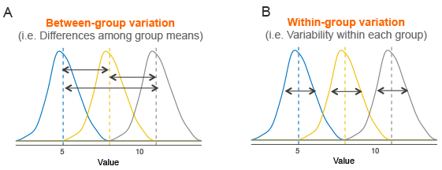
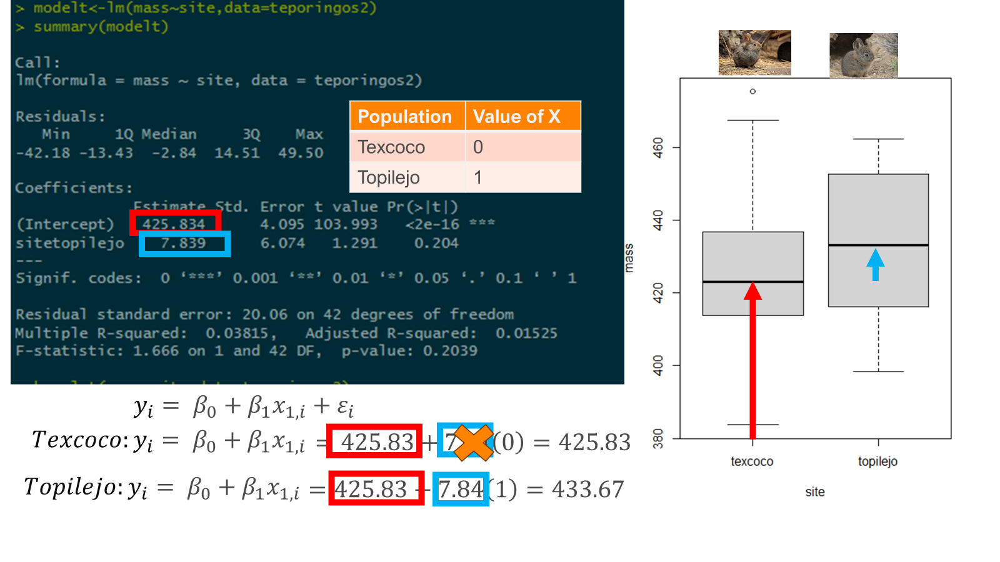
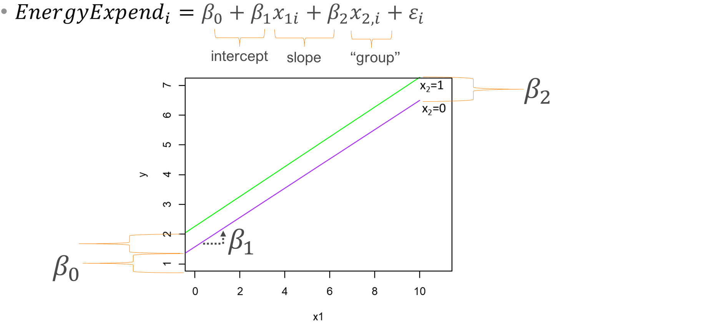
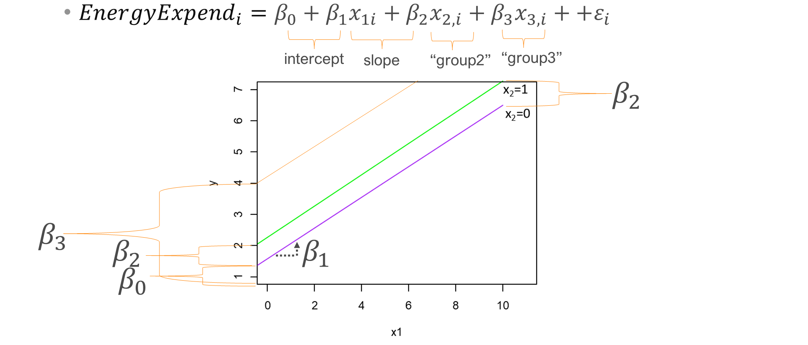
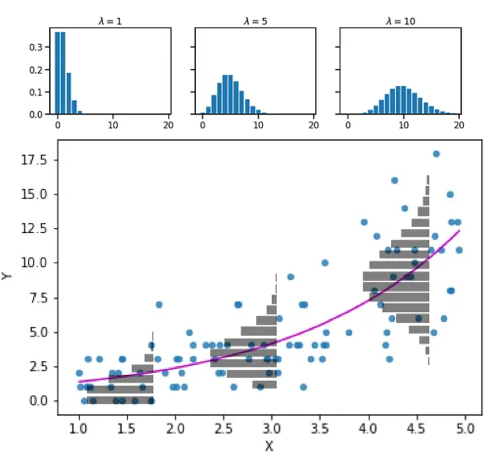

## This lecture

You can access it from: <https://rpubs.com/amolina/review571>

Review of linear models

Review of glm's

## Linear models assumptions

-   Linearity

-   Homoscedasticity

-   Normality

-   Independence

-   No collinearity

## Lack of linearity



## Lack of normality



## Lack of homoscedasticity



## How to interpret GLM's outputs?

-   Let's remember that linear models, and glm's have a "linear" deterministic component

```{r}
#| warning: false
library(ggplot2)
foodav<-read.csv("foodav.csv")
modelfish<-lm(ReproductiveEffort~Foodavailability,data = foodav)
predictedv<-predict.lm(modelfish,foodav,interval="co")
foodav<-cbind(foodav,predictedv)

ggplot(foodav, aes(x = Foodavailability, y = ReproductiveEffort,ymin=lwr,ymax=upr)) +
   geom_point() +
   geom_line(aes(y=fit),color="blue") +
   geom_ribbon(alpha=0.2)+
   theme_classic()

```

## How to interpret GLM's outputs?

-   Let's remember that linear models, and glm's have a "linear" deterministic component

-   In linear models: $\mu_i = \beta_0 + \beta_1x_{1,i} ...$ (which means, the expected value of y )

-   In generalized linear models: $f(\mu_i) = \beta_0 + \beta_1x_{1,i} ...$ (which means, a function of the expected value of y)

## The deterministic component is linear

Which is a good thing! Each linear (not polynomial... let's forget about that for a little while) has two components!

-   A slope

-   An intercept

## The deterministic component is linear

Which is a good thing! Each linear (not polynomial... let's forget about that for a little while) has two components!

::: nonincremental
-   A slope

-   An intercept
:::

$$
y = mx + b 
$$

## The deterministic component is linear

Which is a good thing! Each linear (not polynomial... let's forget about that for a little while) has two components!

::: nonincremental
-   A slope

-   An intercept
:::

$$
y = mx + b = b + mx
$$

is not any different than:

$$
\begin{align}
\mu_i & = \beta_0 + \beta_1x_{1,i} \\
y_i & ~ N(mean = \mu_i, var=\sigma^2)
\end{align}
$$

## Let's remember what a slope and an intercept is

```{r}
par(mar=c(1,1,1,1))
plot(x=-10:10,y=-10:10,type = "n", main=NULL)
abline(a=2, b=1.5)
 abline                      (h=0, v=0, lty = 5)

```

## Let's remember what a slope and an intercept is

```{r}
par(mar=c(1,1,1,1))
plot(x=-10:10,y=-10:10,type = "n", main=NULL)
abline(a=2, b=1.5)
 abline                      (h=0, v=0, lty = 5)
arrows(4,2,0,lwd=2,length=.1, col="darkblue")
text(6,2,"Intercept = 2", col="darkblue")

```

## Let's remember what a slope and an intercept is

```{r}
par(mar=c(1,1,1,1))
plot(x=-10:10,y=-10:10,type = "n", main=NULL)
abline(a=2, b=1.5)
 abline                      (h=0, v=0, lty = 5)
arrows(4,2,0,lwd=2,length=.1, col="darkblue")
text(6,2,"Intercept = 2", col="darkblue")
segments(x0 = - 2, y0 = - 2.5, x1 = -2, y1 = -1, col = "darkgreen")  
segments(x0 = - 2, y0 = - 2.5, x1 = -3, y1 = -2.5, col = "darkgreen")  
arrows(-2,-8,-2,-2.5,lwd=2,length=.1, col="darkgreen")
text(-2,-8.5,"slope = 1.5", col="darkgreen")
```

## Let's remember what a slope and an intercept is

```{r}
par(mar=c(1,1,1,1))
plot(x=-10:10,y=-10:10,type = "n", main=NULL)
abline(a=2, b=1.5)
 abline                      (h=0, v=0, lty = 5)
arrows(4,2,0,lwd=2,length=.1, col="darkblue")
text(6,2,"Intercept = 2", col="darkblue")
segments(x0 = - 2, y0 = - 2.5, x1 = -2, y1 = -1, col = "darkgreen")  
segments(x0 = - 2, y0 = - 2.5, x1 = -3, y1 = -2.5, col = "darkgreen")  
arrows(-2,-8,-2,-2.5,lwd=2,length=.1, col="darkgreen")
text(-2,-8.5,"slope = 1.5", col="darkgreen")
```

-   Slope: For very change in x of 1, y changes 1.5. Intercept: 2

-   So, if x = 5, then y = 2 + 1.5(5) = 9.5

## So, what about linear models?

Each line in a linear model simply has: 1 slope and 1 intercept.

```{r}
ggplot2::ggplot(foodav, aes(x = Foodavailability, y = ReproductiveEffort,ymin=lwr,ymax=upr)) +
   geom_point() +
   geom_line(aes(y=fit),color="blue") +
   geom_ribbon(alpha=0.2)+
   theme_classic()
```

## So, what about linear models?

What is the slope? what is the intercept?

```{r}
ggplot2::ggplot(foodav, aes(x = Foodavailability, y = ReproductiveEffort,ymin=lwr,ymax=upr)) +
   geom_point() +
   geom_line(aes(y=fit),color="blue") +
   geom_ribbon(alpha=0.2)+
   theme_classic()
```

## So, what about linear models?

$$
\begin{split}
y_i & \sim \beta_0 + \beta_1x_i + \epsilon_i \\
\text{where } \epsilon & \sim normal(0,\sigma)
\end{split}
$$ Or, in this specific case:

$$
Reproductive \ effort_i \sim \beta_0 + \beta_1Food \ availability_i + \epsilon_i \\
$$

## So, what about linear models?

```{r}
summary(modelfish)
```

Intercept: 0.895

Slope: 1.194

$$
\begin{split}
y_i & \sim \beta_0 + \beta_1x_i + \epsilon_i \\
\text{where } \epsilon & \sim normal(0,\sigma)
\end{split}
$$

## Results

| Coefficient1        | Estimate | Col3 | Col4 | Col5 |
|---------------------|----------|------|------|------|
| Intercept $\beta_0$ | 0.895    |      |      |      |
| Slope $\beta_1$     | 1.194    |      |      |      |

$$
\begin{split}
y_i & \sim \beta_0 + \beta_1x_i + \epsilon_i \\
\text{where } \epsilon & \sim normal(0,\sigma)
\end{split}
$$

## Results

| Coefficient1        | Estimate | Std. Error | t-value (test) | Col5     |
|---------------------|----------|------------|----------------|----------|
| Intercept $\beta_0$ | 0.895    | 0.072      | 12.32          | \<0.0001 |
| Slope $\beta_1$     | 1.194    | 0.0159     | 75.08          | \<0.0001 |

$$ \begin{split} y_i & \sim \beta_0 + \beta_1x_i + \epsilon_i \\ \text{where } \epsilon & \sim normal(0,\sigma) \end{split} $$

Test:

Ho: Coefficient == 0

Ha Coefficient != 0

## How about this one:

```{r}
drugz<-read.csv("drug_Z.csv")
modeld<-lm(FC~IC+Dose,data=drugz)
drugzpred<-predict.lm(modeld,drugz,interval = "co")
drugz2<-cbind(drugz,drugzpred)
ggplot2::ggplot(drugz2, aes(x = IC, y = FC,ymin=lwr,ymax=upr, color=Dose, shape=Dose)) +
   geom_point() +
   geom_line(aes(y=fit)) +
   geom_ribbon(alpha=0.1)+
   theme_classic()
```

## How about this one:

```{r}
summary(modeld)
```

-   Additive model means only one slope is estimated!

## Back to the plot

```{r}
drugz<-read.csv("drug_Z.csv")
modeld<-lm(FC~IC+Dose,data=drugz)
drugzpred<-predict.lm(modeld,drugz,interval = "co")
drugz2<-cbind(drugz,drugzpred)
ggplot2::ggplot(drugz2, aes(x = IC, y = FC,ymin=lwr,ymax=upr, color=Dose, shape=Dose)) +
   geom_point() +
   geom_line(aes(y=fit)) +
   geom_ribbon(alpha=0.1)+
   theme_classic()
```

-   Parallel lines

-   1 slope, 3 intercepts

-   Each line: $y = mx + b$

## Finding values

```{r}
summary(modeld)
```

$$
\begin{align}
\beta_0 & = 0.51 \ \text{intercept for control} \\
\beta_1 & = 0.93 \ \text{slope} \\
\beta_2 & = -0.44 \ \text{Difference in intercept between control and dose 1} \\
\beta_2 & = -2.099 \ \text{Difference in intercept between control and dose 2} \\
\end{align}
$$

$$
y_i \sim \beta_0 + \beta_1x_{1,i}  + \beta_2x_{2,i} +  \beta_3x_{3,i} + \epsilon_i \\
$$

| Site    | Value of $x_2$ | Value of $x_3$ |
|---------|----------------|----------------|
| Control | 0              | 0              |
| Dose 1  | 1              | 0              |
| Dose 2  | 0              | 1              |

## Finding values

```{r}
summary (modeld)
```

| Measurement | Intercept   | Slope |
|-------------|-------------|-------|
| Control     | 0.51        | 0.93  |
| Dose 1      | 0.51 - 0.44 | 0.93  |
| Dose 2      | 0.51 -2.099 | 0.93  |

## Statistical inference

`anova`

`emmeans`

`contrast`

```{r}
anova(modeld)
a<-emmeans::emmeans(modeld, ~ Dose)
emmeans::contrast(a,"pairwise")
```

## statistical inference

`anova` compares variance. Is the variance between groups higher than within groups?



## Interactive

```{r}
par(mar=c(1,1,1,1))
plot(x=-10:10,y=-10:10,type = "n", main=NULL)
abline(a=2, b=1.5, col="salmon")
abline(a=3, b=0.5, col="brown")
 abline                      (h=0, v=0, lty = 5)
arrows(4,2,0,lwd=2,length=.1, col="darkblue")
text(6,2,"Intercept = 2", col="darkblue")

arrows(-4,3,0,lwd=2,length=.1, col="darkblue")
text(-6,3,"Intercept = 3", col="darkblue")
segments(x0 = - 2, y0 = 1.5, x1 = -2, y1 = 2, col = "darkgreen")  
segments(x0 = - 2, y0 = 1.5, x1 = -3, y1 = 1.5, col = "darkgreen")  
text(-2,1,"slope = 0.5", col="darkgreen")

segments(x0 = - 2, y0 = - 2.5, x1 = -2, y1 = -1, col = "darkgreen")  
segments(x0 = - 2, y0 = - 2.5, x1 = -3, y1 = -2.5, col = "darkgreen")  
arrows(-2,-8,-2,-2.5,lwd=2,length=.1, col="darkgreen")
text(-2,-8.5,"slope = 1.5", col="darkgreen")
```

-   Each line has its own slope and its own intercept

## Interactive

```{r}
modeld2<-lm(FC~IC*Dose,data=drugz)
summary(modeld2)
```

$$
\begin{align}
\beta_0 & = 0.38 \ \text{intercept for control} \\
\beta_1 & = 0.954 \ \text{slope for control} \\
\beta_2 & = -0.073 \ \text{Difference in intercept between control and dose 1} \\
\beta_3 & = -2.24 \ \text{Difference in intercept between control and dose 2} \\
\beta_4 & = -0.085 \ \text{Difference in slope between control and dose 1} \\
\beta_5 & = 0.023 \ \text{Difference in slope between control and dose 2} \\
\end{align}
$$

| Site    | Value of $x_2$ | Value of $x_3$ | Value of $x_4$ | Value of $x_5$ |
|---------|----------------|----------------|----------------|----------------|
| Control | 0              | 0              | 0              | 0              |
| Dose 1  | 1              | 0              | 1              | 0              |
| Dose 2  | 0              | 1              | 0              | 1              |

## Doing inference of interactions

```{r}
anova(modeld2)
a<-emmeans::emmeans(modeld2, ~ Dose)
emmeans::contrast(a,"pairwise")
```

## Interactions

```{r}
par(mar=c(1,1,1,1))
plot(x=-10:10,y=-10:10,type = "n", main=NULL)
abline(a=2, b=1.5, col="salmon")
abline(a=3, b=0.5, col="brown")
 abline                      (h=0, v=0, lty = 5)
arrows(4,2,0,lwd=2,length=.1, col="darkblue")
text(6,2,"Intercept = 2", col="darkblue")

arrows(-4,3,0,lwd=2,length=.1, col="darkblue")
text(-6,3,"Intercept = 3", col="darkblue")
segments(x0 = - 2, y0 = 1.5, x1 = -2, y1 = 2, col = "darkgreen")  
segments(x0 = - 2, y0 = 1.5, x1 = -3, y1 = 1.5, col = "darkgreen")  
text(-2,1,"slope = 0.5", col="darkgreen")

segments(x0 = - 2, y0 = - 2.5, x1 = -2, y1 = -1, col = "darkgreen")  
segments(x0 = - 2, y0 = - 2.5, x1 = -3, y1 = -2.5, col = "darkgreen")  
arrows(-2,-8,-2,-2.5,lwd=2,length=.1, col="darkgreen")
text(-2,-8.5,"slope = 1.5", col="darkgreen")

text(5,8,"group1", col="salmon")

text(9,6,"group2", col="brown")
```

## Finding values (predictions)

::: callout-important
## Assignment question 1 📝

Look at the summary. And before continuing make sure you understand it. If you don't, now is the time to raise your hand.

You need to calculate the expected probability (we'll call this $\pi$) of an individual being infected for each of the following two cases:

1.  An individual of length 50 from Area 1, in 1999
2.  An individual of length 50 from Area 3, in 2001
:::

## GLM

```{r}
#| warning: false
cod<-read.csv("parasitecod.csv")
library(dplyr)
cod<-cod%>%mutate(across(c(Year,Sex,Stage,Area),as.factor))
codmodel1<-glm(Prevalence~Length+Year+Area,data=cod,family = binomial(link="logit"))


predictedmodel<-predict.glm(codmodel1,cod,se.fit = T)
ci_lwr <- with(predictedmodel, plogis(fit - 1.96*se.fit))
ci_upr <- with(predictedmodel, plogis(fit + 1.96*se.fit))
cod2<-cbind(cod,predictedmodel)
cod2$fit2<-plogis(cod2$fit)
cod2$lwr<-ci_lwr
cod2$upr<-ci_upr
ggplot2::ggplot(cod2,aes(x=Length,y=Prevalence,ymin=lwr,ymax=upr,color=Area,shape=Area,fill=Area))+
  geom_point()+
  geom_line(aes(y=fit2))+
  geom_ribbon(alpha=0.1)+
  xlab("Length (cm)")+
  ylab("Prevalence")+
  theme_bw()+
  facet_grid(~Year)
```

## Model

```{r}
str(cod)
cod
```

## Model

```{r}
summary(codmodel1)
```

These are all from a linear model. Need to transform them to get the real value in probabilistic scale

Additive! One slope

## How to estimate the values?

```{r}
summary(codmodel1)
```

$$
logistic(\pi_i)  = \beta_0 + \beta_1 x_{1,i}+ \beta_2 x_{2,i} + \beta_3 x_{3,i}+ \beta_4 x_{4,i} + \beta_5 x_{5,i} + \beta_6 x_{6,i}
$$

Site

|   | Value of $x_2$ | Value of $x_3$ | Value of $x_4$ | Value of $x_5$ | Value of $x_6$ | Value of $x_7$ |
|----|----|----|----|----|----|----|
|  | 2000 | 2001 | Area 1 | Area 2 | Area 3 | Area 4 |
| Area-1 1999 | 0 | 0 | 0 | 0 | 0 | 0 |
| Area-1 2000 | 1 | 0 | 0 | 0 | 0 | 0 |
| Area-1 2001 | 0 | 1 | 0 | 0 | 0 | 0 |
| Area-2 1999 | 0 | 0 | 0 | 1 | 0 | 0 |
| Area-2 2000 | 0 | 1 | 0 | 1 | 0 | 0 |
| Area-2 2001 | 0 | 0 | 1 | 1 | 0 | 0 |
| Area 3- 1999 | 0 | 0 | 0 | 0 | 1 | 0 |
| Area 3 -2000 | 1 | 0 | 0 | 0 | 1 | 0 |
| Area 3 - 2001 | 0 | 1 | 0 | 0 | 1 | 0 |
| Area 4 - 1999 | 0 | 0 | 0 | 0 | 0 | 1 |
| Area 4 - 2000 | 0 | 1 | 0 | 0 | 0 | 1 |
| Area 4 2001 | 0 | 0 | 1 | 0 | 0 | 1 |

## Categorical



## 



## 



## 

## Logistic regression assumptions

-   Binomial distribution

-   Binary data (1, 0)

## Poisson assumptions

-   Count-data

-   While we usually think Poisson, it has an important assumption: $Var(y_i) = \lambda\_i$



## GLM's other assumptions

-   Data is independently distributed

-   Error is independent

## 
