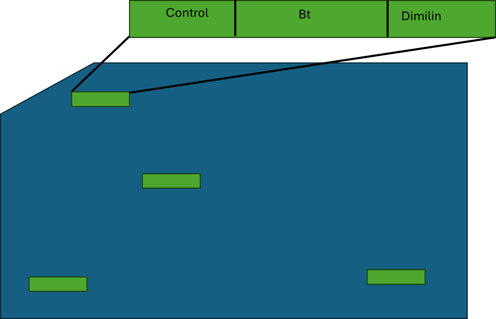

# This assignment

This is just the first section of the assignment. The second one (dealing with data) will be uploaded at some point tomorrow (Tuesday 15).

::: callout-note
## Important dates 📆

Friday 4/10/2026: NO CLASS (TAKE HOME EXAM UPLOADED). I can meet with you and help with this current assignment. This assignment is due 4/13

Friday 4/24/2026: Exam due
:::

# Section 1

## Instructions

I will be describing 5 experiments. For each of them:

1.  Identify the design
2.  Identify the main plot and subplot factors (if applicable).
3.  Identify the experimental and observational unit for each factor.
4.  Write either:
    1.  A linear model equation or
    2.  An ANOVA model equation

You will do this on a Quarto document.

# Experiments

Read the information for each of the following 5 experiments. Answer the 4 questions posted in instructions for **each** experiment.

::: {.panel-tabset style="background-color: #dcf0f2; border: 1px solid white; .tabs{         border-right: 2px solid #636363;       border-top: 2px solid #636363;       border-bottom: 2px solid #636363; }"}
## Irrigation and Fertilizer 🥬

A researcher is testing two irrigation methods (drip vs. spray) and three fertilizer types (A, B, C) on crop yield of a leafy green. Each irrigation method is randomly assigned to fields. Within each field, all three fertilizers are applied randomly to plots.

## Chick Feed and Temperature 🐔

Two feed types (standard vs. high-protein) are randomly assigned to pens of chickens. Within each pen, cages are randomly assigned to one of two temperatures (cool vs. warm). Weight is recorded after 4 weeks. Weight is not recorded prior to the four weeks.

## Plant Genotypes 🌱

A plant breeder tests 4 genotypes of wheat across 4 blocks in the field. Each genotype appears once per block. Each block has a slightly different soil, as there is a gradient change in soil type. Yield is recorded at harvest.

## Weight of Chickens 🐔

Weights of chicks are recorded weekly for 6 weeks. Each chick is randomly assigned to one of three diets. Chick ID is recorded.

## Soil Type and Watering Frequency 🎑

A greenhouse experiment tests the effect of soil type (clay, loam, sand) and watering frequency (daily vs. every 3 days) on seedling height. 6 replicates of each treatment combination are assigned randomly to individual pots.
:::

## How to write equations in Quarto?

You can use double dollar signs: \$\$ to write an equation.

You can also right-click on any equation from any assignment and select LaTeX math to see how I wrote the equation. For example:

$$
y_{ij} = \mu + \alpha_i + \beta_j + \alpha\beta_{ij} + \epsilon_{ij}
$$

where,

$$
\epsilon_{ij} \sim N(0,\sigma^2) 
$$

try right-clicking on one equation.

------------------------------------------------------------------------

# Section 2

## Randomized Complete Block design

Download the `mdat.csv` file and explore it. Make sure to transform Region to a factor.

You are looking at data on abundance of moth larvae following one of three treatments: Control, Bt, and Dimilin. You have four plots, and each plot was divided into 3 and a random treatment was given to each subplot. However, your plots are in very different regions. Look at figure 1.



::: callout-warning
## Question 3 ✏️

1.  Run an anova using `aov` . **ONLY** test the effects of treatment (ignore the potential regional effect). Look at the summary and interpret.

2.  Run the same model, but add the effect of region (as a fixed effect). What changed? Why? Interpret the results.

3.  Now, let's run the same model with region as a random effect. In this case, we do it using the following equation:

    ```         
    av1<-aov(Larvae~Treatment+Error(Region),data=mdat)
    ```

    Do you see any differences with including the blocking factor as random or fixed? Why?
:::

## Split plot design

### Anova (aov)

Download and read the `coffee.csv` file and explore it. Describe what each column means. You can look at the slides, it is the same example. This dataset contains a column called WU. This is used in order to estimate $\delta_{ik}$ which is the residual error at the whole unit level. We have 16 total "whole-units" (and 4 measurements per unit)

You will use the following code to run it as an Anova:

```{r eval=F}
#Step 1: make sure plot and WU are factors:

coffee$plot<-factor(coffee$plot)
coffee$WU<-factor(coffee$WU)
coffeeaov<-aov(y~cover_crop+fertilizer+cover_crop:fertilizer+plot+Error(WU), data=coffee)
summary(coffeeaov)

```

We used the effect of plot as fixed (even though it is random) because `aov` only allows for one random effect.

::: callout-warning
## Question 4 ✏️

1.  Explore the data and describe it
2.  Explore the summary of the model and describe it.
3.  Write the equation (anova)
4.  Check whether we estimated the degrees of freedom correctly on the slideshow
5.  Why is plot random?

Extra credit: Plot the results and describe them.
:::

### Linear Model (lme)

In these models I recommend running a linear model instead of an aov analysis because it allows for multiple random effects.

Outside of Quarto install the `nlme` package.

Load `nlme` and run:

```{r eval=FALSE}
library(nlme)
lme.coffee <- lme(y ~ fertilizer*cover_crop,
                data = coffee,
                correlation = corCompSymm(), # To make results same as aov()
                random = ~1|plot/WU)
```

::: callout-warning
## Question 5 ✏️

1.  Run a summary on the linear model, also run an anova using `anova(lme.coffee)` and interpret the results.
:::

How do we look at the interaction? How do we explore the differences? We will talk more about that soon 😃.

## Latin Square Design

You have 5 cows, and 5 different diet treatments. You want to see if any treatment increases the milk yield of the cows. So, you run a latin square design. Open the `latin_square_data.csv` and analyze the dataset using an ANOVA.

::: callout-warning
## Question 6 ✏️
Run an ANOVA and analyze the latin square data. Make sure to include the null hypotheses, the equation of the model, and an interpretation of the results.
:::


```{r echo=FALSE}
library(tidyverse)
```

## Repeated measures

As discussed in class, repeated measures can be one of the most complex experimental designs to analyze. There are many reasons for this, but the main one is that time is hard to model, and that there is temporal autocorrelation.

## Chicken data

We will do the same example as in class. Make sure to look at the slides! Download the chickdata file and read it

```{r}
chickdata<- read.csv("chickdata.csv")
```

As a reminder, this is what the data looks like:

```{r echo=FALSE}
library(kableExtra)
chickdata_wide <- tidyr::pivot_wider(chickdata, names_from = Time,
                                     names_prefix = "Day", values_from = Weight)
chickdata_wide[c(1,2,10, 11 ,19, 20, 28, 29),] %>%
  kable(format = "html", col.names = c("Chick", "Diet", "Day 0", "Day 2", "Day 4", "Day 6", "Day 8", "Day 10", "Day 12", "Day 14", "Day 16", "Day 18")) %>%
  add_header_above(c(" " = 1, " " = 1, "Weight" = 10))
```

The data that you downloaded is in the long format. What you see in the table is the same data in wide format. We can use the `tidyr` function `pivot_longer` and `pivot_wider` to go from wide to long and long to wide. This can be super useful.

Most analyses in R require our data to be in the long format.

This is some of our data in graphical form:

```{r echo=FALSE}
ggplot(chickdata[chickdata$Chick %in% c(1,2,10, 11 ,19, 20, 28, 29),], aes(x = Time, y = Weight, color = as.factor(Diet), linetype = as.factor(Chick))) +
  geom_path(lwd=1.3) +
  geom_point(size=3) +
  scale_x_continuous("Day") +
  scale_y_continuous("Weight") +
  guides(linetype = "none")+
  theme_classic()
```

### Additive model (split plot)

In the additive model, we can use the following equation:

$$
y_{ijk} = \mu + \alpha_i + \beta_j + \alpha\beta_{ij} + \delta_{ik} + \epsilon_{ijk}
$$

where,

$\mu$ is the grand mean, $\alpha_i$ is the effect of diet, $\beta_j$ is the effect of time, $\alpha \beta_{ij}$ is the interaction of time and diet, $\delta_{ik}$ is the effect of the kth subject receiving the ith treatment, and $\epsilon_{ijk}$ is the residual error.

To fit this model, we use the following:

```{r}
modelaov<-aov(Weight ~ Diet * Time + Error(Chick),data=chickdata)
summary(modelaov)
```

While this might be ok, there is an issue. Our errors are not independent, so we might be underestimating our p-value. This is because of an issue called temporal autocorrelation. How much a chick grew in time 2 will affect its growth in time 4, and that growth will affect time 6 and so on. We need to take this into account by adjusting our p-values up. You should ONLY do the following, if the original ANOVA was significant. If it wasn't, there is no need, as the p-value will only go up.

In order to adjust our p-values, we estimate the sphericity of the data. There are two methods to do this, but the good news is that R runs both.

First off, we need "wide" data:

```{r}
chickdata_wide <- tidyr::pivot_wider(chickdata, names_from = Time,
                                     names_prefix = "Day", values_from = Weight)
```

Check the new dataset.

To run a sphericity test, we run a `manova` :

```{r}
man<-manova(cbind(Day0, Day2, Day4, Day6, Day8,Day10,Day12,Day14,Day16,Day18) ~ Diet, data = chickdata_wide)
```

This model is already taking into account both the effects of diet, time and the interactions. However, it is running it a bit differently. The results from this are:

```{r}
anova(man, X = ~1, test = "Spherical")
```

Where Intercept is the effect of time, and Diet is the interaction of time and diet.

In this case, our p-values for the interaction went from p\<0.0001 to p\>0.05, therefore they are not significant anymore. This is a result of the p-value adjustment.

### Profile analysis

Probably the better way to do it is with a profile analysis. In this case, rather than looking at the weight of the chickens, we look at the weight difference between measurements.

To do this, we do the following:

```{r}
man2<-manova(cbind(Day2-Day0,Day4- Day2, Day6-Day4, Day8-Day6,Day10- Day8,Day12-Day10,Day14-Day12,Day16-Day14,Day18-Day16) ~ Diet, data = chickdata_wide)
```

See how we have only 9 intervals, despite having 10 times.

```{r}
summary.aov(man2)
```

To plot these results, we do the following:

```{r}
Weightm<-chickdata_wide[,3:12]
weightdif<-Weightm[2:10]-Weightm[1:9]
colnames(weightdif) <- paste("interval", 1:9, sep=".")
kable(head(weightdif))
```

This is the data that we have now:

```{r echo=FALSE}
chickdata_widex <- tidyr::pivot_wider(chickdata, names_from = Time,
                                     names_prefix = "Time", values_from = Weight)

chickdata_wide2 <- dplyr::mutate(chickdata_widex, int1 = Time2 - Time0,
                                 int2 = Time4 - Time2,
                                 int3 = Time6 - Time4,
                                 int4 = Time8 - Time6,
                                 int5 = Time10 - Time8,
                                 int6 = Time12 - Time10,
                                 int7 = Time14 - Time12,
                                 int8 = Time16 - Time14,
                                 int9 = Time18 - Time16)

chickdata2 <- tidyr::pivot_longer(chickdata_wide2,
                                  cols = c(int1, int2, int3, int4, int5, int6, int7, int8, int9),
                                  names_to = "Interval",
                                  values_to = "delta")
chickdata2$Interval <- rep(1:9, 36)
ggplot(chickdata2[chickdata2$Chick %in% c(1,2,10, 11 ,19, 20, 28, 29),],
       aes(x = Interval, y = delta, color = as.factor(Diet), linetype = as.factor(Chick))) +
  geom_path(lwd=1.7) +
  geom_point(size=3) +
  scale_x_continuous("Interval", breaks = c(1, 3, 5, 7, 9)) +
  scale_y_continuous("Weight change") +
  guides(linetype = "none")+
  theme_classic()

```

This is a complex analysis, so, it's OK if you get a bit lost.

We need to estimate the means for each week, for each diet:

```{r}
Diet1<-colMeans(weightdif[1:9,])
Diet2<-colMeans(weightdif[10:18,])
Diet3<-colMeans(weightdif[19:27,])
Diet4<-colMeans(weightdif[28:36,])
```

Now, we calculate the Standard Errors:

```{r}
SE <- sqrt(diag(stats:::vcov.mlm(man2)))
SE <- SE[names(SE)==":(Intercept)"] # Only use "intercept" SEs
unname(SE) ## Ignore the names
```

Finally, we can put everything together, and plot:

```{r}
growthDF  <- data.frame(interval = rep(1:9, 4),
                        Diet = rep(c("1", "2", "3", "4"), each = 9),
                        growth = c(Diet1, Diet2, Diet3, Diet4), 
                        SE = rep(SE, 4))


ggplot(growthDF, aes(x = interval, y = growth, color = Diet)) +
  geom_path() +
  geom_point() +
  geom_errorbar(aes(ymin = growth - SE, ymax = growth + SE), width = 0.1) +
  geom_hline(yintercept = 0, linetype = "dashed", color = "grey50") +
  scale_x_continuous("Time interval") +
  scale_y_continuous("Growth rate", limits  = c(-1, 40))+
  theme_classic()
  
```

## Mixed model with correlation

Finally, you can run it as a mixed model with correlated data:

```{r}
library(nlme)
lmm2 <- lme(fixed = Weight ~ Diet *Time,
            random =  ~ (Time-1)|Chick,
            data = chickdata,
            correlation = corAR1())
summary(lmm2)
anova(lmm2)
```

This is what I would recommend. And it actually shows an effect!

## Power analysis

This is a very straightforward analysis.

There are four parameters in a model that are dependent on each other:

1.  Degrees of freedom
2.  Effect (how big of a difference?)
3.  $\alpha$ generally 0.05
4.  Power

If you have three, you can estimate the fourth. For effect, you can choose an effect size metric or you can also give exact differences (and standard deviation)

For example, if we are comparing the effects of fertilizer on plant growth. We believe a growth of 5 cm would be biologically important, we want an $\alpha$ of 0.05 and a power of 0.80 (generally pretty good power). We have observed these populations have a standard deviation of \~3 we can do the following:

```{r}
power.t.test(delta=5,power=.80,sd=3)
```

Essentially, we only need 7 plants in each group!

If we want to find:

1\) smaller differences we need more plants:

```{r}
power.t.test(delta=2,power=.80,sd=3)
```

37 plants per group to be able to find these super small differences!

### Power analysis ANOVA

In Anova, we are able to use the package `pwr`. Because in ANOVA, oftentimes we have complex models with multiple factors, it is hard to completely provide an effect size in absolute terms. Instead of this, we can use Cohen's conventional effect size.

For our example, we will use a two-factor factorial design. The Cohen's f² value would be:

```{r}
library(pwr)
eff<-cohen.ES("f2", size = "medium")$effect.size 
eff
```

For a small value it would be:

```{r}
eff<-cohen.ES("f2", size = "small")$effect.size 
eff
```

In this case, I will use 0.09, which is a value between both of them.

Let's assume in this case we are doing a full factorial 3 by 3 ANOVA

```{r}
pwr.f2.test(u = 1, # I'm assuming you plan to test a 1 df effect
            f2 = 0.09, # We're using Cohen's effect size guidelines, shown above
            sig.level = .05, # Our alpha
            power = .80) # Our desired power
```

In this case the degrees of freedom of the "error term" are 87.17. If we add the 8 df's from the $3 \times 3$ design plus the intercept, we get that we need 97 observations TOTAL. In this case 11 observations per group would be enough.
