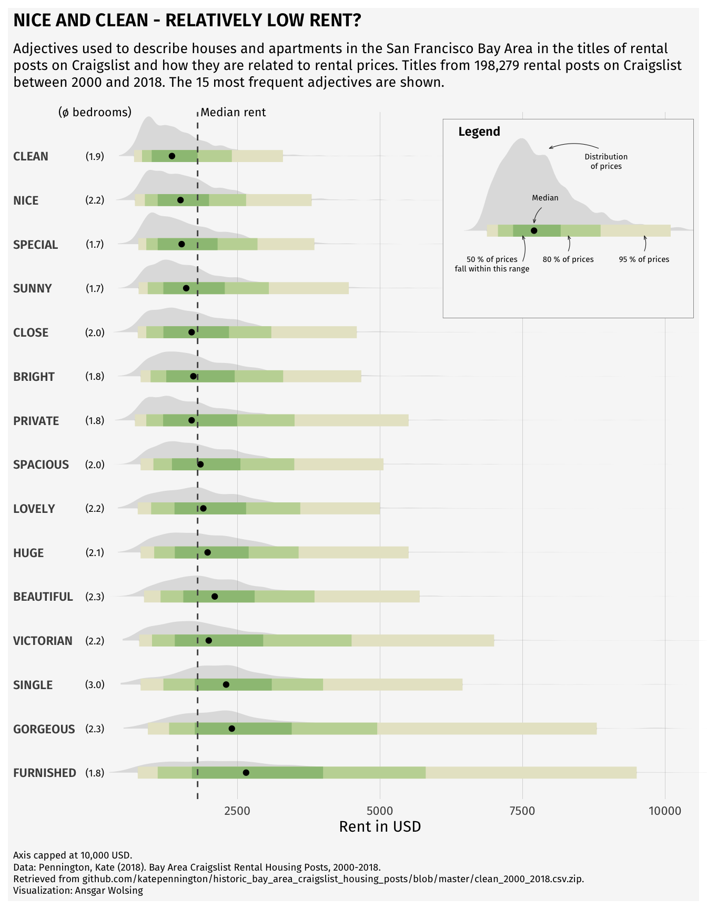

## Today's class

-   A little bit about data visualization
-   A review of topics
-   Start with Generalized Linear Mixed Effects Models
-   Start thinking about advanced topics

## Homework for Wednesday

Find a cool plot that you want to replicate.

On Friday, you will create the data, and replicate the plot

## Data visualization

-   My favorite part of stats/data analysis/ etc

-   You can be creative! but be smart and ethical.

-   Plots are easy to "manipulate"

-   

## Misleading plots


## Incorrect and misleading plots

-   Pie chart with total over 100

-   Avoid pie charts. Grouped barplots are potentially the best solution for "parts of a whole". Stacked barplot can be challenging to distinguish.

## Barplot

```{r}
# Create data
set.seed(112)
data <- matrix(sample(1:30,15) , nrow=3)
colnames(data) <- c("A","B","C","D","E")
rownames(data) <- c("var1","var2","var3")


# Get the stacked barplot
barplot(data, 
        col=colors()[c(23,89,12)] , 
        border="white", 
        space=0.04, 
        font.axis=2, 
        xlab="group")
```

## Barplot

```{r}
# Create data
set.seed(112)
data <- matrix(sample(1:30,15) , nrow=3)
colnames(data) <- c("A","B","C","D","E")
rownames(data) <- c("var1","var2","var3")
 
# Grouped barplot
barplot(data, 
        col=colors()[c(23,89,12)] , 
        border="white", 
        font.axis=2, 
        beside=T, 
        legend=rownames(data), 
        xlab="group", 
        font.lab=2)
```

## Plotting

-   Estimate (point) and CI

-   

-   

-   Similar to a line and CI

## Plots

-   Distribution

-   Correlation

-   Ranking

-   Part of a whole

-   Evolution (time series, line plot)

-   Map

-   Flows

## Distribution plots


```{r}
library(ggplot2)
library(dplyr)
library(hrbrthemes)
library(viridis)

# create a dataset
data <- data.frame(
  name=c( rep("A",500), rep("B",500), rep("B",500), rep("C",20), rep('D', 100)  ),
  value=c( rnorm(500, 10, 5), rnorm(500, 13, 1), rnorm(500, 18, 1), rnorm(20, 25, 4), rnorm(100, 12, 1) )
)

# sample size
sample_size = data %>% group_by(name) %>% summarize(num=n())

# Plot
data %>%
  left_join(sample_size) %>%
  mutate(myaxis = paste0(name, "\n", "n=", num)) %>%
  ggplot( aes(x=myaxis, y=value, fill=name)) +
    geom_violin(width=1.4) +
    geom_boxplot(width=0.1, color="grey", alpha=0.2) +
    scale_fill_viridis(discrete = TRUE) +
    theme_ipsum() +
    theme(
      legend.position="none",
      plot.title = element_text(size=11)
    ) +
    ggtitle("A Violin wrapping a boxplot") +
    xlab("")
```

## Distribution plots

```{r}
data <- read.table("https://raw.githubusercontent.com/holtzy/data_to_viz/master/Example_dataset/1_OneNum.csv", header=TRUE)

# Make the histogram
data %>%
  filter( price<300 ) %>%
  ggplot( aes(x=price)) +
    geom_density(fill="#69b3a2", color="#e9ecef", alpha=0.8) +
    ggtitle("Night price distribution of Airbnb appartements") +
    theme_ipsum()
```

## Distribution plots

```{r}
names=c(rep("A", 20) , rep("B", 8) , rep("C", 30), rep("D", 80))
value=c( sample(2:5, 20 , replace=T) , sample(4:10, 8 , replace=T), sample(1:7, 30 , replace=T), sample(3:8, 80 , replace=T) )
data=data.frame(names,value)
 
# plot
p <- ggplot(data, aes(x=names, y=value, fill=names)) +
    geom_boxplot(alpha=0.7) +
    stat_summary(fun.y=mean, geom="point", shape=20, size=14, color="red", fill="red") +
    theme(legend.position="none") +
    scale_fill_brewer(palette="Set1")
```

## Distribution plots



## Correlation

-   Scatterplot

-   Heatmap

-   Correlogram

-   Bubble

## Scatterplot

```{r}
# Create dummy data
data <- data.frame(
  cond = rep(c("condition_1", "condition_2"), each=10), 
  my_x = 1:100 + rnorm(100,sd=9), 
  my_y = 1:100 + rnorm(100,sd=16) 
)

# Basic scatter plot.
p1 <- ggplot(data, aes(x=my_x, y=my_y)) + 
  geom_point( color="#69b3a2") +
  theme_ipsum()
 
# with linear trend
p2 <- ggplot(data, aes(x=my_x, y=my_y)) +
  geom_point() +
  geom_smooth(method=lm , color="red", se=FALSE) +
  theme_ipsum()

# linear trend + confidence interval
p3 <- ggplot(data, aes(x=my_x, y=my_y)) +
  geom_point() +
  geom_smooth(method=lm , color="red", fill="#69b3a2", se=TRUE) +
  theme_ipsum()

p1
```

## Scatterplot

```{r}
p2
```

## Scatterplot

```{r}
p3
```

## Combining scatterplot and distribution

```{r}
library(ggExtra)
 
# The mtcars dataset is proposed in R
head(mtcars)
 
# classic plot :
p <- ggplot(mtcars, aes(x=wt, y=mpg, color=cyl, size=cyl)) +
      geom_point() +
      theme(legend.position="none")
 
# with marginal histogram
p1 <- ggMarginal(p, type="histogram")
 
# marginal density
p2 <- ggMarginal(p, type="density")
 
# marginal boxplot
p3 <- ggMarginal(p, type="boxplot")

p1
```

## Combining scatterplot and distribution

```{r}
p2
```

## Combining scatterplot and distribution

```{r}
p3
```

## Heatmap

```{r}
data <- as.matrix(mtcars)
heatmap(data, Colv = NA, Rowv = NA, scale="column")
```

## Correlogram

```{r}
library(GGally)
data(flea)
head(flea)
summary(flea)
```

## Correlogram

```{r}
#library(GGally)
 
# From the help page:

ggpairs(flea, columns = 2:4, ggplot2::aes(colour=species)) 
```

```{r}
ggpairs(flea, columns = 2:7, ggplot2::aes(colour=species)) 
```

## Friday's lab

You will simply try to replicate a complex, but cool plot

You will generate data for it
