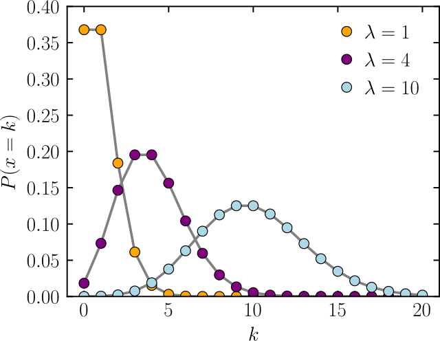
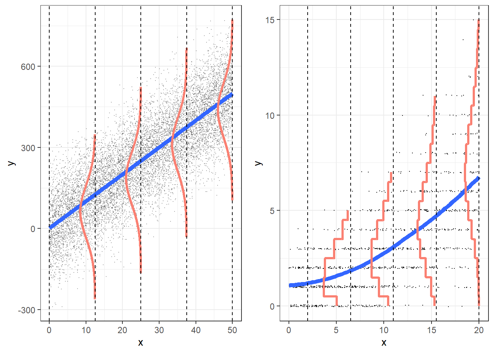
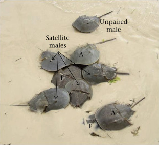

```{r}

library(ggplot2)
library(dplyr)
library(car)
library(readr)


```

## Announcements

-   We will look at overdispersion and zero inflation

-   We will finish the linear model aspect of the course

-   When we are back we will talk about "Generalized Mixed effects Models" –\> combine mixed effects and generalized linear models

-   These can also have zero inflation and overdispersion

-   Then we will talk about GAM's. Very important topic!

-   Some classes for plotting, and data management

-   No class this Friday, but I will be in my office from \~10 to 3 pm

## Poisson distribution



## Poisson distribution



## What happens when variance isn't always $\lambda_i$ ?

-   Poisson assumes that the mean $\lambda_i$ is equal to the variance $Var(y_i|x_i) = \lambda_i$
-   This **very rarely happens!**
-   **Usually** $Var(y_i|x_i) > \lambda_i$: overdispersion
-   We need to correct for this

## What causes overdispersion?

-   Omission of important variables

-   Measurement error

-   Data

-   **CLUSTERING!!!!**

-   Random effects

-   Outliers

-   etc

## Poisson and zeroes

-   Another issue with the Poisson distribution is the number of zeroes

-   Oftentimes we observe more zeroes than expected by the Poisson distribution

-   We call this zero inflation

## Reasons for zero-inflation

-   Structural (or process) zeroes

-   Imagine you are looking at the abundance of a wild vine 🍃 in the Smokies.

-   You set up random plot to sample using coordinates

-   Some areas (river and rocky shore) are unable to produce nonzero counts

-   You have two processes: one that produces only zeroes (inhabitable areas), and one that produces

## Reasons for zero-inflation

-   Clustering: Can be temporal or spatial

-   You get many zeroes, and many high counts. High counts lead to a high $\lambda$ whcih would expect low number of zeroes


## Reasons for zero inflation

-   Observer error

-   For example, jaguars are very hard to observe in camera traps

-   If detection probability is low, then there will be lots of zeroes

## Intermittent occurance

-   For example, number of flu infections

-   More zeroes in the summer than in the winter

## Example

Horseshoe crabs 🦀

{width="357"}

## Horseshoe crabs

Females are grasped by a male for reproduction

-   Satellite males are individuals that do not directly grasp a female.

-   These males attempt to fertilize eggs externally by releasing sperm in close proximity to a nesting pair, increasing their chances of reproductive success.

## Example

Horseshoe crabs 🦀

{width="357"}

## Note

Counting totality of males per female, including "attached" one


## Example

<https://users.stat.ufl.edu/>

::::: columns
::: {.column width="40%"}
```{r}
crabs<-read.table("Crabs.txt",header=T)
crabs$color<-factor(crabs$color)
head(crabs)

```
:::

::: {.column width="60%"}
```{r}
hist(crabs$sat, breaks=c(0:16)-0.5)
```
:::
:::::

## Horseshoe crabs

We are interested in the effects of color on the number of satellites.

First, let's look at the model fitting:

```{r}
glm1<-glm(sat~color,data=crabs,family="poisson")
summary(glm1)
```

## Looking at the data

```{r}

library(dplyr)
f2 <- group_by(crabs, color) %>%
  summarise(mu = mean(sat), stdv = sd(sat))
ggplot(f2, aes(x = color, y = mu)) +
  geom_point() +
  scale_x_discrete("Color") +
  scale_y_continuous("Number of satelites") +
  geom_errorbar(aes(x = color, ymin = mu - stdv, ymax = mu + stdv), width = 0)+
  theme_classic()

```

## Using performance

```{r echo=TRUE}
performance::check_overdispersion(glm1)
```

## What are the problems of overdispersion

Discuss, what problems can arise if there is overdispersion

## Overdispersion and bias...

Overdispersion does not bias the estimates... but can affect the standard error

We can fit this in many different ways

## Method 1

-   In Poisson:

-   $\lambda_i$ is the expected value

-   $\lambda_i$ is the variance

-   We can do a "quassipoisson":

-   $\lambda_i$ is the expected value

-   $\phi\lambda_i$ is the variance

-   $\phi$ is an inflation factor

```{r}
glm2<-glm(sat~color,data=crabs,family="quasipoisson")
summary(glm2)
```

## methods

```{r}
summary(glm1)

```

```{r}
summary(glm2)
```

-   Differences?

```{r}
Anova(glm2)
```

## qAIC

$$
QAIC = \frac{-2 * log-likelihood}{\hat{c}} + 2 * K
$$

Quasipoisson has no AIC!

## Back to over dispersed

```{r message=TRUE}
#| echo: true

performance::check_overdispersion(glm2)
performance::check_zeroinflation(glm2)
```

-   Quasipoisson will never fix the overdispersion. The data is still overdispersed. We are just taking that into account

-   This is good, we are making better inferences, from imperfect data

## Other solutions

Oftentimes adding random effects or running a more complex model may solve the overdispersion (if the dispersion due to other variables!)

If the overdispersion is paired with more zeroes than expected, then, we can use a different distribution

```{r message=TRUE}
#| echo: true


performance::check_zeroinflation(glm2)
```

Potential solutions are:

-   Negative binomial

-   Hurdle models

-   Mixed models!

-   Mixture models

## Negative binomial distribution

-   Discrete probability distribution... similar to Poisson

-   Two parameters (like normal distribution!)

-   $\mu$ and $\theta$

-   But! $\theta$ is not variance! Remember in counts... variance increases with mean!

-   Variance: $\mu + \frac{\mu^2}{\theta}$

-   Think about this... what values of $\theta$ "decrease" variance?

## Negative binomial

```{r}
library(MASS)
glm3<-glm.nb(sat~color,data=crabs)
summary(glm3)
```

## Negative binomial

```{r message=TRUE}
#| echo: true


performance::check_overdispersion(glm3)
performance::check_zeroinflation(glm3)
```

## Negative binomial

Usually great compromise

Closer to actual distribution

Poisson:

```{r}
car::Anova(glm1)

```

Negative binomial:

```{r}
car::Anova(glm3)
```

-   Wow! Choosing the right distribution can have a huge effect!

## Hurdle models

Hurdle models combine two distributions:

1.  "Hurdle": Probability that the observation is 0 or not (Bernoulli)

2.  Count data (with censored zeroes)

-   What distribution do we use for the count-data?

-   Poisson (censored)

-   Negative binomial (censored)

## What distribution to use?

-   We can use both (Poisson, or negative binomial

-   We cannot test overdispersion or zero inflation on these models.

-   We can use AIC

-   Hurdle models are appropriate when there is a separate process that causes the zeroes...

-   In our example, zeroes could be governed by another cause, which is it?

-   Will zeroes be uniquely caused by this?

## Hurdle models (poisson)

```{r message=TRUE}
#| echo: true


library(pscl)

poishurd<-hurdle(sat~color, data=crabs)
summary(poishurd)
```

## Hurdle models (neg binomial)

```{r message=TRUE}
#| echo: true


nbhurd<-hurdle(sat~color, data=crabs, dist="negbin")
summary(nbhurd)
```

## IMPORTANT! Hurdle models

Hurdle models can use different covariates for each submodel!

-   What does this mean?

-   What could we use here?

## Zero inflated mixture models

If zeroes are not uniquely caused by an independent event, then zero inflated mixture models are the way to go.

-   Maybe some crabs that could breed, won't...

-   Two types of zeroes: structural and sampling (Hurdle models only take into account structural zeroes)

-   Zero inflated mixture models can be used in this case

-   Poisson or Negative binomial

```{r message=TRUE}
#| echo: true

zeroinfl1<-zeroinfl(sat~color|.,data=crabs)
summary(zeroinfl1)
```

\##

```{r message=TRUE}
#| echo: true

library(pscl)
zeroinfl2<-zeroinfl(sat~color|.,data=crabs, dist="negbin")
summary(zeroinfl2)
```

## Model comparisons

```{r}
library(AICcmodavg)
library(kableExtra)
tab1<-  aictab(cand.set=list(Poissonglm=glm1))
tab2<-   aictab(cand.set=list(       neg.bin= glm3))
tab3<-  aictab( cand.set=list( nbhurdle=nbhurd,poishurdle=poishurd))
tab4<-  aictab( cand.set=list(zeropois=zeroinfl1, zeronb=zeroinfl2
                   ))

alltab<-rbind(tab1,tab2,tab3,tab4)

alltab<-alltab[order(alltab$AICc),]

alltab$Delta_AICc<-alltab$AICc-alltab[1,3]
alltab
```

## 
